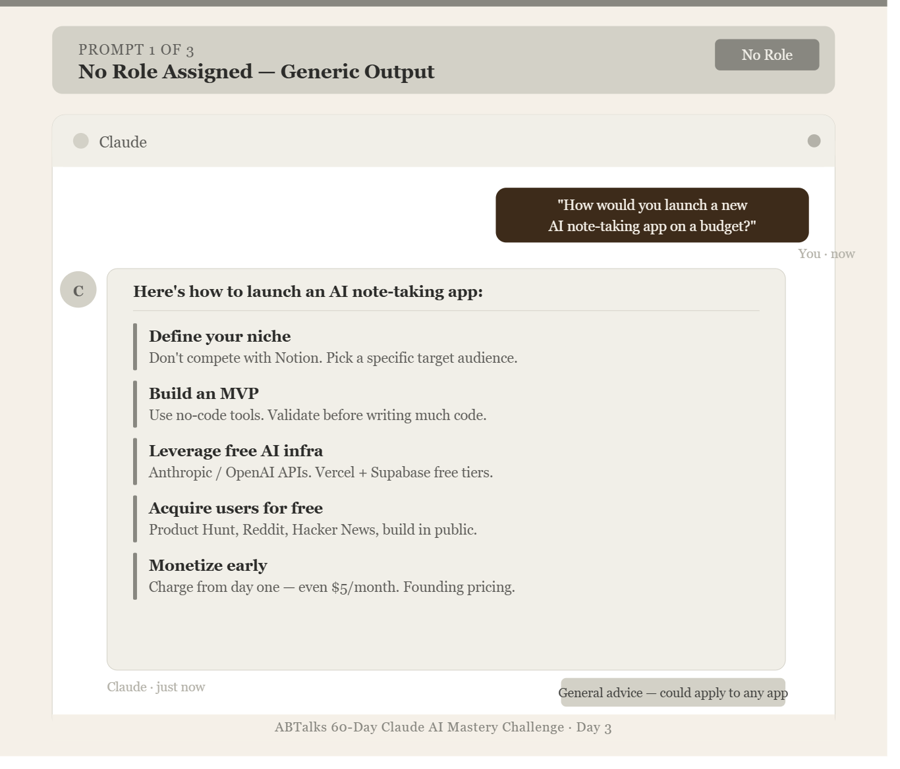
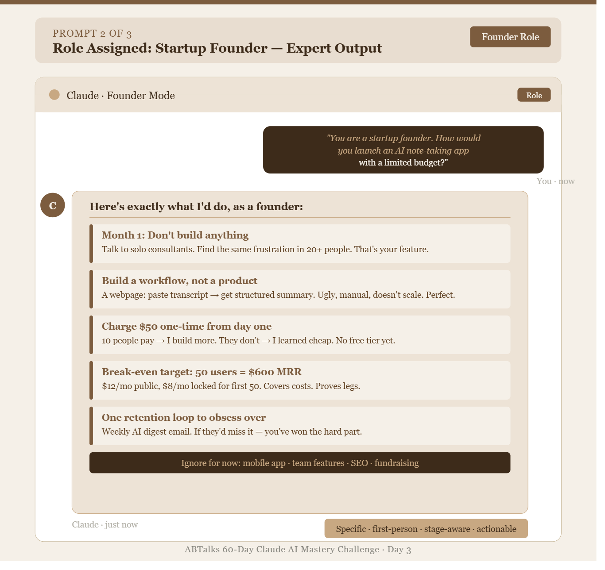
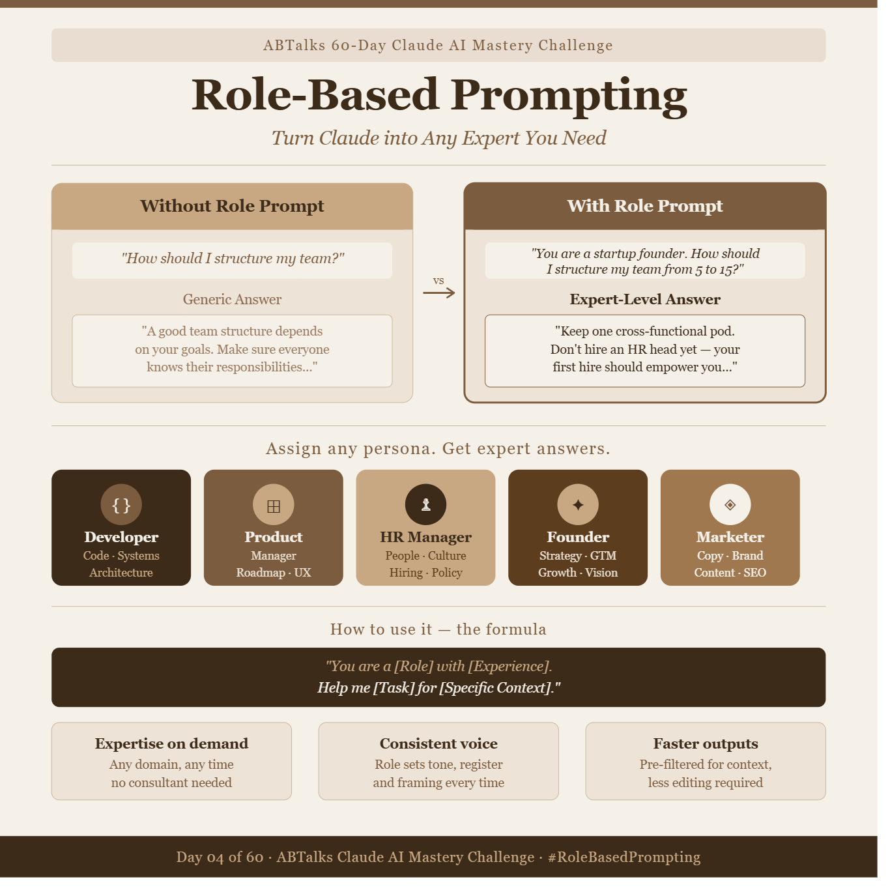

# ABTalks 60-Day Claude AI Mastery Challenge
## Day 3 - Role-Based Prompting

**Date:** June 3, 2026
**Topic:** Role-Based Prompting - Turn Claude into Any Expert You Need
**Challenge Day:** 3 of 60

---

## What I Learned Today

Role-Based Prompting is the practice of assigning a professional identity to Claude before asking your question. Instead of sending a bare prompt, you first tell Claude *who to be* - a startup founder, an HR manager, a senior developer - and then ask. The role acts as a lens that filters Claude's vast knowledge into a focused, expert-calibrated response.

**Core insight:** Claude doesn't change *what it knows* when you assign a role. It changes *which part* of what it knows to prioritize, what tone to use, and how deep to go. Same knowledge base, completely different output quality.

---

## Today's Prompts & Outputs

---

### Prompt 1 - Startup Strategy (No Role)

**Prompt used:**
```
How would you launch a new AI-powered note-taking app with a limited budget?
```

**Output image:**



**My observation:**
Good general advice, but felt like it could apply to *any* app. The answer was from the perspective of an advisor, not a practitioner. Lacked the raw urgency and prioritization instincts of someone who's actually done it.

---

### Prompt 2 - Startup Strategy (With Founder Role)

**Prompt used:**
```
You are a startup founder. How would you launch a new AI-powered note-taking app with a limited budget?
```

**Output image:**



**My observation:**
This felt like advice from a real person who had skin in the game. The specificity was striking — "$8/month locked forever for the first 50 users", "break-even is 50 paying users." That's not generic advice. That's a plan.

---

### Prompt 3 - Teaching Role-Based Prompting (Educator Role)

**Prompt used:**
```
You are an AI educator teaching complete beginners.
Explain Role-Based Prompting in simple language.
Include:
* What Role-Based Prompting is
* Why it matters when using AI tools like Claude
* How assigning a role changes the quality of AI responses
* One example without a role prompt
* One example with a role prompt
* Three practical benefits of Role-Based Prompting
Also create a LinkedIn-ready image.
```

**Output image:**



**My observation:**
The educator role completely changed the register. Analogies appeared, jargon dropped, and the structure felt pedagogical rather than consultative. The LinkedIn visual was production-ready.

---

## Key Learnings

| # | Learning | Why It Matters |
|---|----------|----------------|
| 1 | A role shifts perspective, not just vocabulary | The founder prompt gave *prioritization instincts*, not just information |
| 2 | Roles reduce your editing work | Pre-filtered, context-specific answers need far less cleanup |
| 3 | The more specific the role, the better the output | "Startup founder who scaled to 50 people" beats "entrepreneur" |
| 4 | Roles work across all content types | Explanations, strategies, creative work, visuals — all improve |
| 5 | You can stack constraints with roles | Role + experience level + specific context = precision prompting |

---

## The Formula

```
"You are a [Role] with [Experience].
Help me [Task] for [Specific Context]."
```

---

## Personas I Can Activate

| Persona | Best for |
|---------|----------|
| **Developer** | Code review, architecture decisions, debugging logic |
| **Product Manager** | Roadmaps, user stories, prioritization frameworks |
| **HR Manager** | Job descriptions, feedback scripts, culture building |
| **Founder** | GTM strategy, fundraising narratives, first-principles thinking |
| **Marketer** | Copywriting, campaign strategy, positioning, SEO |
| **Educator** | Explaining complex concepts simply, creating learning material |

---

## Reflections

Today was a turning point in how I think about prompting. Before this, I was treating Claude like a search engine - throw a question, get an answer. Now I understand that Claude is more like a cast of experts waiting to be called on stage. The prompt isn't just the question. The prompt is the *casting call*.

**Tomorrow I want to explore:** Chained roles - assigning multiple roles in sequence to stress-test an idea from different expert perspectives.

---

*Day 3 of 60 complete. #ABTalks #ClaudeAI #RoleBasedPrompting #60DayChallenge*