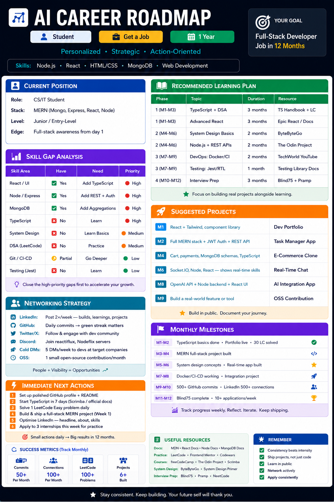

# 📅 Day 4 — AI-Powered Career Roadmap

> *Part of my #100DaysOfLearning journey — documenting growth, one day at a time.*

---

## 🚀 What I Did Today

Used an **AI Career Strategist** (powered by Claude) to generate a fully personalized,
PDF-exported career roadmap based on my current skills and goals.

### My Inputs
| Field | Answer |
|---|---|
| Current Situation | Student |
| Skills | Node.js, React, HTML, CSS, MongoDB |
| Target Goal | Get a Job |
| Timeline | 1 Year |

---

## 🗺️ The Roadmap (Summary)

### 📍 Current Position
- MERN stack student (MongoDB, Express, React, Node.js)
- Junior / Entry-Level readiness
- Strong: full-stack awareness, frontend + backend exposure

### 🎯 Target Goal
**Full-Stack Developer Job within 12 months**

---

## 📈 Skill Gap Analysis

| Skill Area | Status | Priority |
|---|---|---|
| TypeScript | ❌ Not yet | 🔴 Priority 1 |
| DSA / LeetCode | ❌ Not yet | 🔴 Priority 2 |
| System Design | ❌ Not yet | 🔴 Priority 3 |
| Advanced React | ✅ Partial | Deepen |
| Node.js / REST APIs | ✅ Have | Strengthen |
| Git / CI-CD | ⚠️ Partial | Improve |
| Testing (Jest/RTL) | ❌ Not yet | Medium |
| Docker / DevOps | ❌ Not yet | Phase 3 |

---

## 🛠️ 4-Phase Learning Plan

```
Phase 1 (M1–M3)  →  TypeScript + DSA Foundations + Advanced React
Phase 2 (M4–M6)  →  System Design + Node.js APIs + Full-Stack Projects
Phase 3 (M7–M9)  →  Docker/CI-CD + Testing + Open Source Contribution
Phase 4 (M10–M12)→  Interview Prep (Blind75) + Aggressive Applying
```

---

## 💼 Project Roadmap

| Month | Project | Stack / Purpose |
|---|---|---|
| M1 | Dev Portfolio | React + Tailwind, deployed on Vercel |
| M2 | Task Manager App | Full MERN + JWT Auth + REST API |
| M4 | E-Commerce Clone | TypeScript + MongoDB schemas + payments |
| M6 | Real-Time Chat | Socket.IO + Node + React |
| M8 | AI Integration App | OpenAI API + Node backend + React UI |
| M9 | OSS Contribution | Fix a real bug in a popular npm library |

---

## 🌐 Networking Strategy

- **LinkedIn** - Post 2× per week (builds, learnings, project updates)
- **GitHub** - Daily commits to keep the green streak alive
- **Twitter/X** - Engage with dev community, share learning threads
- **Discord** - Join Reactiflux, Nodeiflux, and dev servers
- **Cold DMs** - 5 targeted DMs/week to devs at companies I admire
- **Open Source** - At least 1 contribution per month

---

## 📅 Monthly Milestones

| Period | Milestone |
|---|---|
| M1–M2 | TypeScript basics done · Portfolio live · 30 LeetCode solved |
| M3–M4 | Full MERN project deployed · REST APIs solid |
| M5–M6 | System design concepts · Real-time app built · 100 LC solved |
| M7–M8 | Docker/CI-CD working · AI integration project shipped |
| M9–M10 | 500+ GitHub commits · LinkedIn 500+ connections |
| M11–M12 | Blind75 complete · 10+ applications/week · 🎯 Offer! |

---

## ⚡ Immediate Next Actions (This Week)

- [ ] Set up polished GitHub profile + README
- [ ] Start TypeScript in 7 days (official docs / Scrimba)
- [ ] Solve 1 LeetCode Easy problem daily
- [ ] Build & deploy a full-stack MERN project
- [ ] Optimise LinkedIn — headline, about section, skills
- [ ] Apply to 3 internships this week for practice

---

## 💡 Key Learnings & Observations

### 🔑 Biggest Insight: The Visibility Gap

> The most powerful realization from today's roadmap:
> **I don't have a skills gap — I have a visibility gap.**

Most students with a MERN stack never get callbacks — not because they can't code,
but because they leave no *proof trail*. GitHub streaks, deployed projects, and
LinkedIn presence aren't soft extras. They're the multiplier that makes every
technical skill 3× more effective in a job search.

**The formula:**
```
Strong Code + Visible Work + Consistent Networking = Job Offer
```

### 📝 Other Observations

1. **TypeScript is non-negotiable** — Nearly every job posting at serious companies
   lists TypeScript. It's the single highest-ROI skill to add right now.

2. **Projects > Certificates** — Hiring managers look at GitHub before resumes.
   A deployed, well-documented project beats any Udemy certificate.

3. **DSA is a separate game** — Having React/Node skills doesn't mean passing
   technical interviews. LeetCode prep needs its own dedicated daily practice.

4. **Timeline is realistic but tight** — 12 months is achievable *only* with
   consistent 2–3 hours of focused work daily. No passive watching — active building.

5. **The AI roadmap itself was a meta-learning moment** — Using AI to strategize
   my own career shows exactly the kind of AI-native thinking that modern employers
   value. Tools > talent alone.

---

## 🛠️ Tools Used Today

| Tool | Purpose |
|---|---|
| Claude (Anthropic) | AI Career Strategist + Roadmap Generation |
| ReportLab (Python) | PDF export of roadmap |
| Markdown | Documentation (this file!) |

---

## 📸 Screenshots


---

## 🔗 Resources to Bookmark

- [TypeScript Handbook](https://www.typescriptlang.org/docs/)
- [LeetCode – Blind 75](https://leetcode.com/discuss/general-discussion/460599/blind-75-leetcode-questions)
- [ByteByteGo – System Design](https://bytebytego.com/)
- [Epic React by Kent C. Dodds](https://epicreact.dev/)
- [The Odin Project](https://www.theodinproject.com/)
- [Reactiflux Discord](https://www.reactiflux.com/)

---

## 🧠 Quote of the Day

> *"The best time to plant a tree was 20 years ago. The second best time is now."*
>
> My stack is already planted. Now it's time to grow it — publicly, consistently, and with intent.

---

*Generated using Chain-of-Thought Reasoning · Day 4 of #100DaysOfLearning*