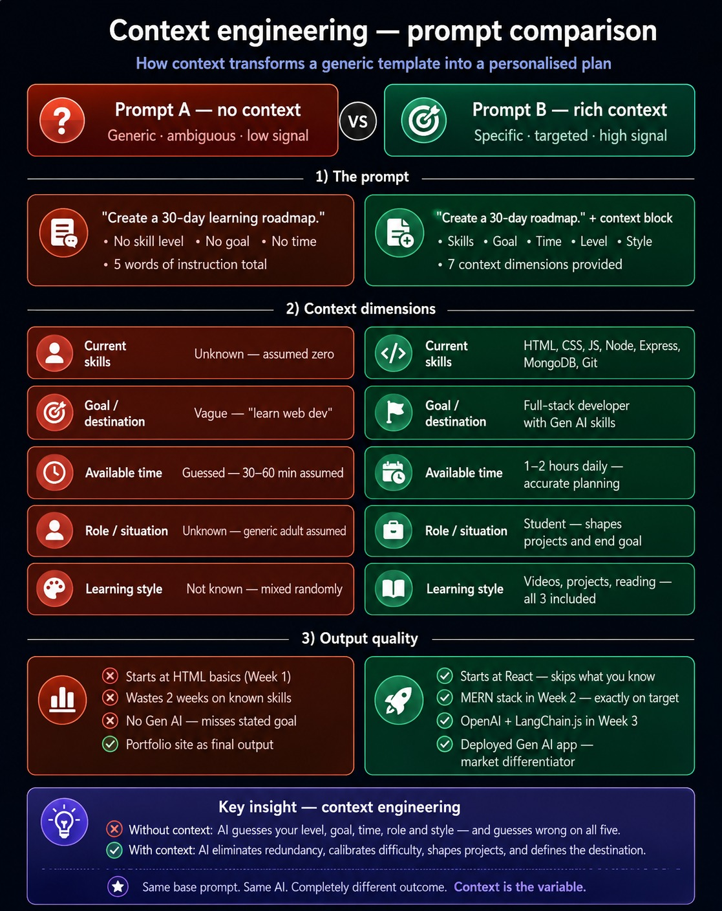
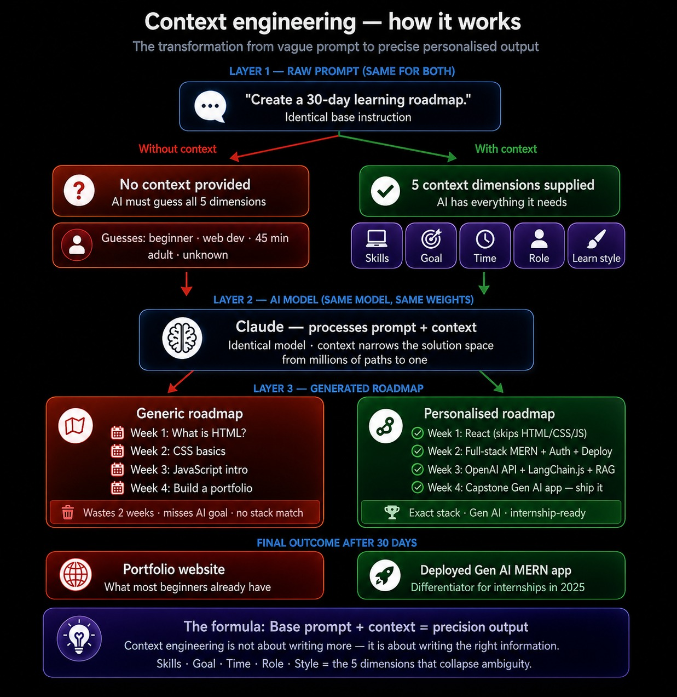
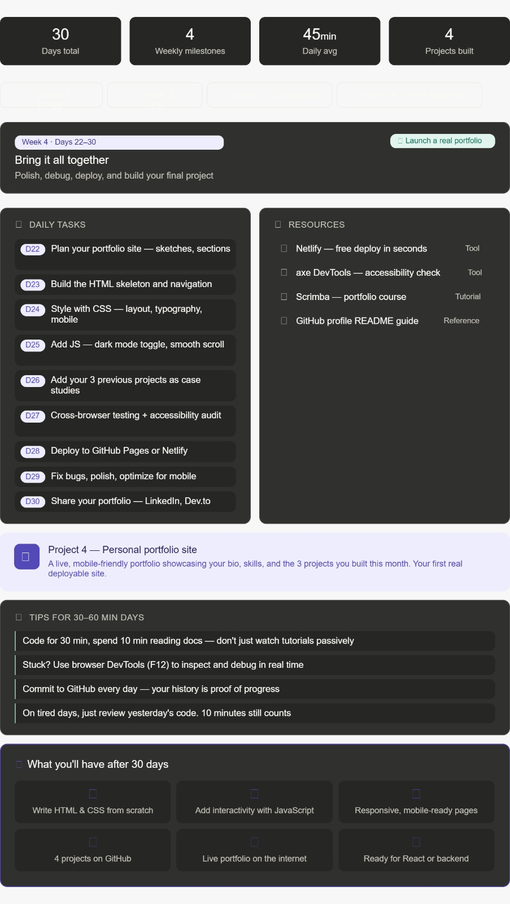
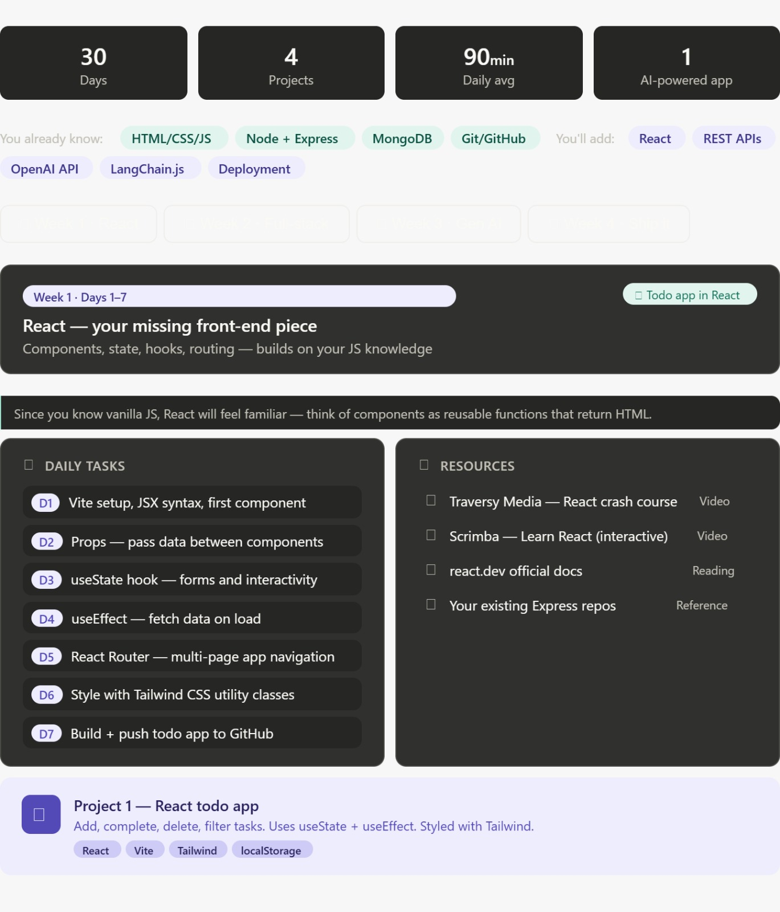

# Context Engineering — Prompt A vs Prompt B

> **Today's Learning · June 5, 2026**
> A hands-on study of how context transforms AI output quality, using a 30-day learning roadmap as the test case.

```
repo-root/
├── README.md
└── assets/
    ├── context-engineering-comparison.png   ← Image 1 screenshot
    ├── context-engineering-flow.png         ← Image 2 screenshot
    ├── prompt-a-roadmap.png                 ← Prompt A full roadmap
    ├── prompt-a-week1.png                   ← Prompt A Week 1 detail
    ├── prompt-b-roadmap.png                 ← Prompt B full roadmap
    └── prompt-b-week3-genai.png             ← Prompt B Week 3 Gen AI detail
```

---

## What is context engineering?

Context engineering is the practice of deliberately supplying an AI model with structured, relevant information - beyond the base instruction - so it can narrow its solution space from millions of generic possibilities down to one precise, personalised output.

**Same model. Same base prompt. Completely different result.**

The variable is context.

---

## The experiment

We ran the same base prompt - *"Create a 30-day learning roadmap"* - twice:

- **Prompt A:** No context. Just the instruction.
- **Prompt B:** The same instruction + 7 structured context fields.

Both outputs were compared across 3 dimensions: personalisation, relevance, and actionability.

---

## Screenshots

### Comparison diagram - Prompt A vs Prompt B



> *Screenshot: Side-by-side structured comparison showing 5 context dimensions, output quality difference, and key insight. Take this from the first visual generated in today's session.*

### Context engineering flow model



> *Screenshot: Flow architecture diagram tracing both prompts through 3 layers - raw input → AI model → output roadmap → final outcome. Take this from the second visual generated in today's session.*

---

## Prompt A — Without context

```text
Create a 30-day learning roadmap.

Include:
- Weekly milestones
- Daily tasks
- Resources
- Projects
- Final outcome

Make it practical and beginner-friendly.
```

### Output summary

| Dimension        | Result                                         |
|------------------|------------------------------------------------|
| Week 1 topic     | What is HTML? — absolute basics                |
| Week 2 topic     | CSS basics                                     |
| Week 3 topic     | JavaScript introduction                        |
| Week 4 project   | Personal portfolio website                     |
| Assumed level    | Complete beginner (guessed)                    |
| Time allocation  | 30–60 min/day (guessed)                        |
| Stack used       | HTML → CSS → JS → GitHub Pages                 |
| Gen AI skills    | None                                           |
| Wasted content   | 2+ full weeks on already-known material        |

### Screenshot — Prompt A output



> *Screenshot: Week 1 of the Prompt A roadmap - starting at "What is HTML?" for a student who already knows HTML, CSS, JS, Node, Express, and MongoDB.*

### Why it falls short

The AI had no information about the learner, so it defaulted to a universal beginner template. It guessed the skill level, guessed the time available, and guessed the goal. It got all three wrong for a student who already knows HTML, CSS, JS, Node.js, Express, MongoDB, and Git.

---

## Prompt B — With rich context

```text
Create a 30-day learning roadmap.
Context:
- Current Situation: [Student]
- Current Skills: [HTML, CSS, JS, Node.js, Express, Git, GitHub, MongoDB]
- Goal: [Full-stack developer with Gen AI skills in projects]
- Available Time: [1–2 hours/day]
- Experience Level: [Beginner]
- Preferred Learning Style: [Videos / Projects / Reading]

Include:
- Weekly milestones
- Daily tasks
- Resources
- Projects
- Final outcome

Make it practical and beginner-friendly.
```

### Output summary

| Dimension        | Result                                                     |
|------------------|------------------------------------------------------------|
| Week 1 topic     | React - skips HTML/CSS/JS entirely                        |
| Week 2 topic     | Full-stack MERN + JWT auth + deployment                   |
| Week 3 topic     | OpenAI API + LangChain.js + MongoDB vector search + RAG   |
| Week 4 project   | Deployed Gen AI capstone app (MERN + OpenAI)              |
| Assumed level    | Correct - beginner in React + AI, not in web dev          |
| Time allocation  | 90 min/day average - accurately calibrated                |
| Stack used       | React · Express · MongoDB · JWT · Vercel · Render         |
| Gen AI skills    | OpenAI API, LangChain.js, embeddings, RAG pipeline        |
| Wasted content   | Zero - starts exactly at the skill boundary               |

### Screenshot — Prompt B output



> *Screenshot: Week 3 of the Prompt B roadmap — OpenAI API, LangChain.js, MongoDB vector search, and RAG pipeline. The week that separates this roadmap from every generic one.*

### Why it works

Every week builds on the learner's existing stack. The backend (Express + MongoDB) is never re-taught - it's connected to a React frontend in Week 2. The Gen AI layer in Week 3 uses JavaScript, not Python, so no context switch. The final project is a deployed, AI-powered MERN app - a genuine differentiator for internship applications.

---

## Side-by-side comparison

| Criterion                        | Prompt A               | Prompt B                          |
|----------------------------------|------------------------|-----------------------------------|
| Starts at skill boundary         | No — starts at zero    | Yes - starts at React             |
| Matches known tech stack         | No                     | Yes - Express, MongoDB reused     |
| Includes Gen AI                  | No                     | Yes - Week 3 entirely             |
| Reflects available time          | Guessed (30–60 min)    | Correct (1-2 hrs = 90 min avg)    |
| Respects role (student)          | No                     | Yes - capstone shaped for intern  |
| Matches learning style           | Random                 | Videos + projects + reading all 3 |
| Final deliverable relevance      | Generic portfolio site | Deployed Gen AI app               |
| Would you follow this?           | Probably not           | Yes                               |

---

## The 5 context dimensions

These are the five fields that collapsed all ambiguity between Prompt A and Prompt B:

### 1. Current skills
Without this, the AI defaults to zero. With it, the AI skips two full weeks of redundant content and starts at the exact skill boundary.

### 2. Goal / destination
"Learn web dev" is too vague to act on. "Full-stack developer with Gen AI skills" specifies the exact tech (React, OpenAI API, LangChain.js) and the market positioning (internship-ready).

### 3. Available time
The difference between 30-60 min/day and 1-2 hours/day is not cosmetic - it's the difference between shallow overviews and actually building and deploying things within 30 days.

### 4. Role / situation
Knowing the learner is a student shaped Day 30: "apply to 3 internships" only makes sense in that context. An adult career-changer would get a different final step.

### 5. Learning style
Three styles were specified (videos, projects, reading). All three appeared in the resource lists for every week — not randomly, but matched to the type of content being learned.

---

## What context engineering is NOT

- It is not about writing longer prompts
- It is not about adding more instructions
- It is not about being polite or formal
- It is not prompt *hacking* or manipulation

It is about supplying the **right structured information** so the model's output space narrows from millions of plausible answers to the one answer that is actually useful to you.

---

## The formula

```
Precise output = Base prompt + Context

Where context =
  Skills     → eliminates redundancy
  Goal       → defines the destination
  Time       → calibrates depth
  Role       → shapes the framing
  Style      → matches the delivery
```

---

## Key takeaway

> A prompt without context forces the AI to guess your starting point, your goal, and your constraints.
> It will guess wrong on all three.
>
> Context collapses that uncertainty.

## What's next

Based on today's learning, the logical next steps in the Prompt B roadmap are:

1. Set up a Vite + React project today (Day 1 of Week 1)
2. Push every day's work to GitHub — the commit history is proof of progress
3. After 30 days, apply to internships with a live deployed Gen AI app as the headline project

---

*Documented on June 5, 2026*