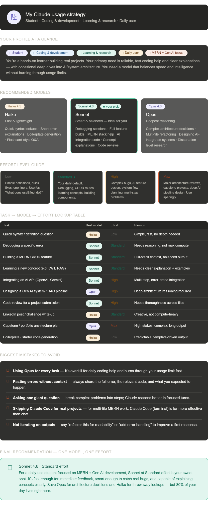

# Day 7 — My Claude Usage Strategy
## #60DaysOfABTalksOnAI by ABTalksOnAI

> **Challenge:** Build a personalized Claude model + effort strategy based on your profile and daily tasks using structured prompting and context engineering.

---

## 🧠 What I Did Today

Used Claude as an AI Workflow Architect to analyze my profile, daily tasks, and goals — then generate a **personalized Claude usage strategy** covering which model to use, what effort level to set, and how to structure my daily workflow.

This exercise was a direct application of **context engineering**: giving Claude a structured role, structured questions, and structured output format to dramatically improve the quality and usefulness of the response.

---

## 👤 My Profile

| Attribute | Value |
|---|---|
| Role | Student |
| Primary Activities | Coding & Development, Learning & Research |
| Usage Frequency | Daily |
| Primary Output Need | Coding Help & Debugging |
| Tech Focus | MERN Stack + Generative AI |
| Challenge | #60DaysOfABTalksOnAI |

---

## 🤖 Recommended Primary Model

### ⭐ Claude Sonnet 4.6 — Standard Effort

**Why Sonnet fits me best:**
- Balances speed and intelligence for daily coding work
- Strong enough to debug complex MERN + AI integration issues
- Explains concepts clearly without being slow like Opus
- Handles full-stack context (routes, schemas, components) well
- Doesn't burn through usage limits like Opus would

---

## 📊 Model Selection Guide

### Haiku 4.5 — Fast & Lightweight
Use when:
- Looking up quick syntax or definitions
- Generating boilerplate / starter code
- Short error message explanations
- Drafting LinkedIn posts or challenge write-ups
- Flashcard-style Q&A while studying

### Sonnet 4.6 — Smart & Balanced ⭐ (Primary)
Use when:
- Debugging a specific error in my code
- Building a full MERN CRUD feature
- Learning a new concept (JWT, RAG, vector DBs)
- Reviewing code before submission
- Integrating AI APIs (OpenAI, Gemini, etc.)
- Day-to-day coding tasks

### Opus 4.6 — Deepest Reasoning
Use when:
- Designing a complete Gen AI system or RAG pipeline
- Making major architecture decisions for a project
- Multi-file refactoring sessions
- Capstone / portfolio project planning
- Complex multi-layered problems requiring long reasoning

---

## ⚙️ Effort Level Guide

| Effort | When to Use | Example |
|---|---|---|
| **Low** | Simple, fast lookups with no depth needed | "What does useEffect do?" |
| **Standard** ⭐ | Daily default for most coding + learning tasks | Debugging, building features, learning concepts |
| **High** | Complex problems, multi-step AI integrations, code reviews | Integrating OpenAI API, designing system flow |
| **Max** | High-stakes, architecture-heavy, long output tasks | Capstone planning, deep AI pipeline design |

---

## 📋 Task → Model → Effort Lookup Table

| Task | Best Model | Best Effort | Reason |
|---|---|---|---|
| Quick syntax / definition question | Haiku | Low | Simple, fast, no depth needed |
| Debugging a specific error | Sonnet | Standard | Needs reasoning, not max compute |
| Building a MERN CRUD feature | Sonnet | Standard | Full-stack context, balanced output |
| Learning a new concept (JWT, RAG) | Sonnet | Standard | Clear explanation + examples needed |
| Integrating an AI API (OpenAI, Gemini) | Sonnet | High | Multi-step, error-prone integration |
| Designing a Gen AI / RAG pipeline | Opus | High | Deep architecture reasoning required |
| Code review for a project submission | Sonnet | High | Needs thoroughness across all files |
| LinkedIn post / challenge write-up | Haiku | Standard | Creative, not compute-heavy |
| Capstone / portfolio architecture plan | Opus | Max | High-stakes, complex, long output |
| Boilerplate / starter code generation | Haiku | Low | Predictable, template-driven output |

---

## 🚫 Biggest Mistakes to Avoid

1. **Using Opus for every task** — overkill for daily coding help; burns usage limits fast
2. **Pasting errors without context** — always share the full error, relevant code, and expected behavior
3. **Asking one giant question** — break complex problems into steps; Claude reasons better in focused turns
4. **Skipping Claude Code for real projects** — for multi-file MERN work, Claude Code (terminal) is far more effective than chat
5. **Not iterating on outputs** — say "refactor for readability" or "add error handling" to improve first responses

---

## 🗺️ My Personalized Daily Claude Workflow

```
Morning Study Session
  └── Haiku (Low) → Quick concept lookups, definitions

Active Coding / Feature Building
  └── Sonnet (Standard) → MERN routes, components, debugging

AI Integration Work
  └── Sonnet (High) → OpenAI / Gemini API wiring

Architecture / Design Decisions
  └── Opus (High) → System design, data flow planning

Capstone / Portfolio Work
  └── Opus (Max) → Full architecture reviews, complex planning

Content / Challenge Write-ups
  └── Haiku (Standard) → LinkedIn posts, README updates
```

---

## 💡 Key Learnings from Day 7

1. **Context quality = output quality** — structured prompts with role, goal, and format constraints dramatically outperform vague ones
2. **Model choice is a strategic decision**, not just a default habit — matching the model to the task matters
3. **Effort level controls depth of reasoning** — Standard is sufficient for most daily tasks
4. **Iterate, don't accept first drafts** — asking Claude to "improve", "refactor", or "add error handling" compounds output quality
5. **Claude Code > chat for real codebases** — multi-file MERN projects need an agentic coding environment, not a chat box
6. **Structured prompts = structured outputs** — giving Claude a clear format produces consistently better, more useful results

---

## 🔗 Tools & Resources

- [Claude.ai](https://claude.ai) — Primary interface used
- [Claude Code](https://claude.ai/code) — For multi-file project work (recommended)
- [Anthropic Prompt Engineering Docs](https://docs.claude.com/en/docs/build-with-claude/prompt-engineering/overview)
- [ABTalksOnAI Challenge](https://www.linkedin.com/in/abtalksonai/) — #60DaysOfABTalksOnAI

---

## 📸 Screenshot

> See [Open HTML](./day7-strategy-html.html) for the full visual strategy card.



---

## 🏆 Final Recommendation

**One model, one effort for most of my work:**

> **Sonnet 4.6 · Standard Effort**

For a daily-use student focused on MERN + Gen AI development, Sonnet at Standard is the sweet spot. It's fast enough for immediate feedback, smart enough to catch real bugs, and capable of explaining concepts clearly. Save Opus for architecture decisions and Haiku for throwaway lookups — but 80% of daily work lives right here.

---

*Day 7 / 60 · #60DaysOfABTalksOnAI · Lakshay · June 2026*