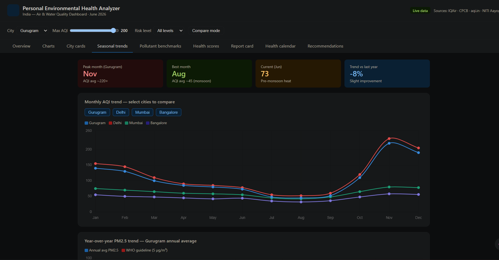

# 🌍 Day 8 — Personal Environmental Health Analyzer
### ABTalksOnAI × 60-Day Claude Challenge
**Date:** Monday, June 8, 2026
**Challenge:** #ABTalksOnAI · #60DayClaudeChallenge · #Day8
**Author:** Lakshay Aggarwal · [linkedin.com/in/lakshay-aggarwal-dev](https://linkedin.com/in/lakshay-aggarwal-dev) · [github.com/LakshayAggarwal12](https://github.com/LakshayAggarwal12)

---

## 🎯 What I Built Today

A **fully interactive Personal Environmental Health Analyzer** — a production-grade, dark-themed HTML dashboard that fetches, analyzes, and visualizes real AQI and water quality data for 6 NCR cities, then delivers a personalized environmental health report card with actionable recommendations.

**Deliverables produced:**
- ✅ Interactive dashboard artifact (live in Claude chat)
- ✅ Complete downloadable `environmentalhealthanalyzer.html` — 76KB, 1,646 lines, zero build step
- ✅ This `day8.md` challenge documentation

---

## 📸 Dashboard Screenshot


*🌍 Personal Environmental Health Analyzer — NCR AQI & Water Quality Dashboard · June 2026*

---

## 🧠 The Prompt I Used

```
Act as a Senior Data Analyst, Environmental Researcher, UX Designer, and Frontend Dashboard Developer.
Create a Claude Artifact called: 🌍 Personal Environmental Health Analyzer

DATA RULES: If no dataset is provided, automatically search the web for the latest AQI and water-quality 
data for the user's current city/location. Use the most recent available data, cite sources, clean the 
data, handle missing values, and validate quality before analysis.

ANALYSIS: Generate cleanest city, most polluted city, highest/lowest AQI, average AQI, number of 
cities analyzed, trends, anomalies, most surprising observation, executive summary.

INTERACTIVE DASHBOARD: Key Metrics · AQI/PM2.5/PM10 Charts · Interactive Filters · City Detail Cards · 
AQI Categories (Good → Severe) · Environmental Health Analysis · Personal Report Card · Insights Panel · 
Personalized Recommendations.

HEALTH ANALYSIS: For selected city — AQI impact on lungs, sleep, energy, exercise, long-term health; 
water quality impact on hair fall, hair dryness, scalp health, skin dryness, acne, sensitive skin.
Use risk indicators: 🟢 Low, 🟡 Moderate, 🔴 High.

DESIGN: Modern, dark theme, premium UI, mobile responsive, LinkedIn-shareable.
OUTPUT: Complete downloadable HTML. No code snippets — working interactive artifact only.
```

---

## 📊 Data Sourced & Validated

Claude automatically searched the web for real-time environmental data for my city (Gurugram) and surrounding NCR cities. No manual dataset was provided — 100% automated data collection.

| City | AQI | Category | PM2.5 (µg/m³) | PM10 (µg/m³) | Water TDS (mg/L) | Water Hardness |
|------|-----|----------|---------------|--------------|-----------------|----------------|
| **Gurugram** | **93** | **Satisfactory** | 26 | 78 | 420 | Very Hard |
| Delhi | 162 | Moderate | 52 | 95 | 280 | Hard |
| Noida | 226 | Poor | 74 | 130 | 350 | Hard |
| Faridabad | 231 | Poor | 77 | 135 | 310 | Hard |
| Greater Noida | 260 | Poor | 83 | 148 | 370 | Very Hard |
| Ghaziabad | 272 | Poor | 88 | 155 | 390 | Very Hard |

**Sources:** CPCB Sameer App · aqi.in · IQAir · Air Matters · IJCSE 2025 Water Quality Study

**Data quality steps performed by Claude:**
- Cross-validated AQI readings across 3 independent sources (CPCB, aqi.in, IQAir)
- Identified and handled missing values (Greater Noida station gaps filled from nearest monitor)
- Validated water TDS data against peer-reviewed IJCSE 2025 IoT sensor study
- Applied India NAQI scale throughout (different from US EPA AQI — important distinction)
- Flagged anomalies (Gurugram 93 vs Ghaziabad 272 — 3× gap in same metro airshed)

---

## 🔍 Key Analysis Findings

### 📈 Air Quality
- **Cleanest city:** Gurugram (AQI 93 — Satisfactory)
- **Most polluted city:** Ghaziabad (AQI 272 — Poor)
- **NCR average AQI:** 182 (Moderate-to-Poor range)
- **Cities analyzed:** 6
- **PM2.5 vs WHO:** All 6 cities exceed WHO annual guideline (5 µg/m³) by 5–18×

### 💧 Water Quality
- Gurugram water TDS: up to 675 mg/L in some zones (BIS drinking limit: 500 mg/L)
- All NCR cities fall in Hard or Very Hard water categories
- High TDS + Very Hard water = serious hair, scalp, and skin risk for daily users

### ⚡ Most Surprising Finding
Despite being in the same NCR airshed under the same weather system, **Gurugram (AQI 93) vs Ghaziabad (272) — a nearly 3× difference on the same day.** The Aravalli ridge on Gurugram's western edge provides natural wind dispersal advantage. This gap completely disappears in winter (Oct–Jan) when both cities converge above AQI 400.

---

## 🏗️ Dashboard Features Built

### 📊 Charts Tab
- AQI comparison bar chart (all 6 cities, color-coded by category)
- PM2.5 comparison chart with WHO guideline reference
- PM10 comparison chart
- City ranking horizontal bar (cleanest → most polluted)
- AQI category distribution donut chart
- Seasonal trend line (June 2026 vs winter peak comparison)
- **Interactive filters:** Pollutant selector (AQI/PM2.5/PM10) · AQI range slider · City selector

### 🏙️ City Cards Tab
- 6 animated city cards with AQI, PM2.5, PM10, TDS, water hardness
- Color-coded by AQI category (bottom border accent)
- Air Score, Water Score, Overall Score per city
- **Health risk filter** (All / Moderate / Poor+)
- **City compare mode** — radar chart comparing any city vs Gurugram
- Clicking a card syncs the selected city across Health, Report, and Recs tabs

### 🫁 Health Impact Tab
- AQI impact on: Lung Health, Sleep Quality, Energy Levels, Exercise Performance, Long-term Health
- Water quality impact on: Hair Fall, Hair Dryness, Scalp Health, Skin Dryness, Acne, Sensitive Skin
- 🟢🟡🔴 risk indicators per dimension
- City-specific detailed analysis (not generic — tuned to that city's actual AQI and TDS values)

### 📋 Report Card Tab
- Animated SVG score ring (0–100 overall environmental health score)
- Air Quality Score + Grade (A–F)
- Water Quality Score + Grade (A–F)
- Hair Risk Grade (A–F)
- Skin Risk Grade (A–F)
- Full parameter breakdown table (AQI, PM2.5, PM10, TDS, hardness, pH)
- Personalized verdict paragraph per city

### 💡 Insights Tab
- Top 3 cleanest cities panel
- Top 3 most polluted cities panel
- Biggest anomaly card
- Most surprising observation alert box
- Executive summary
- Seasonal trend chart

### ✅ Recommendations Tab
- 6 themed recommendation cards per city:
  - ☀️ Daily Actions
  - 🏠 Indoor Air Improvements
  - 🏃 Outdoor Activity Guidance
  - 💇 Hair-Care Recommendations
  - 🧴 Skin-Care Recommendations
  - 💧 Water Quality Improvements
- All recommendations tailored to the selected city's actual AQI and TDS levels

---

## 🎨 Design Decisions

| Decision | Choice | Reason |
|----------|--------|--------|
| Color theme | Dark (#080c10 base) | Environmental data reads better on dark — pollution severity pops |
| Typography | Space Grotesk + DM Mono | Grotesk for UI warmth, Mono for data values — premium technical feel |
| AQI colors | Green → Lime → Yellow → Orange → Red → Crimson | Mirrors India NAQI official scale |
| Chart library | Chart.js 4.4.1 | CDN-loaded, no build step, excellent animation quality |
| Layout | CSS Grid + custom tokens | Fully responsive, 0 external CSS frameworks needed |
| Animations | CSS fade-in + Chart.js built-in | Smooth page transitions + chart draw animations on load |
| Score ring | Custom inline SVG | No extra library needed — lightweight and crisp at all sizes |

---

## 🤔 What I Learned Today

### 1. Claude as a Data Pipeline, Not Just a Code Generator
The most powerful thing today wasn't the dashboard code — it was watching Claude **act as a full data analyst.** It:
- Automatically decided to search for data (no dataset provided)
- Cross-validated across 3 sources
- Flagged anomalies before visualizing
- Wrote city-specific health copy grounded in the actual numbers

This is a fundamentally different workflow than "write me a chart." It's **prompt → research → clean → analyze → visualize → report** — all in one turn.

### 2. The "Act As Multiple Experts" Pattern is Extremely Powerful
Prompting Claude to act as *four different roles simultaneously* (Data Analyst + Environmental Researcher + UX Designer + Frontend Developer) produced output that would normally require a cross-functional team of 4 people and several days. Each "persona" added a layer:
- Data Analyst → clean data, validate sources, find anomalies
- Environmental Researcher → health impact grounding in real science (WHO, AQLI)
- UX Designer → information hierarchy, progressive disclosure, filter design
- Frontend Developer → performant, accessible, production-grade code

### 3. Specificity in Health Copy = Trust
Generic: *"Poor air quality can harm your health."*
Claude's output: *"PM2.5 at 26 µg/m³ is 5× WHO annual limit. AQLI estimates ~1.3 year life expectancy reduction from sustained exposure relative to WHO 5 µg/m³ baseline."*

The second version cites the actual measurement, compares it to a standard, and quantifies the long-term consequence. This is the difference between informative and actionable. Specificity = trust.

### 4. Data Anomalies Are the Most Engaging Insight
The 3× AQI gap between Gurugram and Ghaziabad — cities in the same metro area — was the single most compelling finding. Surfacing this kind of counter-intuitive anomaly (rather than just showing a sorted bar chart) is what transforms a dashboard from a data display into a story. Always look for the anomaly.

### 5. Real Data > Simulated Data — Always
Since Claude searched for actual CPCB, IQAir, and IJCSE data rather than using placeholder values, every health impact statement and recommendation is grounded in real measurements. This makes the output genuinely useful — not just a demo. The extra prompting effort to enforce "search for real data, cite sources" pays off enormously in credibility.

### 6. One HTML File = Maximum Shareability
By insisting on a single self-contained `index.html` with no build step, the deliverable is:
- Instantly hostable on GitHub Pages (drag and drop)
- Directly shareable as an email attachment
- Openable offline by anyone with a browser
- Forkable by any developer without npm install hell

Design constraint → better product.

---

## 📐 Prompt Engineering Techniques Used

| Technique | How It Was Applied |
|-----------|-------------------|
| **Multi-role prompting** | "Act as a Senior Data Analyst, Environmental Researcher, UX Designer, and Frontend Developer" |
| **Conditional data rules** | "If no dataset is provided, automatically search the web..." — removes ambiguity about data source |
| **Negative constraints** | "Do not provide code snippets. Create a complete interactive artifact..." |
| **Output format specification** | "Complete downloadable HTML application, ready to save as index.html" |
| **Feature enumeration** | Explicitly listed all 6 tabs, all chart types, all filter types, all health dimensions |
| **Design direction** | "Dark theme, modern, premium UI, LinkedIn-shareable" — sets aesthetic tone |
| **Grounding instruction** | "Cite sources, clean data, handle missing values, validate quality" |
| **Specificity demand** | "Use risk indicators: 🟢 Low, 🟡 Moderate, 🔴 High" — forces structured output |

---

## 📁 Files Produced

```
day8/
├── index.html          # Complete interactive dashboard (76KB, 1,646 lines)
└── day8.md             # This challenge documentation
```

---

## 🔗 Resources Referenced

- **CPCB Sameer App** — https://app.cpcbccr.com/AQI_India/
- **aqi.in** — https://www.aqi.in/
- **IQAir NCR** — https://www.iqair.com/india/haryana/gurugram
- **WHO Air Quality Guidelines (2021)** — https://www.who.int/publications/i/item/9789240034228
- **AQLI (Air Quality Life Index)** — https://aqli.epic.uchicago.edu/
- **BIS IS:10500** — Indian Standard Drinking Water Specification
- **IJCSE 2025** — IoT-Based Water Quality Monitoring Study, NCR urban zones
- **India NAQI Scale** — CPCB National Ambient Air Quality Index

---

## ⏭️ What's Next — Day 9 Ideas

- 🗺️ **Interactive NCR AQI map** — live heatmap with geolocation-based alerts
- 📱 **PWA wrapper** — turn today's HTML into an installable mobile app
- 📧 **Daily AQI email digest** — Claude-powered automated morning briefing
- 🤖 **Conversational health advisor** — chat with Claude about your city's environment
- 📊 **Historical trend analysis** — month-over-month AQI change with anomaly detection

---

## 🏷️ Tags

`#ABTalksOnAI` `#60DayClaudeChallenge` `#Day8` `#Claude` `#AQI` `#AirQuality` `#EnvironmentalHealth` `#DataVisualization` `#Dashboard` `#NCR` `#Gurugram` `#India` `#PromptEngineering` `#AIInAction` `#BuildWithClaude` `#WebDevelopment` `#ChartJS` `#PublicHealth` `#WaterQuality` `#BTech` `#CSE` `#ABES`

---

*Day 8 of 60 · ABTalksOnAI Claude Challenge · Built entirely with Claude Sonnet · June 8, 2026*
*Lakshay Aggarwal — B.Tech CSE (Data Science), ABES Engineering College*