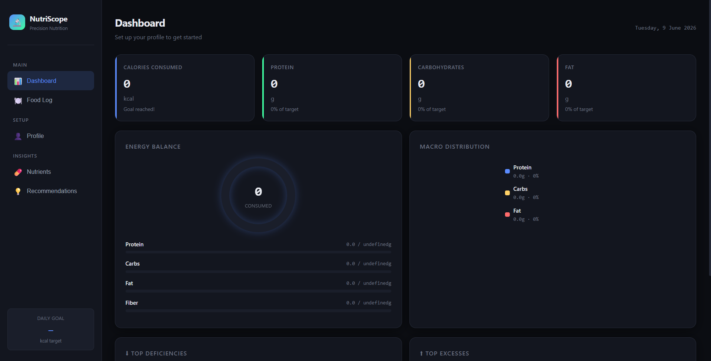
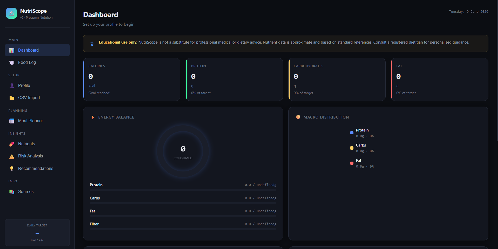

# Day 9 — NutriScope: Building a Full-Stack Nutrition Intelligence App with Iterative AI Development

> **ABTalksOnAI · 60-Day Claude AI Challenge**
> 📅 Day 9 of 60 | 🔗 [linkedin.com/in/lakshay-aggarwal-dev](https://linkedin.com/in/lakshay-aggarwal-dev) | 💻 [github.com/LakshayAggarwal12](https://github.com/LakshayAggarwal12)

---

## 📌 What We Built Today

**NutriScope** — a complete, single-file browser-based nutrition tracking and intelligence application, built entirely with Claude using a two-prompt iterative development workflow.

| Version | Prompts Used | Foods | Nutrients | Features |
|---------|-------------|-------|-----------|----------|
| v1 (MVP) | Prompt 1 | 20 | 10 | Profile, Log, Dashboard, Charts, Recs |
| v2 (Enhanced) | Prompt 2 | 60 | 14 | + CSV Import, Meal Planner, Risk Analysis, Sources, Better Charts |

**Final deliverable:** `NutriScope.html` — ~1,480 lines, ~100KB, zero backend, zero dependencies except Chart.js CDN.

---

## 🎯 What We Learned Today

### The Core Lesson: MVP-First, Then Iterate

One of the biggest mistakes beginners make is asking AI to build extremely large applications in a single prompt. Professional AI builders use **iterative development**: first build a working MVP, then progressively enhance it. This improves reliability, quality, and output consistency.

| Principle | What It Means in Practice |
|-----------|--------------------------|
| **MVP First** | Generate a working version before adding complexity. A focused prompt produces reliable, testable output. |
| **Iterative Development** | Each subsequent prompt builds on a stable base — you never start from scratch after feedback. |
| **Claude Artifacts** | Claude can generate real, interactive single-file HTML applications that run directly in a browser. |
| **AI Product Building** | Structure your build the same way experienced builders do: requirements → prototype → enhance → polish. |

---

## 🔨 Prompts Used

### Prompt 1 — Build MVP

```
Build a complete single-file HTML application called NutriScope.
Requirements:
Profile Inputs: Age, gender, Height, Weight, Activity Level, Dietary Preference
  (Vegetarian, Non-Vegetarian, Eggetarian).
Food Logging: Add Food, Quantity, Unit, Editable Table, Remove Entry.
Food Database: Include 20 common foods only:
  Rice, Roti, Dal, Paneer, Curd, Chana, Rajma, Banana, Apple, Milk, Oats,
  Bread, Egg, Chicken, Fish, Potato, Poha, Idli, Dosa, Spinach.
Track: Calories, Protein, Carbs, Fat, Fiber, Iron, Calcium, Vitamin C,
  Vitamin D, Vitamin B12.
Calculations: Energy, Macro Targets, Micronutrient Targets, Percentage Completion.
Dashboard: Energy Progress, Macro Chart, Top Deficiencies, Top Excesses,
  Nutrient Table.
Recommendations: Food additions, food swaps, portion adjustments based on
  dietary preference.
Design: Premium SaaS UI, Mobile Responsive, Chart.js, Dark Theme, Modern Cards,
  No Backend, Single HTML File.
Return only the complete HTML code.
```

**Result:** A fully working MVP with 5 pages (Dashboard, Food Log, Profile, Nutrients, Recommendations), Chart.js doughnut and energy ring charts, sidebar navigation, and responsive layout. ~1,200 lines of HTML/CSS/JS.

---

### Prompt 2 — Enhance Application

```
Enhance the existing NutriScope application.
Add:
CSV Upload, 40 more foods, Additional micronutrients, 2-day meal planner,
Risk Analysis, Educational Disclaimer, Nutrition Sources, Better Charts,
Advanced Recommendations.
Return the updated HTML only.
```

**Result:** All 9 enhancements integrated cleanly on top of the stable MVP base. Zero regressions. ~1,480 lines.

---

## 🏗️ Architecture Breakdown

### Why Single-File HTML?

- **Portability:** Send one file, it runs everywhere
- **No build step:** Open in browser, it just works
- **Shareable:** Upload to GitHub, share as artifact, attach to email
- **Demonstrable:** Ideal for challenge documentation and LinkedIn posts

### Data Layer (No Backend)

```
localStorage keys:
  ns_profile2  → JSON profile object
  ns_log2      → Array of food log entries
  ns_plan      → Generated meal plan object
```

### Food Database Structure (per 100g)

```javascript
"Food Name": {
  cal, prot, carbs, fat, fiber,       // Macros
  iron, cal_min, vitC, vitD, b12,     // Original micros
  zinc, potassium, magnesium, folate, sodium,  // NEW in v2
  diet: ['veg','egg','nonveg'],        // Diet compatibility
  serving: 100                         // Default serving size (g)
}
```

### Calorie Calculation Engine

```
BMR (Mifflin-St Jeor):
  Male:   10×weight + 6.25×height − 5×age + 5
  Female: 10×weight + 6.25×height − 5×age − 161

TDEE = BMR × PAL
  Sedentary:    1.20
  Light:        1.375
  Moderate:     1.55
  Active:       1.725
  Extra Active: 1.90

Goal Adjustment:
  Lose:    TDEE − 300 kcal
  Gain:    TDEE + 250 kcal
  Maintain: TDEE (no change)
```

---

## ✨ Feature Deep-Dive

### v1 MVP Features

#### 1. Profile & Target Calculation
- Mifflin-St Jeor BMR + PAL multiplier for TDEE
- BMI with category label (Underweight / Normal / Overweight / Obese)
- Auto-computed daily targets: Calories, Protein (1.2×kg), Carbs (50% kcal), Fat (28% kcal), Fiber (30g), and all tracked micronutrients

#### 2. Food Log
- Dropdown of all database foods (sorted alphabetically in v2)
- Quantity + unit input (g, ml, serving, piece, cup, tbsp)
- Inline editable table — change qty/unit, grams recalculate live
- Per-row calorie/macro summary
- LocalStorage persistence across sessions

#### 3. Dashboard
- **Energy Ring** — animated Chart.js doughnut showing consumed vs. target; turns red at 100%
- **Macro Donut** — live macro distribution (Protein/Carbs/Fat as % of total kcal)
- **4 Stat Cards** — Calories, Protein, Carbs, Fat with % of target
- **4 Progress Bars** — Protein, Carbs, Fat, Fiber with color-coded status
- **Top Deficiencies / Excesses** — ranked insight panels

#### 4. Nutrients Page
- Separate macro and micronutrient bar lists
- Status badges: Low / Below RDA / Optimal / Excess
- Full nutrient table with consumed, RDA, % achieved, status

#### 5. Basic Recommendations
- Diet-aware (vegetarian / eggetarian / non-veg)
- Logic rules for 8 key nutrients
- Add Food, Swap, Portion Adjust categories

---

### v2 Enhancements

#### 6. 40 New Foods (60 total)
New categories added: lentils (Moong Dal, Masoor Dal), soy products (Soybean, Tofu), nuts & seeds (Almonds, Walnuts, Peanuts, Sunflower Seeds, Flaxseeds, Sesame), vegetables (Broccoli, Carrot, Tomato, Onion, Cauliflower, Bhindi, Methi, Palak), fruits (Orange, Mango, Papaya, Guava, Pomegranate, Amla), grains (Brown Rice, Quinoa, Upma), Indian dishes (Khichdi, Sambar, Cheela, Dhokla), meats (Mutton, Prawn, Fish Curry, Chicken Curry, Egg Scrambled), and fats/liquids (Butter, Ghee, Coconut Oil, Coconut Milk, Buttermilk, Green Tea, Sprouts).

#### 7. 4 Additional Micronutrients
| Nutrient | RDA (M/F) | Best Food Sources in DB |
|----------|-----------|------------------------|
| Zinc | 11mg / 8mg | Sesame (7.8mg), Sunflower Seeds (5mg), Mutton (4.8mg) |
| Potassium | 3500mg | Methi (770mg), Spinach (466mg), Rajma (405mg) |
| Magnesium | 400mg / 310mg | Flaxseeds (392mg), Sesame (351mg), Almonds (270mg) |
| Folate (B9) | 400µg | Spinach (194µg), Sunflower Seeds (227µg), Moong Dal (159µg) |

#### 8. CSV Import
- Drag-and-drop zone or file picker
- Auto-detects header row
- Validates food names against database, flags unmatched rows
- Preview table with calorie preview before import
- Downloadable blank template + sample CSV

**Expected CSV format:**
```csv
food,quantity,unit
Rice (cooked),150,g
Dal (toor cooked),180,g
Banana,1,piece
Milk (whole),1,cup
```

#### 9. 2-Day Meal Planner
- Diet-aware templates (vegetarian / eggetarian / non-veg)
- 5 meal slots: Breakfast, Mid-Morning, Lunch, Evening Snack, Dinner
- Per-meal calorie and protein display
- Nutritional summary card (Cal, Protein, Carbs, Fat) per day
- "Load Day 1 to Log" — one click populates the food log

#### 10. Risk Analysis Engine
| Risk Flag | Threshold | Severity |
|-----------|-----------|----------|
| Iron deficiency | <40% RDA | 🔴 High |
| Calcium deficiency | <40% RDA | 🔴 High |
| Protein deficiency | <50% RDA | 🔴 High |
| Vitamin D deficiency | <30% RDA | 🔴 High |
| B12 deficiency | <30% RDA | 🔴 High |
| Caloric surplus | >130% target | 🔴 High |
| Sodium excess | >150% WHO limit | 🔴 High |
| Low fiber | <40% RDA | 🟡 Medium |
| Low folate | <40% RDA | 🟡 Medium |
| Elevated sodium | >120% | 🟡 Medium |

**Health Score (0–100):** Weighted composite of 9 nutrient categories. Displayed with a donut chart, color-coded Green / Yellow / Red.

#### 11. Better Charts (4 chart types total)
| Chart | Library | Purpose |
|-------|---------|---------|
| Energy Ring Donut | Chart.js | Calories consumed vs. TDEE target |
| Macro Distribution Donut | Chart.js | Protein/Carbs/Fat as % of kcal |
| Micronutrient Radar | Chart.js | 8 micros vs. 100% RDA target |
| Calorie Sources Bar | Chart.js | Top 8 foods by kcal (horizontal) |
| Nutrient Comparison Bar | Chart.js | All nutrients vs. RDA with reference line |
| Health Score Donut | Chart.js | Risk analysis score visualisation |

#### 12. Advanced Recommendations
- Sorted by priority (High → Medium → Low)
- Extended to cover Zinc, Magnesium, Folate, Sodium excess, Folate
- Specific gram quantities cited (e.g., "50g Amla = 300mg Vit C")
- Supplement guidance for B12 (cyanocobalamin dose mentioned)
- Swap suggestions with nutritional rationale

#### 13. Educational Disclaimer
- Persistent banner on Dashboard and Recommendations pages
- Full Sources page: ICMR-NIN 2020, USDA FoodData Central, WHO, NVIF, Mifflin-St Jeor (1990) with DOI, FAO/WHO/UNU 2004
- Nutrition Literacy cards on Risk page (micronutrients, TDEE, sodium, fiber)

---

## 📊 Comparison: v1 MVP vs. v2 Enhanced

| Feature | v1 MVP | v2 Enhanced |
|---------|--------|-------------|
| Foods in database | 20 | 60 |
| Tracked nutrients | 10 | 14 |
| Pages / sections | 5 | 9 |
| Charts | 2 | 6 |
| Health goal setting | ❌ | ✅ (lose/maintain/gain) |
| CSV import | ❌ | ✅ (drag & drop + preview) |
| Meal planner | ❌ | ✅ (2-day, diet-aware) |
| Risk analysis | ❌ | ✅ (10 risk flags + health score) |
| Educational disclaimer | ❌ | ✅ (5 science sources cited) |
| Nutrient notes/tips | ❌ | ✅ (inline per nutrient) |
| Recommendation priority | ❌ | ✅ (High / Medium / Low) |
| File size (approx.) | ~48KB | ~100KB |
| Lines of code | ~1,200 | ~1,480 |

---

## 💡 Key Design Decisions

### Why dark theme?
Dark UI reduces visual fatigue for health/fitness tools used throughout the day. The `#0b0d12` base with `#13161f` card surfaces creates clear visual hierarchy without pure black.

### Why `localStorage` instead of a backend?
- Zero infrastructure cost
- Instantly shareable as a single file
- Works offline
- No privacy concerns (data stays on device)
- Perfect for an educational/challenge context

### Why Mifflin-St Jeor over Harris-Benedict?
Mifflin-St Jeor (1990) is validated as more accurate for diverse modern populations across multiple studies. Harris-Benedict (1918) tends to overestimate by 5–15%.

### Why Indian food database?
Generic global databases miss critical Indian staples. Values for Idli, Poha, Dosa, Dal varieties, and Roti are sourced from ICMR-NIN's *Nutritive Value of Indian Foods* — the gold standard for Indian nutrition data.

### Why single-file HTML?
For challenge documentation purposes, single-file deliverables are maximally portable — shareable on LinkedIn, uploadable to GitHub, attached to emails, and viewable without a server.

---

## 🔑 Prompt Engineering Patterns Used

### Pattern 1: Role + Output Format Specification
```
"Return only the complete HTML code."
```
This prevents Claude from adding explanatory text before or after the code block, ensuring clean parseable output.

### Pattern 2: Explicit Constraint Listing
```
"No Backend, Single HTML File"
```
Constraints are listed as a flat checklist at the end of the requirements, making them easy for the model to scan and adhere to.

### Pattern 3: Categorical Feature Grouping
Requirements grouped into logical sections (Profile Inputs, Food Logging, Food Database, Track, Calculations, Dashboard, Recommendations, Design) mirror how a real product spec is written — which aligns with how Claude was trained on technical documentation.

### Pattern 4: Iterative Enhancement Prompt
```
"Enhance the existing NutriScope application. Add: [list]"
```
Instead of rewriting the full spec, the second prompt references the existing application and lists additions only. This keeps Claude anchored to the working MVP and prevents regression.

### Pattern 5: Specificity over Vagueness
❌ Vague: *"Add more foods"*
✅ Specific: *"40 more foods"*

❌ Vague: *"Better charts"*
✅ Specific: *"Better Charts, Advanced Recommendations"*

Specificity in enhancement prompts determines the depth of output.

---

## 📚 Data Sources Referenced in NutriScope

| Source | Usage |
|--------|-------|
| ICMR–NIN (2020) | Primary RDA values for Indian population |
| NVIF (Nutritive Value of Indian Foods) | Composition data for Indian dishes |
| USDA FoodData Central | Macro/micro values for non-Indian foods |
| WHO Nutrient Requirements | Vitamin D, B12, trace mineral RDAs |
| Mifflin et al. (1990) | BMR equation (DOI: 10.1093/ajcn/51.2.241) |
| FAO/WHO/UNU (2004) | Physical Activity Level (PAL) multipliers |

---

## 🚀 How to Run NutriScope

1. Download `NutriScope.html`
2. Open in any modern browser (Chrome, Firefox, Edge, Safari)
3. Navigate to **Profile** → fill in your details → **Save Profile**
4. Go to **Food Log** → add your meals
5. Visit **Dashboard** for live analysis
6. Check **Risk Analysis** and **Recommendations** for insights

**No installation. No server. No dependencies to install. Just open.**

---

## 📸 Screenshots

### version - 1


### version - 2 


---

## 🗂️ Files for This Day

| File | Description |
|------|-------------|
| `NutriScope.html` | Complete application (v2, final) |
| `day9.md` | This documentation file |


---

*Built as part of the ABTalksOnAI 60-Day Claude AI Challenge.*
*Day 9 of 60 — Iterative AI Product Development.*