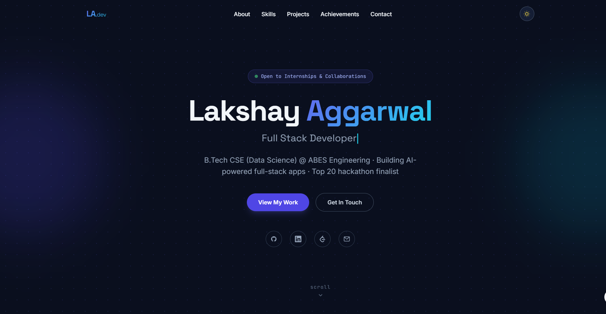
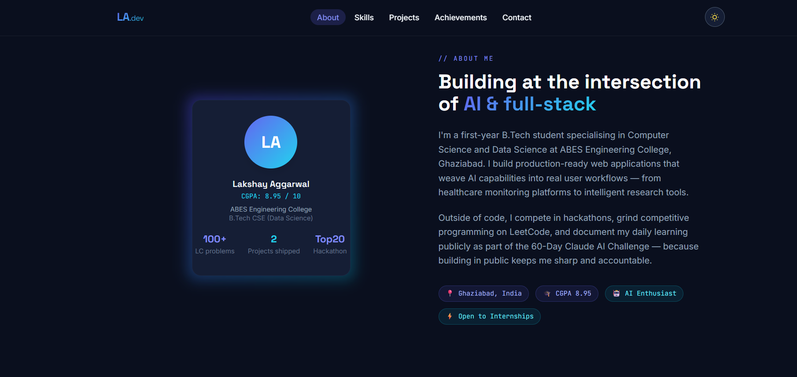
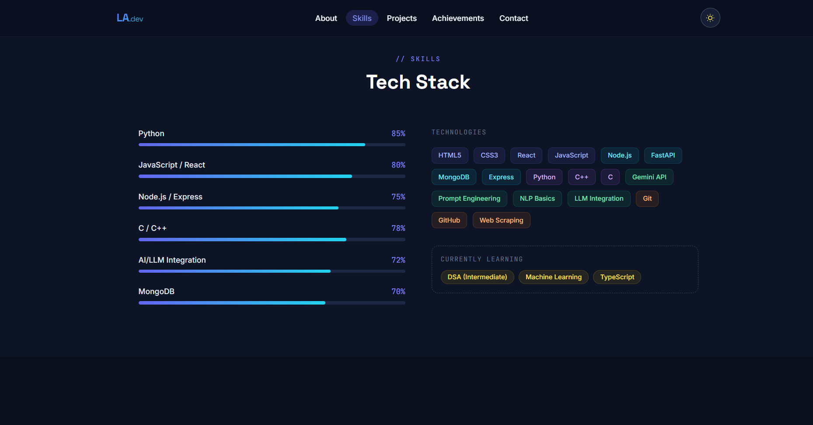
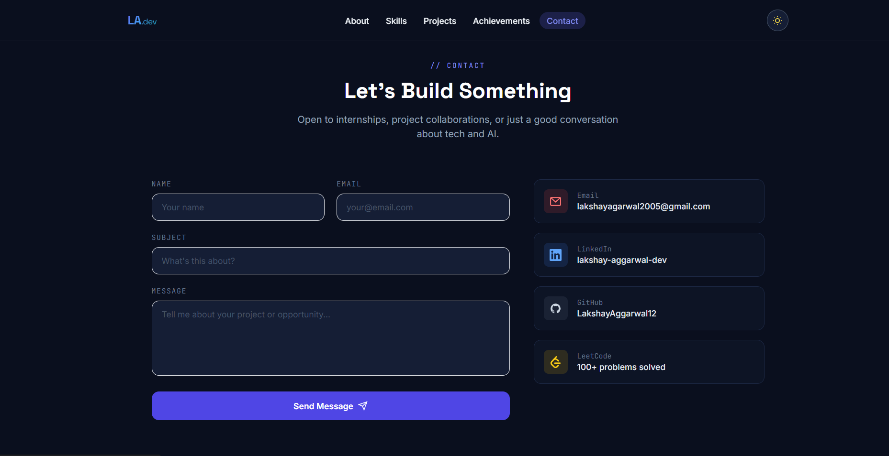

# Day 10 — Personal Portfolio Website
**ABTalksOnAI · 60-Day Claude Challenge**
**Date:** June 10, 2026
**Challenge:** Build a complete personal portfolio website using Claude as a full-stack developer + UX designer

---

## 📌 What I Built

A fully responsive, single-file personal portfolio website — extracted directly from my resume by Claude — featuring dark/light mode, smooth scroll animations, a typing hero, animated skill bars, project cards, achievements timeline, and a working contact form. Zero dependencies, zero build step. Just one HTML file.

**Live at:** `[your-github-username].github.io/portfolio` *(deploy to update)*
**File:** `lakshay-portfolio.html` — single file, open in any browser

---

## 🖼️ Screenshots

### Hero Section
> *Screenshot placeholder — paste your screenshot here*

```
[ HERO SCREENSHOT ]
Name + typing animation + CTA buttons + social icons
```

---

### About Me Section
> *Screenshot placeholder — paste your screenshot here*

```
[ ABOUT SCREENSHOT ]
Avatar card with CGPA/stats + bio paragraphs + chips
```

---

### Skills Section
> *Screenshot placeholder — paste your screenshot here*

```
[ SKILLS SCREENSHOT ]
Animated progress bars + colour-coded tech tag cloud
```

---

### Projects Section
> *Screenshot placeholder — paste your screenshot here*

```
[ PROJECTS SCREENSHOT ]
Nano-Nanny card + AI Research Agent card + WIP card
```

---

### Achievements Section
> *Screenshot placeholder — paste your screenshot here*

```
[ ACHIEVEMENTS SCREENSHOT ]
IBM internship · HCL-GUVI Top 20 · CGPA · LeetCode · 60-Day Challenge
```

---

### Contact Section
> *Screenshot placeholder — paste your screenshot here*

```
[ CONTACT SCREENSHOT ]
Form + direct links (Email / LinkedIn / GitHub / LeetCode)
```

---

### Dark / Light Mode Toggle
> *Screenshot placeholder — paste both side by side*

```
[ DARK MODE ]                    [ LIGHT MODE ]
```

---

## 🧠 The Prompt I Used

```
You are an expert full-stack web developer and personal branding designer.
Build a complete, modern, single-file personal portfolio website using
HTML, Tailwind CSS (CDN), and vanilla JavaScript for this person:

=== PERSONAL INFO ===
Name: Lakshay Aggarwal
Title: Full Stack Web Developer
Location: Ghaziabad, India
Email: lakshayagarwal2005@gmail.com
LinkedIn: https://www.linkedin.com/in/lakshay-aggarwal-dev
GitHub: LakshayAggarwal12

=== DESIGN PREFERENCES ===
Mode: Dark/Light toggle
Style: Modern, minimal, premium
Colors: Purple + Teal (Indigo + Cyan)
Font: Clean sans-serif display font

=== REQUIREMENTS ===
- Hero (name, title, typing animation, social links)
- About Me
- Skills (animated bars + tech tags)
- Projects (cards with tech tags)
- Achievements & Certifications
- Contact (form + direct links)
- Dark/Light mode toggle
- Mobile responsive
- Smooth scroll animations
- Active nav highlighting
- Single HTML file, no build step
- Tailwind via CDN
- SEO meta tags included

If a resume is uploaded, extract details automatically.
```

**Claude Roles Assigned:** Full Stack Developer + UX Designer + Personal Branding Expert

---

## ⚙️ Technical Architecture

### Stack
| Layer | Technology |
|---|---|
| Markup | HTML5 (semantic) |
| Styling | Tailwind CSS via CDN + custom CSS |
| Logic | Vanilla JavaScript (ES6) |
| Fonts | Space Grotesk + Inter + JetBrains Mono (Google Fonts) |
| Icons | Inline SVG (zero external icon library) |
| Deployment | Any static host — GitHub Pages, Vercel, Netlify |

### File Structure
```
lakshay-portfolio.html          ← entire site in one file (~1000 lines)
  ├── <head>                    Tailwind config + Google Fonts + SEO meta
  ├── <style>                   Custom CSS (animations, dot-grid, reveal)
  ├── Navbar                    Fixed, scroll-aware, dark/light toggle
  ├── #hero                     Typing animation + social links + CTA
  ├── #about                    Avatar card + bio + chips
  ├── #skills                   Animated bars + tech tag cloud
  ├── #projects                 Glow cards with tech tags + links
  ├── #achievements             Achievement cards (span-2 for highlight)
  ├── #contact                  Form + direct links
  ├── Footer
  └── <script>                  Theme · Typing · Scroll Reveal · Skill bars · Nav
```

### Key Sections Breakdown

**Hero**
- Typing animation cycles through 5 roles (Full Stack Developer, AI Integration Engineer, etc.)
- Blinking cyan cursor via CSS `::after` pseudo-element
- Dot-grid SVG background with indigo/cyan ambient glow blobs
- Terminal-style "Open to Internships" badge with pulsing green dot

**Skills**
- Animated progress bars triggered by `IntersectionObserver` — only animate when scrolled into view
- Tech tags colour-coded by category: Frontend (indigo), Backend (cyan), Languages (purple), AI (emerald), Tools (orange)
- "Currently Learning" section with dashed border

**Scroll Reveal**
- Every section uses `.reveal` class → `opacity:0; transform:translateY(28px)`
- `IntersectionObserver` adds `.visible` class when element enters viewport
- `transition-delay` staggered on cards for cascade effect

**Dark/Light Mode**
- `localStorage` persistence — preference survives page reloads
- `document.documentElement.classList.toggle('dark')` — Tailwind's `darkMode: 'class'`
- Sun/moon icon swap on toggle

**Active Nav Highlighting**
- Separate `IntersectionObserver` with `rootMargin: '-40% 0px -55% 0px'`
- Adds `.active` class (indigo pill background) to the nav link matching the current section

---

## 💡 What I Learned Today

### 1. Resume → Portfolio in One Prompt
Uploading the PDF and describing design preferences was enough for Claude to extract every relevant detail — name, CGPA, skills, projects, achievements, internship — and weave them into recruiter-friendly copy. No manual copy-pasting required.

### 2. Tailwind CDN JIT Has a Blind Spot
The CDN version of Tailwind uses JIT (Just-in-Time) compilation, but it can only scan the file it's loaded in. Custom colour classes like `navy-900` defined in `tailwind.config` only work reliably when used directly in the HTML — not generated dynamically via JavaScript strings. This caused the entire multi-file version to break visually (blank page). Solution: use inline CSS styles or CSS custom properties for any dynamically injected content.

### 3. Single-File Portability vs. Multi-File Maintainability
- **Single file** = instant portability, works by double-clicking, easy to share, deploy anywhere
- **Multi-file** = better separation of concerns, easier to edit one section without touching others, scales as a codebase
- For a portfolio at this size, single-file wins on simplicity. Multi-file wins if you're adding a blog, CMS, or new sections regularly.

### 4. IntersectionObserver Is Powerful for Performance
Instead of `window.addEventListener('scroll', ...)` (which fires hundreds of times per second), `IntersectionObserver` fires only when an element actually enters or exits the viewport. Used here for: scroll reveal animations, skill bar triggers, and active nav highlighting — all performant with zero janky frame drops.

### 5. CSS Custom Properties > Tailwind for Dynamic Theming
Defining `--indigo: #6366F1` and `--navy-900: #0A0F1E` as CSS variables gave full control over dark/light mode without depending on Tailwind's class generation pipeline. Inline styles referencing `var(--indigo)` always work, regardless of whether Tailwind has JIT'd that class or not.

### 6. Prompt Engineering for UI: Role Framing Works
Framing Claude as "expert full-stack web developer AND personal branding designer" produced noticeably more intentional design decisions — font pairing (Space Grotesk + Inter + JetBrains Mono), the terminal-style badge, dot-grid background, colour-coded tag categories — compared to a prompt that just asks for "a portfolio website."

### 7. SEO Is Free and Takes 10 Lines
Adding Open Graph tags (`og:title`, `og:description`, `og:type`), Twitter Card meta, `meta[name=description]`, `meta[name=keywords]`, and `meta[name=robots]` costs nothing but is critical for how the portfolio link appears when shared on LinkedIn, WhatsApp, or indexed by Google.

---

## 🎨 Design Decisions

| Decision | Reasoning |
|---|---|
| Space Grotesk for headings | Geometric, modern, stands out from default system fonts — conveys technical confidence |
| JetBrains Mono for labels | Section eyebrows and stats look like code annotations — reinforces "developer" identity |
| Indigo + Cyan palette | Indigo = structured/serious (backend/logic), Cyan = creative/fluid (UI/AI) — matches the full-stack + AI positioning |
| Dot-grid background | Subtle engineering graph-paper feel — used in many premium dev tool UIs (Vercel, Linear, Raycast) |
| Glow cards on hover | Depth and focus without heavy shadows — common in modern dark-mode UIs |
| Terminal badge in hero | Immediately signals: this is a developer, not a generic portfolio |
| Staggered card animations | Cascade effect makes the section feel alive and intentional, not all-at-once |

---

## 📊 Stats

| Metric | Value |
|---|---|
| Total file size | ~42 KB (unminified) |
| Lines of code | ~1000 |
| Sections | 6 (Hero, About, Skills, Projects, Achievements, Contact) |
| External dependencies | 2 (Tailwind CDN + Google Fonts) |
| Build step required | ❌ None |
| Mobile responsive | ✅ Yes |
| Dark/light mode | ✅ Yes (persisted) |
| SEO meta tags | ✅ Yes |
| Time to build with Claude | ~15 minutes |

---

## Screenshots:









---

*Day 10 of 60 — ABTalksOnAI Claude Challenge*
*Built with Claude Sonnet · Documented by Lakshay Aggarwal*