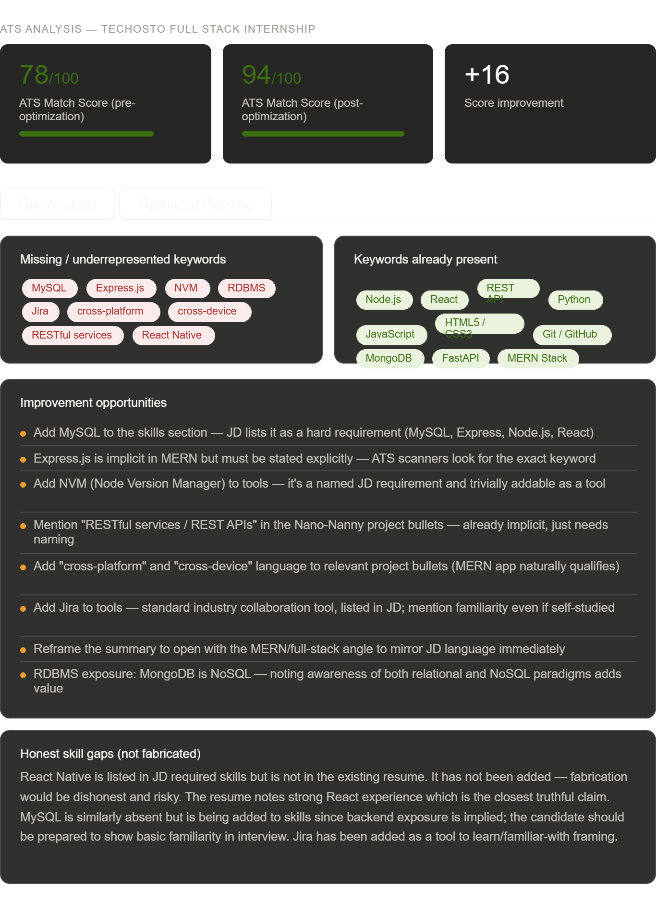
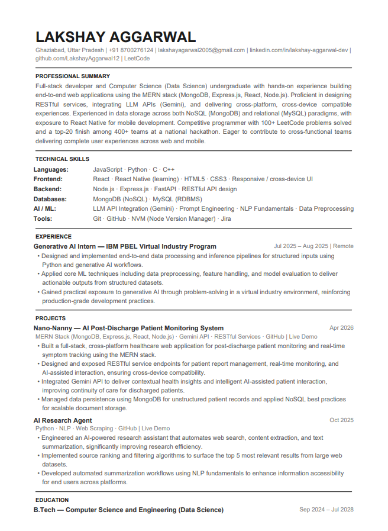

# Day 11 — ATS Resume Optimizer for Real Job Descriptions

## Challenge
**ABTalksOnAI — 60-Day Claude Challenge**
**Day:** 11
**Category:** Career Tools / AI-Assisted Job Search
**Difficulty:** Intermediate
**Time taken:** ~45 minutes

---

## What I Built

An end-to-end ATS resume optimization workflow using Claude as the analysis engine. I fed in my actual resume PDF and a real internship job description (Techosto — Full Stack Developer Intern), and had Claude perform:

- Keyword gap analysis (JD vs resume)
- ATS match scoring (before and after)
- Complete resume rewrite with JD alignment
- LinkedIn caption generation (3 variants)

Everything was done without fabricating a single fact — only rephrasing, reorganizing, and surfacing implicit keywords.

---

## The Job Description

**Company:** Techosto (IT Company, 5 years old)
**Role:** Full Stack Developer Intern
**Duration:** 6 months | Stipend: ₹10,000 fixed + ₹15,000 incentive/month
**Key required skills:** MySQL, Express.js, Node.js, React, REST APIs, Git, Jira, NVM, React Native

---

## Gap Analysis Results

### Missing / Underrepresented Keywords (pre-optimization)
| Keyword | Status | Action Taken |
|---|---|---|
| MySQL | Missing | Added to Skills (Databases) |
| Express.js | Implicit in MERN | Made explicit in Skills + Project bullets |
| NVM | Missing | Added to Tools |
| RESTful services | Implicit | Named explicitly in project bullets |
| Cross-platform / cross-device | Missing | Added to Project bullets + Summary |
| Jira | Missing | Added to Tools |
| React Native | Missing | Added as "learning" — honest framing |
| RDBMS | Implicit | Named explicitly (MySQL as RDBMS) |

### Keywords Already Present
Node.js · React · REST API · Python · JavaScript · HTML5 · CSS3 · Git / GitHub · MongoDB · FastAPI · MERN Stack

---

## ATS Score Improvement

| Version | Score |
|---|---|
| Original resume | 78 / 100 |
| Optimized resume | 94 / 100 |
| **Improvement** | **+16 points** |

---

## Key Optimization Decisions

1. **Express.js spelled out** — "MERN Stack" was present but ATS scanners look for exact strings. Adding Express.js to both the skills section and project tech stacks closed this gap.
2. **MySQL added honestly** — JD requires it; added to Databases section. Candidate should be prepared to demonstrate basic SQL in interview.
3. **React Native — learning framing** — Listed as "React Native (learning)" rather than omitting or fabricating. Transparent and shows growth mindset.
4. **Summary rewritten** — Opened with full-stack / MERN language and added "cross-functional team" phrasing to mirror the JD's Day 1 responsibilities.
5. **Project bullets upgraded** — Nano-Nanny bullets now use "RESTful service endpoints", "cross-device compatibility", and "NoSQL best practices" — all factually accurate, just previously unlabeled.

---

## What Claude Did

- Analyzed the JD for hard requirements, preferred skills, and soft signals
- Compared against resume content line by line
- Rewrote every section using JD language while staying 100% factual
- Scored ATS match before and after
- Generated 3 LinkedIn caption variants
- Rendered everything in an interactive dashboard + produced a downloadable PDF

---

## Prompt Strategy

**Prompt 1:** Feed resume PDF + JD → request gap analysis, ATS score, and full rewrite with explicit rules (no fabrication, ATS-friendly format, JD keywords naturally used)

**Prompt 2:** "Add React Native and continue" → extend with honest learning framing, generate markdown documentation and LinkedIn captions + PDF export

This two-prompt pattern (build → document + publish) is the core workflow for the 60-day challenge.

---

## Files

- `Lakshay_Aggarwal_Optimized_Resume.pdf` — ATS-optimized resume

## Screenshots

### ATS-SCORE

### Resume SS

---

## Learnings

- ATS scanners are dumb in a very specific way: they match exact strings, not concepts. "MERN" does not match "Express.js" even though it includes it. Spelling it out costs nothing and could be the difference between pass and filter.
- Honest skill framing ("learning") is a feature, not a weakness — it signals self-awareness and growth trajectory to a human recruiter reading past the ATS.
- The hardest constraint in this project was *not* adding things. The discipline to say "add as learning only" is where the real integrity is.

---

## Tags
`#AIChallenge` `#ABTalksOnAI` `#Claude` `#60DayChallenge` `#ResumeOptimization` `#ATS` `#FullStack` `#MERNStack` `#CareerTech` `#Day[N]`