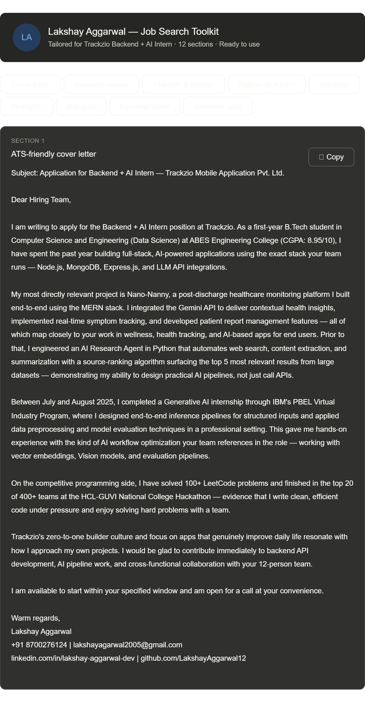
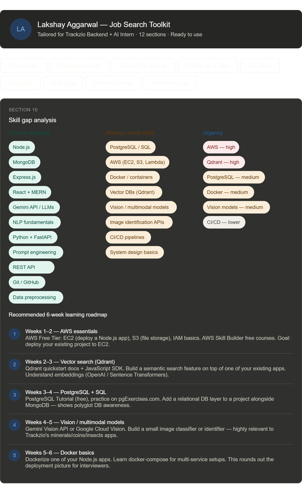
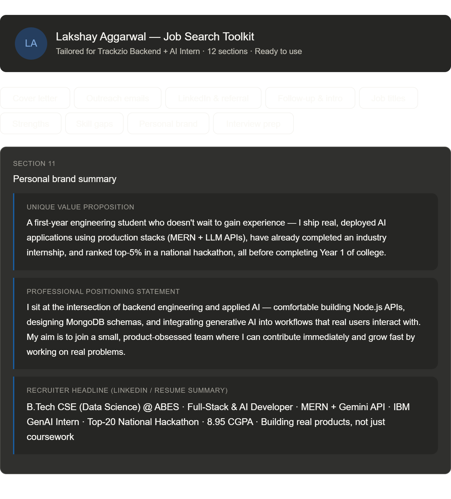
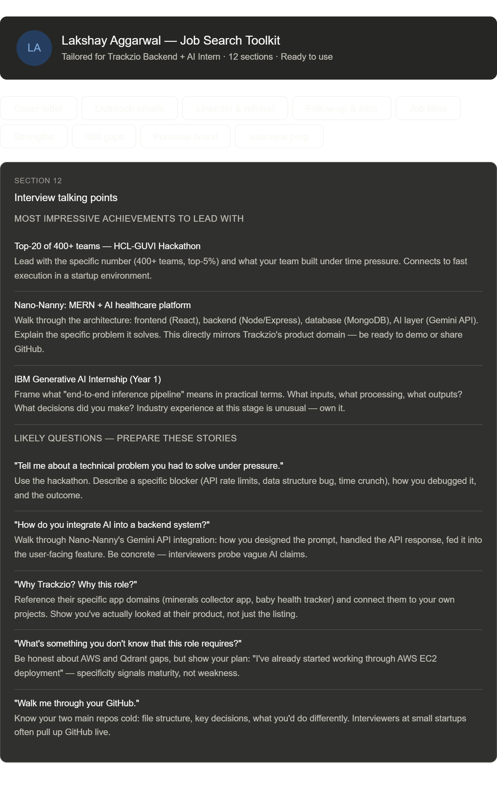

# 🧰 Day 12 — AI-Powered Job Search & Personal Branding Toolkit
**ABTalksOnAI 60-Day Claude Challenge**
*by Lakshay Aggarwal | B.Tech CSE (Data Science) | ABES Engineering College*

---

## 📌 What We Built Today

A **complete, interactive Job Search & Personal Branding Toolkit** — a single-session AI workflow that takes a resume + job description as input and outputs 12 ready-to-use career assets, all rendered as a tabbed, copyable web interface inside Claude.

**Target role:** Backend + AI Intern at **Trackzio Mobile Application Pvt. Ltd.**
**Tool used:** Claude Sonnet (claude.ai) — no external tools, no code editors

---

## 🎯 The Challenge

Most students spend hours writing a single cold email or cover letter, often producing something generic. The goal today was to see if Claude could function as a full career consultant — analyzing a resume against a specific JD and producing a complete, personalised job search toolkit in one prompt.

---

## 📦 The 12 Deliverables Generated

| # | Section | Description |
|---|---------|-------------|
| 1 | **ATS-Friendly Cover Letter** | 420-word letter tailored to Trackzio's JD, hitting every skill requirement |
| 2 | **Recruiter Outreach Email** | Short, punchy cold email for talent teams |
| 3 | **Hiring Manager Email** | Deeper, story-driven email for decision makers |
| 4 | **LinkedIn Connection Request** | ≤300-character message with context |
| 5 | **Referral Request Message** | Warm ask for an internal referral |
| 6 | **Follow-Up Email** | Timed for 5 days post-application silence |
| 7 | **30-Second Professional Introduction** | For interviews, events, and networking |
| 8 | **Top 10 Job Titles** | Best-fit roles based on current profile |
| 9 | **Key Strengths Recruiters Will Notice** | 6 recruiter-facing signal strengths |
| 10 | **Skill Gap Analysis** | Current strengths vs. missing skills + 6-week learning roadmap |
| 11 | **Personal Brand Summary** | UVP, positioning statement, LinkedIn headline |
| 12 | **Interview Talking Points** | 5 likely questions with story frameworks |

---

## 🛠️ How It Was Built

### Inputs provided to Claude
1. **Resume PDF** — Lakshay_Aggarwal_ATS_Resume.pdf (uploaded directly)
2. **Full Job Description** — Trackzio Backend + AI Intern (pasted as text)
3. **Mega-prompt** — A structured 12-section brief specifying exact outputs, tone, word counts, and constraints

### What Claude did
- Parsed the resume and extracted: projects, stack, internship, CGPA, hackathon achievement
- Matched resume signals against JD requirements (Node.js, MongoDB, Express, AI pipelines, AWS, Qdrant)
- Generated all 12 sections with zero fabrication — every claim traceable to the actual resume
- Rendered the entire toolkit as an **interactive tabbed HTML widget** with one-click copy buttons for every asset

### The prompt structure used
```
You are an expert Technical Recruiter, Hiring Manager, Career Coach,
Executive Resume Writer, and Personal Branding Consultant.

Carefully analyze my resume, LinkedIn profile, portfolio, and professional background.
Your objective is to create a complete job search and personal branding toolkit
tailored to my profile.

Requirements:
* Use only information available in my resume/profile
* Identify and highlight my most relevant skills, achievements...
[12 specific sections defined]
```

---

## 📸 Screenshots

> **Toolkit — Cover Letter tab**
> The cover letter opens by default, tailored to Trackzio's health/wellness domain using Nano-Nanny as the anchor project.



> **Toolkit — Skill Gap Analysis tab**
> Three-column view: current strengths (teal), missing skills (amber), urgency ratings (red/gray) + 6-step roadmap.



> **Toolkit — Personal Brand Summary tab**
> Three brand assets: unique value proposition, positioning statement, and recruiter headline — all copy-ready.



> **Toolkit — Interview Prep tab**
> Structured talking points with likely questions and story frameworks keyed to specific resume achievements.



---

## 💡 What I Learned Today

### 1. Multi-role prompting unlocks depth
By telling Claude to act as *five roles simultaneously* (recruiter + hiring manager + career coach + resume writer + brand consultant), each section got written from the right perspective — the cover letter reads like a job applicant wrote it, the outreach email reads like a networker, and the interview prep reads like a coach prepared it.

### 2. Resume-grounded AI output beats templates
The constraint "use only information from my resume" forced every claim to be traceable. Claude didn't invent certifications or fake metrics. This produced output I could actually send without fact-checking — a massive practical improvement over generic templates.

### 3. JD-matching is where AI adds the most value
Claude cross-referenced my resume against the JD automatically — it identified that Nano-Nanny directly mirrors Trackzio's health-tracking app domain, that the IBM internship maps to their AI pipeline requirement, and that AWS + Qdrant are the two real gaps. This would have taken me 30+ minutes of careful reading.

### 4. Skill gap analysis as a learning roadmap
The most actionable output wasn't the cover letter — it was the 6-week roadmap in the skill gap section. Claude sequenced the learning (AWS first → Qdrant → PostgreSQL → Vision models → Docker) based on urgency to the specific JD, not just general popularity.

### 5. Interactive UI makes AI output actually usable
Wrapping all 12 sections in a tabbed, copy-button interface meant the toolkit is immediately usable, not buried in a scroll of text. The UX design decision (tabs + copy buttons) was as important as the content quality.

---

## 🔢 By the Numbers

| Metric | Value |
|--------|-------|
| Sections generated | 12 |
| Approximate words produced | ~2,500 |
| Time in Claude (end-to-end) | ~8 minutes |
| Resume facts used | 14 distinct claims |
| Skills matched to JD | 7 direct matches |
| Skills gaps identified | 8 |
| Learning roadmap steps | 5 (6 weeks) |

---

## 🔗 Stack & Tools

| Layer | Tool |
|-------|------|
| AI engine | Claude Sonnet (claude.ai) |
| Resume format | PDF (uploaded directly) |
| Output format | Interactive HTML widget (inline) |
| Icons | Tabler Icons (CDN) |
| Styling | CSS variables (dark/light mode adaptive) |
| No-code | ✅ Zero external tools needed |

---

## 🚀 Key Takeaway

> Claude functioning as a complete career consultant is not a future use case — it's available right now. The only requirement is a well-structured prompt and a real resume. The output quality scales directly with the specificity of your input.

If you're a student applying for internships, this workflow takes ~10 minutes and produces materials that would otherwise take hours — or cost money at a professional resume service.

---

## 📁 Files in This Project

```
day12/
├── day12.md                     ← This file
├── Lakshay_Aggarwal_ATS_Resume.pdf   ← Input: resume
└── screenshots/
    ├── day12_cover_letter.png
    ├── day12_skill_gap.png
    ├── day12_personal_brand.png
    └── day12_interview_prep.png
```

---

## 🔜 What's Next

Day 13 will push into a new domain — staying tuned for the next build.

---

*Part of the #ABTalksOnAI 60-Day Claude Challenge*
*Follow the journey: [linkedin.com/in/lakshay-aggarwal-dev](https://linkedin.com/in/lakshay-aggarwal-dev)*
*All code & docs: [github.com/LakshayAggarwal12](https://github.com/LakshayAggarwal12)*