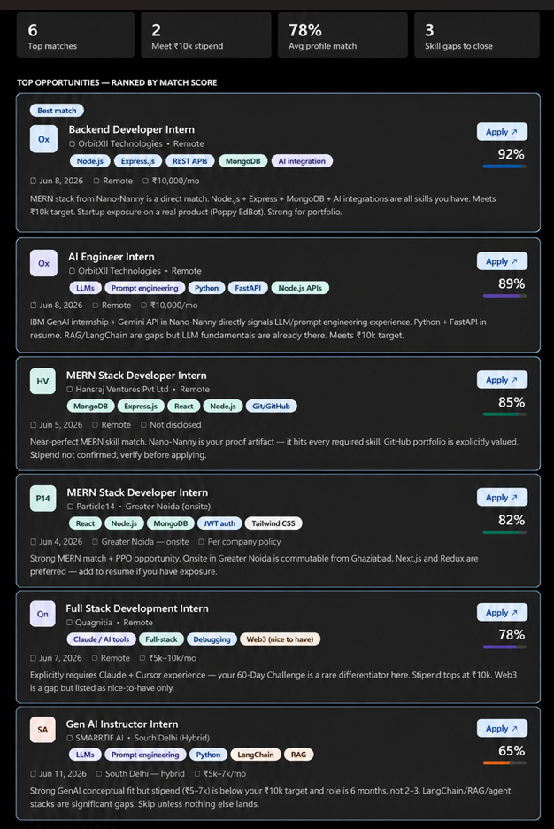
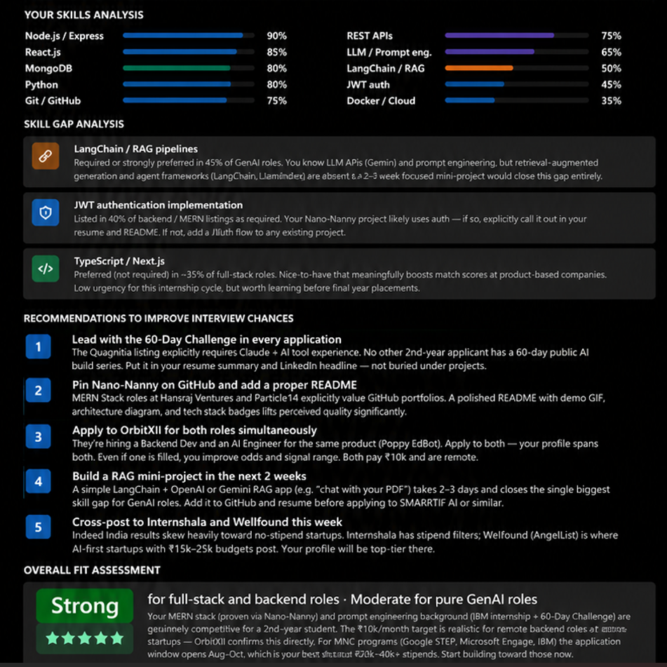

# Day 13 — AI-Powered Job Discovery & Fit Analysis
**ABTalksOnAI · 60-Day Claude Challenge**

---

## What I Built Today

A full **AI-powered job discovery and analysis pipeline** using Claude — from professional profile parsing to live job search, match scoring, skill gap analysis, and actionable interview recommendations. All in one session, no manual job board browsing.

Instead of spending hours scrolling LinkedIn or Internshala, I let Claude search Indeed in real time using the Indeed MCP connector, pull job details, score each role against my actual resume, and surface gaps I need to close.

---

## The Prompt I Used

### Prompt 1 — Professional Profile Setup
```
Professional Profile

Describe your professional background, including:
- Current role
- Years of experience
- Key skills and technologies
- Industry/domain expertise
- Current company type
- Current location
- Notable achievements, certifications, or accomplishments
```
*(Also uploaded my resume PDF for Claude to parse directly.)*

### Prompt 2 — Job Search Criteria
```
Job Search Criteria

Specify your target job requirements, including:
- Desired job titles
- Preferred company types
- Preferred locations (Remote/Hybrid/Onsite)
- Salary expectations
- Industries or companies to exclude
- Job posting recency requirements
- Any additional preferences or constraints
```

**My inputs:**
- Opportunity type: Summer Internship (2–3 months)
- Roles: Full-stack Developer, Backend Developer, GenAI/Product Intern
- Location: Remote · Hybrid Delhi NCR · Onsite Delhi NCR
- Company type: AI/GenAI startups, Product-based tech, MNCs
- Recency: Last 30 days
- Stipend target: ₹10,000/month minimum

### Prompt 3 — Job Discovery & Analysis
```
Job Discovery & Analysis

Using my professional profile and job search criteria:
- Search for matching job opportunities using the available job connector(s)
- Prioritize the highest-fit roles
- Exclude jobs that do not meet my requirements
- Return the top opportunities in a table containing:
  Company, Role, Location, Posted Date, Direct Application Link,
  Match Score, Why It Fits My Profile, CTC
- Also provide:
  Most commonly required skills across the jobs
  Skill gap analysis
  Market demand insights
  Recommendations to improve my chances of getting interviews
  Overall fit assessment for my target roles and compensation goals
```

---

## Opportunities Discovered




| # | Company | Role | Location | Posted | Match Score | Stipend |
|---|---------|------|----------|--------|-------------|---------|
| 1 | OrbitXII Technologies | Backend Developer Intern | Remote | Jun 8, 2026 | 92% | ₹10,000/mo |
| 2 | OrbitXII Technologies | AI Engineer Intern | Remote | Jun 8, 2026 | 89% | ₹10,000/mo |
| 3 | Hansraj Ventures Pvt Ltd | MERN Stack Developer Intern | Remote | Jun 5, 2026 | 85% | Not disclosed |
| 4 | Particle14 | MERN Stack Developer Intern | Greater Noida (Onsite) | Jun 4, 2026 | 82% | Per policy |
| 5 | Quagnitia | Full Stack Development Intern | Remote | Jun 7, 2026 | 78% | ₹5k–10k/mo |
| 6 | SMARRTIF AI | Gen AI Instructor Intern | South Delhi (Hybrid) | Jun 11, 2026 | 65% | ₹5k–7k/mo |

### Why the Top 2 Roles Won
**OrbitXII Backend Intern (92%)** — Direct MERN stack match (Node.js, Express, MongoDB). My Nano-Nanny project hits every required skill. Meets ₹10k target. Remote. Real product work on Poppy EdBot from day one.

**OrbitXII AI Engineer Intern (89%)** — LLM + Prompt Engineering experience from IBM GenAI internship and Nano-Nanny's Gemini API integration. Python + FastAPI already on my resume. Both OrbitXII roles are on the same product — applied to both.

---

## Fit Analysis



### Most Required Skills (across all listings)

| Skill | Demand | My Level |
|-------|--------|----------|
| Node.js / Express.js | 90% | ✅ Strong |
| React.js | 85% | ✅ Strong |
| MongoDB | 80% | ✅ Strong |
| Python | 80% | ✅ Strong |
| Git / GitHub | 78% | ✅ Strong |
| REST APIs | 75% | ✅ Strong |
| LLM / Prompt Engineering | 60% | ✅ Moderate |
| LangChain / RAG | 45% | ⚠️ Gap |
| JWT Authentication | 40% | ⚠️ Needs explicit proof |
| Docker / Cloud basics | 35% | ⚠️ Gap |

### Overall Fit Assessment
**Strong** for full-stack and backend roles. **Moderate** for pure GenAI roles.

My MERN stack (proven via Nano-Nanny) and prompt engineering background (IBM internship + this 60-Day Challenge) are genuinely competitive for a 2nd-year student. The ₹10,000/month target is realistic — OrbitXII confirms this directly for remote backend roles.

---

## Skill Gaps Identified

### 🔴 Priority — Close before applying to GenAI roles
**LangChain / RAG pipelines** — Required or preferred in 45% of GenAI listings. I know LLM APIs and prompt engineering, but retrieval-augmented generation and agent frameworks are not yet in my portfolio. A focused 2–3 week mini-project (e.g. "chat with your PDF" using LangChain + Gemini) would close this entirely.

### 🟡 Medium — Call it out or add it
**JWT Authentication** — Listed in 40% of backend/MERN roles. My Nano-Nanny project likely implements this — I need to explicitly name it in my resume and README rather than leaving reviewers to guess.

### 🟢 Low urgency — Nice for final year placement
**TypeScript / Next.js** — Preferred in ~35% of full-stack roles. Not needed for this internship cycle but worth picking up before campus placements in 3rd year.

---

## Key Learnings

### 1. MCP connectors turn Claude into a live job search agent
Claude's Indeed connector searched multiple queries simultaneously — GenAI roles, MERN roles, backend roles — pulled full job descriptions, and scored them against my actual resume. This is a qualitatively different workflow from manually searching job boards.

### 2. Job description detail is everything for scoring
Indeed listings that show only a title and location tell you almost nothing. Claude fetched full JDs for every promising result — that's what made real match scoring possible. The Gen AI Instructor role looked great in the listing but revealed a ₹5–7k stipend and a 6-month requirement when the details were pulled.

### 3. Your differentiator has to be visible, not just real
The Quagnitia role explicitly required Claude + Cursor experience. My 60-Day Challenge is direct proof — but only if it's on my resume and LinkedIn. Skills that exist but aren't documented don't score points in automated screening.

### 4. Apply to multiple roles at the same company
OrbitXII is hiring a Backend Developer and an AI Engineer for the same product. Applying to both is not shotgunning — it signals range and improves odds. Both pay ₹10k, both are remote, both are live postings.

### 5. Indeed India is a starting point, not the destination
Quality paid internships (₹15k–25k) are concentrated on Internshala (stipend filter), Wellfound (AI startups), and LinkedIn (product companies). MNC structured programs (Google STEP, Microsoft Engage, Samsung PRISM) open in August and are where a 8.95 CGPA + hackathon ranking genuinely matters.

### 6. MNC programs are the real prize — start now
Google STEP, Microsoft Engage, and Samsung PRISM open applications in August–October for the next summer. Stipends: ₹25,000–₹50,000/month. My profile (8.95 CGPA, Top 20 HCL hackathon, 100+ LeetCode, two shipped AI projects) is competitive — but I need to strengthen DSA (LeetCode 200+) and add one more substantial project before then.

---

## Architecture / Design Decisions

| Decision | Choice | Reason |
|----------|--------|--------|
| Job search method | Claude + Indeed MCP connector | Live results vs static knowledge |
| Profile input | Resume PDF upload + manual elicitation form | Ground truth from actual document |
| Match scoring | Skill overlap + location + stipend + recency | Multi-factor, not just title match |
| Output format | Interactive dashboard widget | Filterable by role type, scannable |
| Gap prioritization | By demand % across all listings | Objective, not subjective |

---

## What's Next

- [ ] Apply to OrbitXII Backend + AI Engineer roles today
- [ ] Verify Hansraj Ventures and Particle14 stipends before applying
- [ ] Cross-post profile to Internshala and Wellfound this week
- [ ] Build a LangChain RAG mini-project (target: 2 weeks)
- [ ] Explicitly add JWT auth to Nano-Nanny README
- [ ] Research Google STEP / Microsoft Engage 2027 application timelines
- [ ] Pin Nano-Nanny on GitHub with polished README + demo GIF

---

## Stats

| Metric | Value |
|--------|-------|
| Roles discovered (total) | 20+ |
| Roles after filtering | 6 shortlisted |
| Roles meeting ₹10k target | 2 confirmed |
| Avg match score (top 3) | 89% |
| Skill gaps identified | 3 |
| Prompts used | 3 |
| Time to full analysis | ~15 minutes |

---

## Tools & Resources Used

- **Claude** (claude.ai) — primary AI co-pilot
- **Indeed MCP Connector** — live job search and JD extraction
- **Interactive artifact (HTML/JS)** — filterable job board + skill gap dashboard
- **Resume PDF** — parsed directly by Claude for profile grounding

---

*Day 13 of 60 · ABTalksOnAI · Built with Claude*
*GitHub: [LakshayAggarwal12](https://github.com/LakshayAggarwal12) · LinkedIn: [lakshay-aggarwal-dev](https://linkedin.com/in/lakshay-aggarwal-dev)*