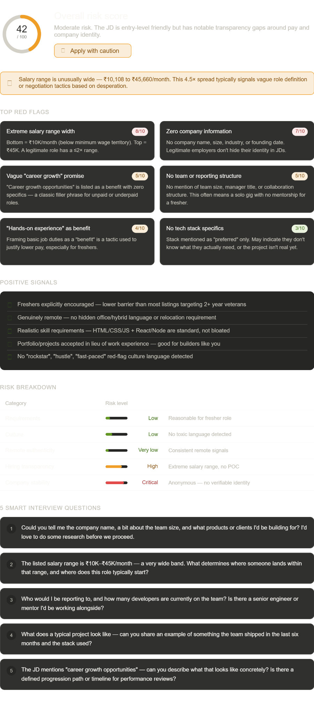

# Day 14 — AI Job Red Flag Detector

**ABTalksOnAI 60-Day Claude Challenge**
**Date:** June 14, 2026
**Category:** Career Tools / AI-Powered Analysis

---

## What I Built

An **AI Red Flag Detector for Job Seekers** — a structured prompt + interactive dashboard that analyzes any job description and surfaces hidden risks before you invest time applying.

The tool outputs:
- An **Overall Risk Score (0–100)** with a visual gauge
- **Top red flags** with individual severity ratings (1–10)
- **Positive signals** to balance the analysis
- A **risk breakdown table** across 5 categories
- A **final verdict** (Apply / Apply with Caution / Avoid)
- **5 smart interview questions** tailored to the specific risks found

---

## The Problem

Most freshers apply to jobs blindly. A job description can look exciting on the surface but hide:
- Exploitative salary ranges
- Anonymous companies with no verifiable identity
- "Benefits" that are just basic job duties reframed
- No team structure = no mentorship for a junior dev
- Vague responsibilities that signal a disorganized company

I wanted a repeatable framework to analyze any JD in under 60 seconds.

---

## Architecture

```
Input: Raw Job Description (paste)
         ↓
Claude Prompt (Red Flag Analyzer)
         ↓
5-Category Risk Engine:
  ├── Requirements Analysis
  ├── Toxic Culture Signals
  ├── Remote Authenticity Check
  ├── Hiring Transparency Score
  └── Company Stability Signals
         ↓
Output Dashboard (HTML + SVG)
  ├── Risk Score Ring (SVG gauge)
  ├── Flag Cards (severity badges)
  ├── Positive Signals Panel
  ├── Risk Bar Chart (per category)
  ├── Verdict Badge
  └── 5 Smart Interview Questions
```

---

## Prompt Engineering

The core of this project is a single, well-structured Claude prompt. Key design decisions:

### Prompt Structure
```
You are an AI Red Flag Detector for job seekers.
Analyze the Job Description and Company Information.
Identify:
1. Unrealistic Requirements
2. Toxic Workplace Signals
3. Remote Job Authenticity
4. Hiring Risks
5. Company Risks

Output:
## Overall Risk Score (0-100)
### Top Red Flags (with severity 1-10)
### Positive Signals
### Risk Breakdown Table
### Final Verdict
### 5 Smart Interview Questions
```

### Why this works
- **Structured output format** forces consistent, parseable responses
- **Severity scores (1–10)** make flags comparable and prioritizable
- **Positive signals** prevent fear-mongering — every JD has something good
- **Interview questions** make the output immediately actionable
- **5 categories** cover the full risk surface, not just obvious red flags

---

## Test Case: Web Developer JD Analysis

**JD Summary:** Remote, Full-Time/Part-Time, Fresher to 2 Years, HTML/CSS/JS + React/Node preferred, ₹10,108–₹45,660/month

### Results

| Category | Risk Level |
|----------|-----------|
| Requirements | Low |
| Culture | Low |
| Remote Authenticity | Very Low |
| Hiring Transparency | High |
| Company Stability | Critical |

**Overall Risk Score: 42/100 — Apply with Caution**

### Top Red Flags Found

| Flag | Severity |
|------|----------|
| Extreme salary range width (4.5× spread) | 8/10 |
| Zero company information (anonymous listing) | 7/10 |
| Vague "career growth" as a benefit | 5/10 |
| No team or reporting structure mentioned | 5/10 |
| "Hands-on experience" framed as a benefit | 4/10 |
| No specific tech stack confirmed | 3/10 |

### Key Insight
The ₹10,108 floor is the red flag. Any company offering that to a developer isn't a company — it's a cost-cutting exercise. The ₹45K ceiling is real but requires negotiating from strength (i.e., a strong portfolio).

---

## Visualisation Stack

Built as a single-file interactive HTML widget rendered inline in Claude:

- **SVG gauge ring** — animated stroke-dashoffset for the risk score
- **Flag cards grid** — color-coded severity badges (red/amber/green)
- **Risk bar charts** — pure CSS `width` percentages, no JS charting library needed
- **Salary warning banner** — contextual callout triggered by the 4.5× range detection
- **Interview questions** — numbered card layout for easy copy-paste

All colors use Claude's design system CSS variables (`--color-text-primary`, `--color-background-secondary`, etc.) for automatic light/dark mode support.

---

## Prompts Used

### Prompt 1 — The Red Flag Analyzer
```
You are an AI Red Flag Detector for job seekers.
Analyze the Job Description and Company Information.
Identify:
1. Unrealistic Requirements
   - Excessive experience for the role
   - Too many skills/responsibilities
   - Contradictory expectations
2. Toxic Workplace Signals
   - Burnout indicators
   - 'Wear many hats', 'Fast-paced', 'rockstar', 'hustle culture'
   - Poor work-life balance signals
3. Remote Job Authenticity
   - Hidden office requirements
   - Relocation expectations
   - Misleading remote claims
4. Hiring Risks
   - Missing salary information
   - Vague responsibilities
   - Excessive qualifications
   - Suspicious hiring practices
5. Company Risks
   - Reputation concerns
   - Stability concerns
   - Growth or layoff indicators

Output:
## Overall Risk Score (0-100)
### Top Red Flags — list with severity (1-10)
### Positive Signals
### Risk Breakdown Table
### Final Verdict (Apply / Apply with Caution / Avoid)
### 5 Smart Interview Questions

[Job Description here]
```

### Prompt 2 — Interactive Dashboard
```
Build an interactive HTML dashboard that visualizes the red flag analysis.
Include: SVG risk gauge, flag cards with severity badges, 
risk bar chart per category, positive signals panel, 
verdict badge, and 5 smart interview questions.
Use CSS variables for light/dark mode. No external libraries.
```

---

## Key Learnings

1. **Prompt structure = output structure.** When you format your prompt with numbered categories and specify the exact output format, Claude returns consistently structured results every time. This is the foundation of reliable AI tooling.

2. **The "5 smart questions" section made this 10× more useful.** Analysis alone is passive. Questions turn the output into something you can act on in the next 24 hours.

3. **Salary range width is an underrated signal.** A legitimate company knows what the role is worth. A 4.5× range is a negotiation trap, not flexibility.

4. **Anonymous listings are a dealbreaker at the research stage** — not necessarily the application stage. But you need to extract the company name in the first touchpoint before going further.

5. **Positive signals matter.** A purely negative analysis creates anxiety. Balancing red flags with genuine positives makes the output more trustworthy and usable.

---

## Screenshots





---

## Files

```
day14/
├── day14.md              ← This file
├── prompt.txt            ← The red flag analyzer prompt
└── screenshots/          ← UI screenshots
```

---

## What's Next

- Day 15: TBD — continuing the 60-Day Challenge
- Potential extension: Build this as a proper web app where you paste a JD URL and it auto-scrapes + analyzes
- Add company name → auto-fetch Glassdoor/LinkedIn reputation signals via web search

---

*Part of the [ABTalksOnAI 60-Day Claude Challenge](https://github.com/LakshayAggarwal12) — building real AI projects daily and documenting everything publicly.*

**GitHub:** [LakshayAggarwal12](https://github.com/LakshayAggarwal12)
**LinkedIn:** [lakshay-aggarwal-dev](https://linkedin.com/in/lakshay-aggarwal-dev)