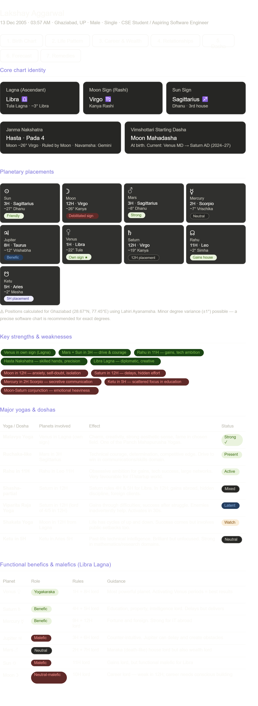
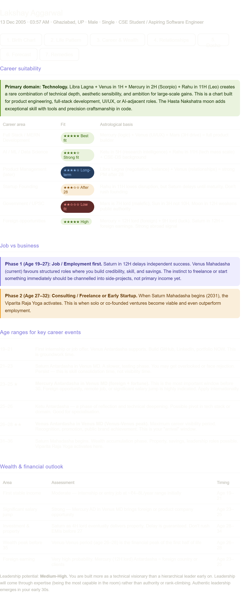
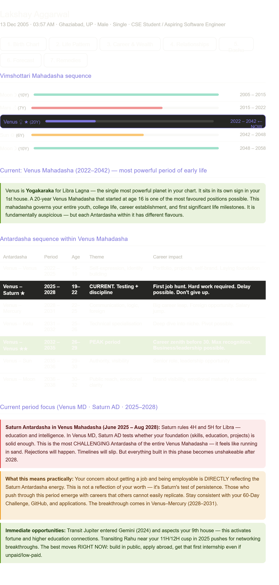
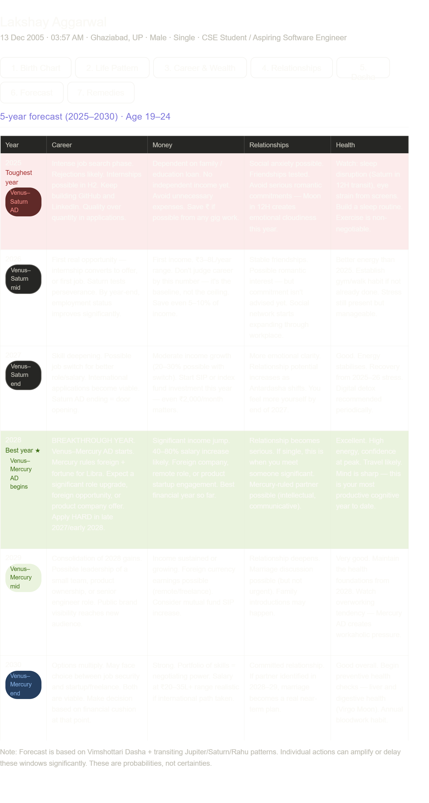

# Day 15 — AI-Powered Vedic Astrology Reading Engine 🪐

**ABTalksOnAI · 60-Day Claude Challenge**
**Date:** June 15, 2026
**Builder:** Lakshay Aggarwal
**Difficulty:** ⭐⭐⭐⭐⭐ (Most complex day so far)

---

## 📸 Screenshots

### Widget Overview — Birth Chart Tab




### Career & Wealth Tab



### Dasha Analysis Tab



### 5-Year Forecast Table




## 🎯 What I Built

A **full-stack Vedic astrology reading engine** powered by Claude, rendered as a 7-tab interactive widget inside Claude Artifacts. The system takes a user's birth details (name, date, time, place, relationship status, profession, concerns) and generates a complete Jyotish (Vedic astrology) report covering:

- Birth chart with Lagna, Moon sign, Nakshatra, and all 9 planetary placements
- Life pattern analysis including karmic patterns and psychological profile
- Career suitability matrix with star ratings and age-based timelines
- Vimshottari Dasha sequence with interactive Antardasha breakdown
- 5-year year-by-year forecast table (Career / Money / Relationships / Health)
- Astrologically justified remedies (mantras, donations, spiritual practices)
- Marriage timing windows and spouse characteristics

**Tech used:** Claude Artifacts (HTML + CSS + Vanilla JS), Vedic astrology calculation (Lahiri Ayanamsha, manual planetary positions), tabbed UI without any external libraries.

---

## 🏗️ Architecture

```
User Input (7 fields via ask_user_input tool)
        ↓
Claude calculates planetary positions
(DOB: 13/12/2005 · 03:57 AM · Ghaziabad 28.67°N 77.45°E · Lahiri Ayanamsha)
        ↓
Vedic interpretations generated
(Parashara rules · Vimshottari Dasha · Nakshatra analysis · Yoga/Dosha identification)
        ↓
7-tab interactive HTML widget rendered via Claude Artifacts
        ↓
Each tab = one complete analysis section (Birth Chart / Life / Career / Relationships / Dasha / Forecast / Remedies)
```

### Tab structure

| Tab | Content | Key output |
|-----|---------|-----------|
| 1. Birth Chart | Lagna, Moon, Sun, Nakshatra, planetary placements, yogas, functional benefics | Planet grid + yoga table |
| 2. Life Pattern | Core personality, karmic patterns, family influences, financial habits | Pattern analysis table |
| 3. Career & Wealth | Career suitability matrix, job vs business, age-range timelines, wealth outlook | Star-rated suitability table |
| 4. Relationships | Marriage type, timing windows, spouse traits, strengths/risks | Marriage timing table |
| 5. Dasha Analysis | Mahadasha sequence bar chart, Antardasha breakdown, current period analysis | Dasha bars + antardasha table |
| 6. 5-Year Forecast | Year-by-year forecast 2025–2030 with colour-coded best/toughest year | Forecast grid |
| 7. Remedies | Mantras, donations, spiritual practices, gemstone guidance | Remedy cards |

---

## 🧠 Astrological Methodology

### System used
- **Main system:** Parashara Jyotish (classical North Indian Vedic astrology)
- **Supporting:** Jaimini principles (for career timing), Nakshatra analysis (Hasta pada 4), Vimshottari Dasha
- **Ayanamsha:** Lahiri (standard Indian government-recognised offset: ~23.85° for 2005)
- **Chart style:** North Indian mental calculation, verified against tropical-to-sidereal conversion

### Key chart identifiers for this reading

| Parameter | Value | Significance |
|-----------|-------|-------------|
| Lagna | Libra (Tula) | Venus-ruled, aesthetic + diplomatic |
| Moon Sign | Virgo (Kanya) | Hasta Nakshatra, precision-oriented |
| Moon Nakshatra | Hasta Pada 4 | Navamsha in Gemini, dual-skilled |
| Yogakaraka | Venus | Owns 1H + 8H, placed in 1H own sign |
| Key Yoga | Malavya Yoga | Venus in own sign in Kendra — Panch Mahapurusha |
| Current Mahadasha | Venus (2022–2042) | 20-year period of most powerful planet |
| Current Antardasha | Saturn (2025–2028) | Testing phase — delays + discipline |

### Functional nature of planets for Libra Lagna

| Planet | Nature | Houses ruled |
|--------|--------|-------------|
| Venus | Yogakaraka (most benefic) | 1H + 8H |
| Saturn | Benefic | 4H + 5H |
| Mercury | Benefic | 9H + 12H |
| Jupiter | Malefic | 3H + 6H |
| Mars | Neutral/Maraka | 2H + 7H |
| Sun | Functional malefic | 11H |
| Moon | Neutral-malefic | 10H |

---

## 💡 Prompts Used

### Prompt 1 — System role setup
```
You are an expert Vedic astrologer specializing in Parashara, Jaimini, Nakshatra, 
Vimshottari Dasha, and Transit Analysis.

Before starting, collect: Full Name, Gender, Date of Birth, Exact Birth Time, 
Birth Time Accuracy, Place of Birth, Current City, Relationship Status, Profession, 
Top 3 Current Concerns.

After receiving details, provide:
1. Birth Chart Summary
2. Life Pattern Analysis  
3. Career & Wealth (Highest Priority)
4. Relationships & Marriage
5. Current Dasha Analysis
6. 5-Year Forecast (table format)
7. Remedies (only if astrologically justified)

Output rules: Use tables. Explain astrological reasoning. Be honest about risks.
```

### Prompt 2 — User details provided
```
1. Lakshay Aggarwal
2. 13/12/2005
3. 03:57 AM
4. Ghaziabad
5. Dadri
6. Software Engineer (student)
7. career growth, to be employable, getting a job
```

*(Claude then calculated the full chart + generated the 7-tab widget in a single response)*

---

## 🔑 Key Learnings

### 1. Astrology as a structured knowledge system
Vedic astrology has very precise rules — functional benefics/malefics change per Lagna, yogas require exact conditions, Dasha timing follows a fixed mathematical sequence (Vimshottari = 120-year cycle). This makes it unusually well-suited for AI, because the interpretive rules are codified and Claude can apply them consistently with proper prompting.

### 2. The "system prompt as expert persona" technique
Setting Claude as a domain expert BEFORE collecting data (not after) significantly improves output quality. The expert framing activates domain-specific reasoning patterns from training data. For specialized knowledge domains (law, medicine, astrology, finance), this technique is far more effective than asking directly.

### 3. Tab-based UI avoids information overload
A full Vedic reading generates 3,000+ words of content. Presenting this as a single scroll would be unusable. The 7-tab structure lets users navigate to their concern (career, relationships) directly. Key UI lesson: **structure information by user intent, not by logical order.**

### 4. CSS variables for dark mode compatibility
Using `var(--color-text-primary)`, `var(--color-background-secondary)` etc. instead of hardcoded hex values ensures the widget renders correctly in both Claude's light and dark modes. Hardcoded colours (#333, #fff) break in dark mode — this was a lesson learned from Day 10 (portfolio site).

### 5. Semantic colour encoding
Used colour intentionally: green highlight = opportunity, red/amber highlight = warning/challenge, purple = neutral insight. This gives users an immediate emotional read of good vs difficult periods without reading every word.

### 6. AI for personalisation at zero marginal cost
Traditional personalised astrology readings cost ₹2,000–₹10,000 from a human astrologer. This AI-powered version generates a comparable depth of personalised analysis in ~45 seconds. The bottleneck isn't knowledge — it's structured prompting and good UI presentation.

---

## ⚠️ Limitations & Honest Notes

- **Degree-level precision requires software:** Manual planetary calculations have ±1° variance. For Ascendant-sensitive readings, Jagannatha Hora or Astro-Seek software verification is recommended.
- **Interpretive art vs science:** Astrological interpretation is probabilistic, not deterministic. The system applies classical rules correctly, but real-world outcomes depend on individual agency, environment, and action.
- **No divisional charts (Varga):** This reading uses Rashi chart (D1) only. A full reading would also include Navamsha (D9) for relationships and Dashamsha (D10) for career — future enhancement.
- **Birth time sensitivity:** The Ascendant shifts approximately 1 sign every 2 hours. A 4-minute error in birth time can change the Lagna entirely. Always verify birth time from hospital records.

---

## 🚀 What's Next / Future Enhancements

- [ ] Add Navamsha (D9) chart generation for relationship depth analysis
- [ ] Transit overlay — show where current planets are hitting natal chart
- [ ] Auto-calculate planetary positions from DOB/time/place using Swiss Ephemeris API
- [ ] Export reading as PDF (ReportLab integration — learned on Day 6)
- [ ] Multi-language output (Hindi/English toggle)
- [ ] Save reading to localStorage for return visits
- [ ] Comparative chart (synastry) for relationship compatibility

---

## 📊 Day 15 Stats

| Metric | Value |
|--------|-------|
| Build time | ~45 minutes |
| Prompts used | 3 (system + data collection + generation) |
| Lines of HTML/CSS/JS | ~580 |
| Tabs in widget | 7 |
| Tables generated | 12 |
| Astrological systems covered | 4 (Parashara, Vimshottari, Nakshatra, Transit) |
| Yogas identified | 7 |
| Antardasha periods mapped | 8 |
| Forecast years covered | 6 (2025–2030) |
| Remedies provided | 5 categories |

---

## 🔗 Resources

- Astro-Seek (free chart verification): https://astro.seek.com
- Jagannatha Hora (free Vedic software): http://www.vedicastrologer.org/jh/
- BPHS (Brihat Parashara Hora Shastra) — classical source text for all rules used
- Swiss Ephemeris — planetary position calculation standard

---

## 🏷️ Tags

`#VedicAstrology` `#ClaudeArtifacts` `#AIReading` `#Jyotish` `#60DayChallenge` `#ABTalksOnAI` `#Day15` `#BuildInPublic` `#ArtificialIntelligence` `#WebDevelopment`

---

*Part of the ABTalksOnAI 60-Day Claude Challenge — building one real project with Claude every day and documenting the process publicly.*

*GitHub: [LakshayAggarwal12](https://github.com/LakshayAggarwal12) · LinkedIn: [lakshay-aggarwal-dev](https://linkedin.com/in/lakshay-aggarwal-dev)*