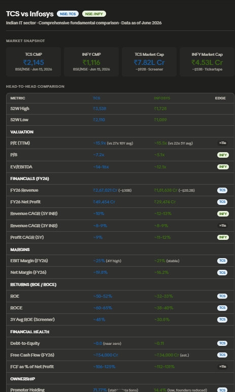
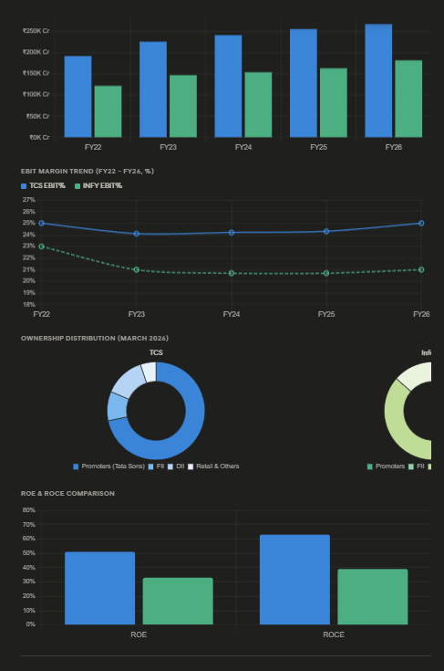
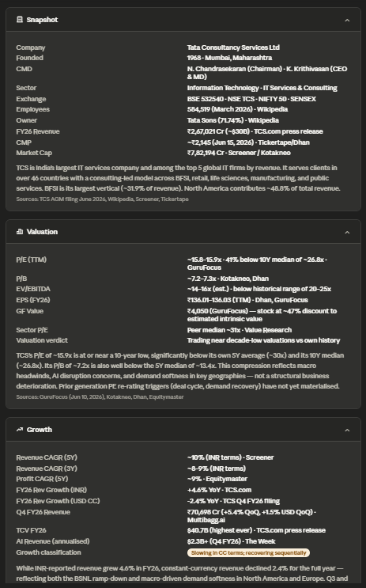
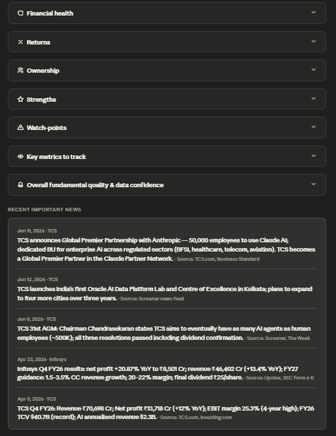

# Day 16 — Stock Fundamental Research Skill

**ABTalksOnAI 60-Day Claude Challenge**  
**Date:** June 16, 2026  
**Category:** Financial Research / Custom Claude Skills

---

## What I Built

Today I created a reusable Claude Custom Skill called **stock-fundamental-research**.

The goal of the skill is to generate structured, evidence-based stock research reports using company fundamentals instead of speculation. The skill supports both Indian and global listed companies and automatically analyzes:

- Business quality
- Financial statements
- Revenue and profit trends
- Valuation metrics
- Ownership patterns
- Competitive advantages
- Sector tailwinds and headwinds
- Risk factors
- Peer comparisons
- Investor-friendly summaries

Unlike most stock analysis prompts, this skill explicitly avoids:
- Buy recommendations
- Sell recommendations
- Hold recommendations
- Target prices
- Personalized investment advice

The skill is designed to be reusable so that future stock analysis can be performed without rewriting large prompts every time.

---

## The Problem

Most retail investors consume stock information from fragmented sources:

- Annual reports
- News articles
- Financial portals
- Earnings call transcripts
- Social media opinions

This creates three major problems:

1. Information is scattered across multiple platforms.
2. Important metrics are often ignored.
3. Analysis quality varies significantly between companies.

I wanted a repeatable framework that forces a consistent evaluation process for every company analyzed.

---

## Custom Skill Architecture

```text
User Query
     ↓
Claude Custom Skill
(stock-fundamental-research)
     ↓
Research Framework
     ├── Company Snapshot
     ├── Valuation Analysis
     ├── Growth Analysis
     ├── Financial Health
     ├── Ownership Trends
     ├── Competitive Position
     ├── Risk Assessment
     ├── Peer Comparison
     └── Educational Summary
     ↓
Interactive HTML Report
     ├── Market Snapshot
     ├── Charts
     ├── Valuation Dashboard
     ├── Ownership Analysis
     ├── Financial Metrics
     ├── News & Commentary
     └── Overall Fundamental View
```

---

## Skill Design

### Skill Name

```text
stock-fundamental-research
```

### Description

```text
Analyze Indian and global listed companies using fundamentals,
financial statements, business quality, competitive advantages,
valuation, risks, and growth prospects.

Generate evidence-based research reports and investor-friendly
summaries.

Never provide direct buy, sell, or hold recommendations.
```

---

## Core Features

### 1. Quick Take Mode

Generates a short analysis containing:

- Company overview
- CMP
- Market capitalization
- Valuation summary
- Growth trend
- Strengths
- Watch-points
- Fundamental quality rating

---

### 2. Deep Dive Mode

Produces a complete research report including:

- Snapshot
- Valuation
- Growth
- Financial Health
- Returns
- Ownership
- Strengths
- Watch-points
- Key Metrics
- Data Confidence

---

### 3. Compare Mode

Supports side-by-side stock comparisons using:

- P/E
- P/B
- EV/EBITDA
- Revenue CAGR
- Profit CAGR
- ROE
- ROCE
- Debt-to-Equity
- Ownership Trends
- Dividend History

---

### 4. Portfolio Fit Mode

Evaluates:

- Sector concentration
- Overlap with existing holdings
- Diversification benefits
- Fundamental contribution

---

## Test Case

### Comparison: TCS vs Infosys

To validate the skill, I generated a comprehensive comparison report between:

- Tata Consultancy Services (TCS)
- Infosys Ltd.

The report included:

### Market Snapshot

- CMP
- Market Capitalization
- 52 Week High/Low

### Valuation Metrics

- P/E
- P/B
- EV/EBITDA

### Growth Metrics

- Revenue CAGR
- Profit CAGR
- Margin Trends

### Financial Health

- Debt-to-Equity
- Free Cash Flow

### Returns

- ROE
- ROCE

### Ownership

- Promoter Holding
- FII Participation
- DII Participation

### Additional Insights

- Latest earnings commentary
- Recent news
- Competitive positioning
- Peer analysis

---

## Key Findings

### TCS

Strengths observed:

- Larger market capitalization
- Stronger profitability metrics
- Higher ROE and ROCE
- Consistently strong free cash flow generation
- Industry-leading scale and client base

Watch-points:

- Slower growth profile compared to earlier years
- Dependence on large enterprise IT spending cycles

---

### Infosys

Strengths observed:

- Competitive valuation metrics
- Healthy balance sheet
- Strong digital transformation exposure
- Stable operating performance

Watch-points:

- Margin pressure relative to historical levels
- Similar macroeconomic headwinds affecting IT spending

---

## Visualisation Components

The generated report included multiple visual elements:

### Market Comparison Dashboard

- CMP comparison
- Market cap comparison
- Head-to-head metric table

### Revenue Trend Charts

- Multi-year revenue comparison
- Growth trend visualization

### Margin Analysis

- EBIT Margin comparison
- Historical trend tracking

### Ownership Charts

- Promoter ownership distribution
- Institutional ownership overview

### Return Metrics

- ROE comparison
- ROCE comparison

---

## Prompt Engineering Learnings

### Why Custom Skills Matter

Instead of repeatedly pasting a massive stock-analysis prompt, the entire framework is stored once inside Claude.

Benefits:

- Consistent output quality
- Faster workflow
- Reusable research process
- Standardized evaluation criteria

---

### Importance of Structured Instructions

The skill performed well because:

- Clear output formats were defined.
- Mandatory metrics were specified.
- Risk interpretation rules were provided.
- Data quality requirements were enforced.

This significantly reduced output variability.

---

## Key Learnings

### 1. Reusable Skills Save Significant Time

A large prompt only needs to be written once. Every future stock analysis can reuse the same framework.

### 2. Output Structure Drives Analysis Quality

By forcing sections like Valuation, Ownership, and Financial Health, important metrics are less likely to be missed.

### 3. Comparisons Reveal More Than Individual Reports

Side-by-side analysis quickly highlights relative strengths and weaknesses that may not be obvious in standalone research.

### 4. Charts Improve Decision Support

Visual trends are often easier to interpret than raw tables of financial data.

### 5. Explicit Constraints Improve Reliability

Preventing buy/sell recommendations keeps the analysis focused on evidence rather than speculation.

---

## Screenshots

### 1. TCS vs Infosys Comparison Dashboard



---

### 2. Revenue, Margin & Ownership Charts



---

### 3. Deep Dive Report — Snapshot & Valuation



---

### 4. Financial Health, Ownership & News Sections



---

## Files

```text
day16/
├── day16.md
├── screenshots/
│   ├── comparison-dashboard.png
│   ├── charts-analysis.png
│   ├── deep-dive-valuation.png
│   └── financial-health-news.png
```

---

## What's Next

- Expand the skill to support sector-level analysis.
- Add multi-company screening capability.
- Generate downloadable PDF equity research reports.
- Integrate earnings-call summarization into the workflow.

---

*Part of the ABTalksOnAI 60-Day Claude Challenge — building practical AI systems, workflows, and reusable tools every day.*

**GitHub:** https://github.com/LakshayAggarwal12  
**LinkedIn:** https://linkedin.com/in/lakshay-aggarwal-dev