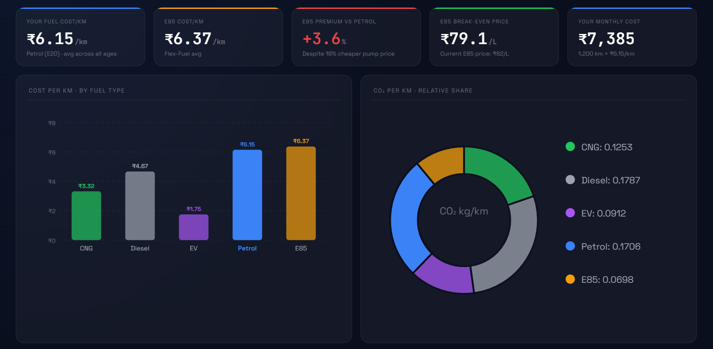
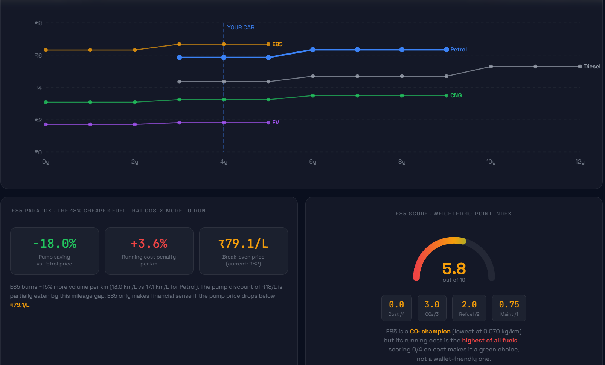
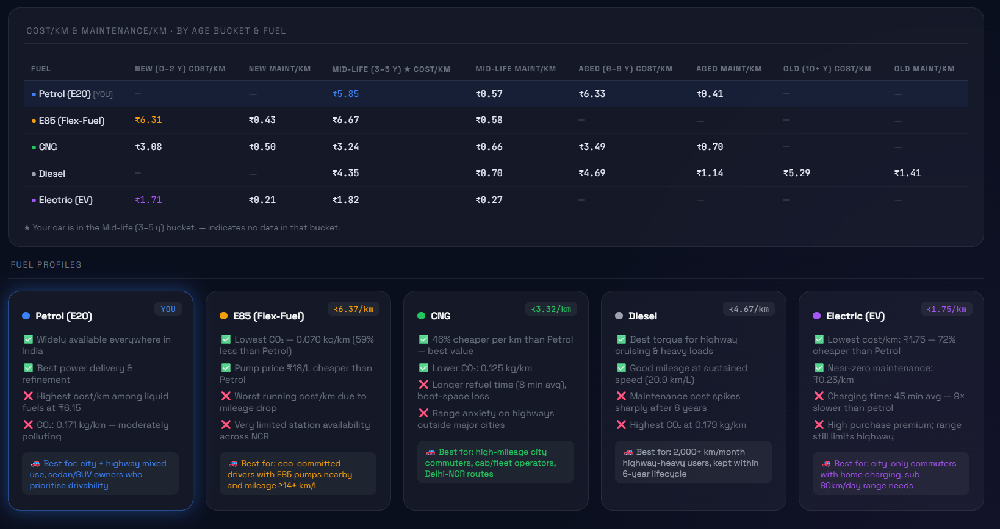

# Day 17 - Fuel Cost Analytics Dashboard
**ABTalksOnAI · 60-Day Claude Challenge**

---

## What I Built

A **complete fuel analytics dashboard** for my Hyundai Venue (Petrol, 4 years old, 1,200 km/month) - built entirely from a raw CSV dataset with zero manual calculation.

Claude acted as a full-stack data analyst: it ingested 52 records across 5 fuel types, computed 7 categories of metrics, and rendered an interactive HTML dashboard with pure SVG charts, glassmorphism UI, hover tooltips, an animated gauge, and responsive layout - all in a single file.

**Live output:** `day17-fuel-dashboard.html`

---

## Screenshots

### Section 1 — KPI Cards + Bar & Doughnut Charts


### Section 2 — Age Line Chart + E85 Paradox + Gauge


### Section 3 — Age Bucket Table + Fuel Profile Cards


---

## The Prompt Structure

The prompt was a structured analytics brief with four layers:

```
## Details       → vehicle context (make, fuel, age, usage, km/month)
## Role          → "Data analyst. Read CSV → compute → output HTML"
## Compute       → 7 explicit metric formulas (no ambiguity)
## Dashboard     → layout, chart types, colour system, responsive rules
```

**Key design decision:** Specifying formulas explicitly (e.g. `Avg Cost/km = Fuel_Cost_INR ÷ Distance_km`) eliminated hallucinated averages. Claude computed from raw rows, not assumptions.

---

## Metrics Computed (all from CSV)

| Metric | Formula | Source |
|---|---|---|
| Avg Cost/km | `Fuel_Cost_INR ÷ Distance_km` | Per fuel type |
| Avg CO₂/km | `CO2_emitted_kg ÷ Distance_km` | Per fuel type |
| Avg Maintenance/km | `Maintenance_Cost_INR ÷ Distance_km` | Per fuel type |
| Avg Refuel Time | `Refuel_Recharge_time_min` | Per fuel type |
| Age Bucket Analysis | New / Mid-life / Aged / Old | Cost + Maint per bucket |
| E85 Paradox | Pump saving, Running penalty, Break-even price | Cross-fuel calc |
| E85 Score /10 | Cost=4pt · CO₂=3pt · Refuel=2pt · Maint=1pt | Weighted rank |

---

## Key Findings from the Data

### My Car (Petrol E20 · 4 yrs · 1,200 km/mo)
- **Running cost:** ₹6.15/km → **₹7,385/month**
- At Mid-life bucket (3–5y): ₹5.85/km — still pre-aging-cost-spike

### The E85 Paradox (the headline insight)
E85 is priced **₹18/L cheaper** than Petrol — sounds like a win. It isn't.

| Metric | Value |
|---|---|
| Pump price saving | −18.0% vs Petrol |
| Running cost penalty | **+3.6% per km** |
| Break-even price needed | ₹79.1/L |
| Current E85 price | ₹82/L → still above break-even |

**Why?** E85 delivers 13.0 km/L vs Petrol's 17.1 km/L. The 24% mileage gap consumes the pump discount. E85 only makes financial sense if the pump price falls below ₹79.1/L.

### E85 Score: 5.75/10
- CO₂ champion → scores **3/3** (lowest at 0.070 kg/km, 59% less than Petrol)
- Cost → scores **0/4** (highest running cost/km of all fuels)
- Verdict: green choice, not a wallet-friendly one

### Full Fuel Comparison

| Fuel | Cost/km | CO₂/km | Maint/km | Refuel |
|---|---|---|---|---|
| Electric (EV) | ₹1.75 ✅ | 0.091 kg | ₹0.23 ✅ | 45 min ❌ |
| CNG | ₹3.32 | 0.125 kg | ₹0.66 | 8 min |
| Diesel | ₹4.67 | 0.179 kg ❌ | ₹1.00 ❌ | 5 min |
| Petrol (E20) | ₹6.15 | 0.171 kg | ₹0.47 | 5 min |
| E85 (Flex-Fuel) | ₹6.37 ❌ | 0.070 kg ✅ | ₹0.46 | 5 min |

---

## Dashboard Architecture

```
day17-fuel-dashboard.html
│
├── Header            Vehicle · Fuel · Age · km/month
├── KPI Row (5 cards) Cost/km · E85/km · E85 Premium · Break-even · Monthly cost
├── SVG Bar Chart     Cost/km per fuel · hover tooltips
├── SVG Doughnut      CO₂/km relative share · hover tooltips
├── SVG Line Chart    Cost/km vs age (0–12y) · vertical marker at car age
├── E85 Paradox Panel Pump saving · Running penalty · Break-even
├── SVG Gauge         E85 Score/10 · CSS animated arc
├── Age Bucket Table  Cost/km + Maint/km across 4 age buckets × 5 fuels
└── Fuel Profile Cards 5 cards · 2 pros · 2 cons · best-for · [YOU] glow on Petrol
```

**Tech constraints enforced in prompt:**
- No CDN libraries (pure SVG, vanilla JS, CSS in `<style>`)
- Dark navy `#0a0f1e` + glassmorphism panels
- Responsive: 375px → 1440px

---

## What I Learned

### 1. Formula-first prompting eliminates hallucination
When working with data, specifying the exact formula (not just "calculate cost per km") locks Claude to your logic. Implicit instructions leave room for wrong assumptions.

### 2. Claude as a data analyst — the real workflow
```
Raw CSV → Python computation → HTML render
```
Claude ran actual Python under the hood to aggregate 52 rows, then passed exact numbers into the HTML. This is the same pipeline used in real consulting and BI work — just compressed into a single prompt.

### 3. The E85 Paradox is a real analytics trap
A metric that looks good on one axis (pump price) can be misleading without the full picture (mileage efficiency). Dashboards exist to surface exactly this kind of hidden truth.

### 4. SVG charts without libraries are powerful — and verbose
Pure SVG gives complete control over every pixel. The tradeoff is verbosity: a bar chart that takes 3 lines in Chart.js takes 40+ lines in raw SVG. Worth it when you need zero dependencies.

### 5. Age bucket analysis reveals cost curves
Petrol's Mid-life (3–5y) cost/km is ₹5.85 vs Aged (6–9y) at ₹6.33 — a 8% jump. Diesel spikes harder: Mid-life ₹4.35 → Old ₹5.29 (21% increase). Knowing your car's age bucket changes the buy-vs-hold calculus.

---

## Prompting Patterns Used

| Pattern | Application |
|---|---|
| **Role assignment** | "Data analyst. Read CSV → compute → output HTML only" |
| **Formula specification** | Explicit math for each KPI, no ambiguity |
| **Constraint layering** | No CDN · pure SVG · responsive range · colour system |
| **Output contract** | "Output: `<!DOCTYPE html>` only. All numbers from CSV." |
| **Vehicle context injection** | `[YOUR VEHICLE]`, `[FUEL]`, `[CAR AGE]` as fill-in tokens |

---

## Tech Stack

| Layer | Tool |
|---|---|
| Data processing | Python (csv, collections, statistics) |
| Charts | Pure SVG (no D3, no Chart.js) |
| Interactivity | Vanilla JS (hover tooltips, gauge animation) |
| Styling | CSS custom properties + glassmorphism |
| Fonts | Space Grotesk · JetBrains Mono |
| Deployment | Single HTML file — no build step |

---

## Files

```
day17/
├── day17-csv.csv              Raw dataset (52 records · 5 fuel types)
├── day17-fuel-dashboard.html  Complete analytics dashboard
└── day17.md                   This documentation
```

---

*Day 17 of 60 · ABTalksOnAI · Built with Claude Sonnet*
*GitHub: LakshayAggarwal12 · LinkedIn: lakshay-aggarwal-dev*