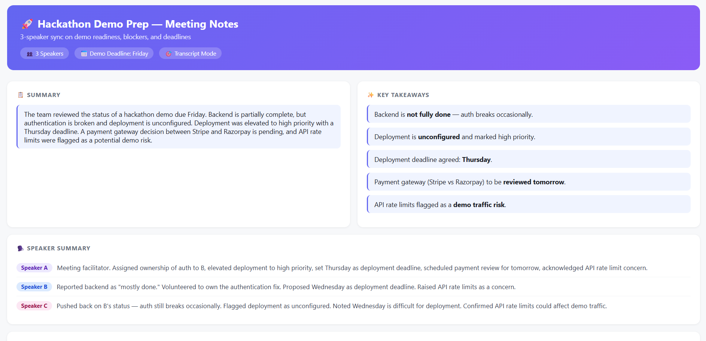
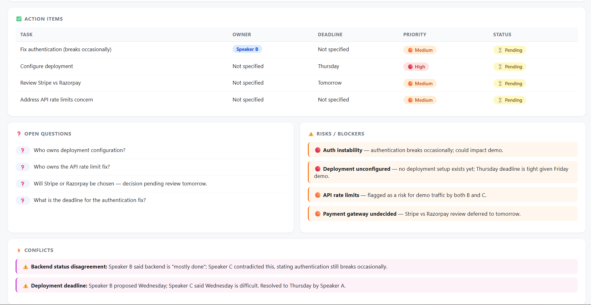
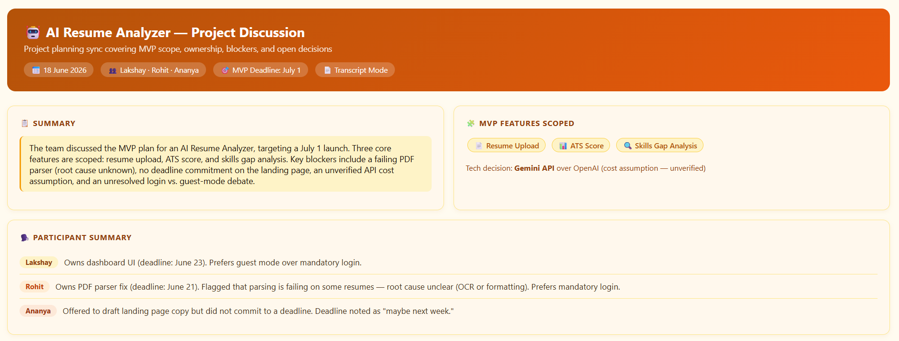
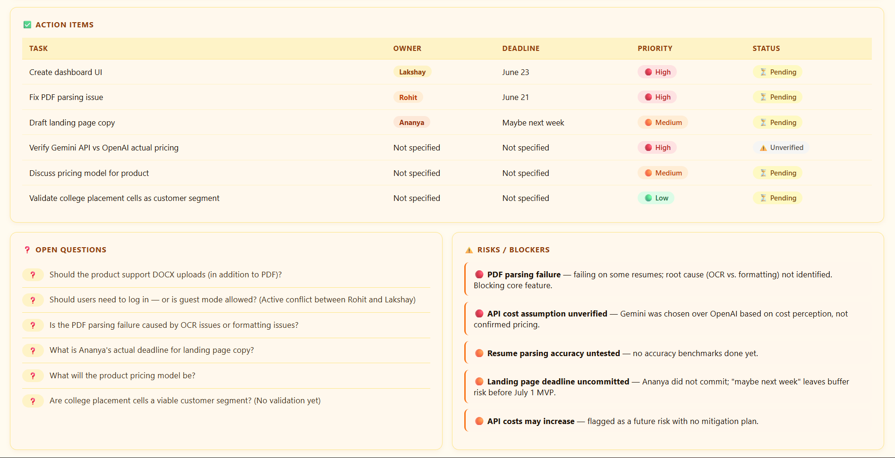
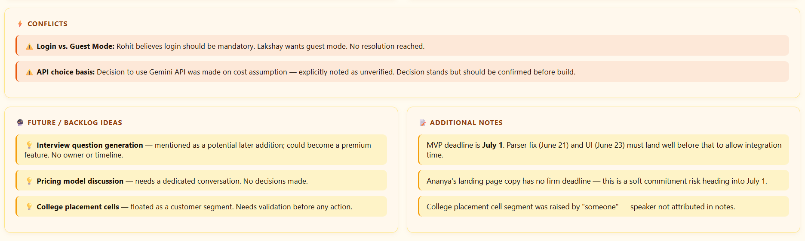

# Day 18 — Building a Brain Dump → Action Planner Custom Skill

**Challenge:** ABTalksOnAI 60-Day Claude Challenge
**Date:** June 18, 2026
**Category:** Claude Custom Skills · Productivity · Meeting Intelligence

---

## What I Built

A **Custom Claude Skill** called `brain-dump-action-planner` that transforms raw meeting transcripts, voice memos, and messy notes into structured, interactive project dashboards — inside Claude itself.

No external tools. No copy-pasting into Notion. Just drop your notes and get a fully formatted, colour-coded action board.

---

## The Skill

### Skill Name
`brain-dump-action-planner`

### Skill Description

> Transform messy notes, meeting transcripts, voice memos, brainstorming sessions, and stream-of-consciousness thoughts into structured summaries, action plans, decisions, open questions, and task lists. Organize information clearly without inventing, assuming, or filling gaps. Preserve all names, dates, numbers, and terminology exactly as provided.

### What the Skill Produces

Every output is a **self-contained interactive HTML dashboard** with the following sections:

| Section | Purpose |
|---|---|
| 📋 Summary | Short overview of the meeting or brain dump |
| ✨ Key Takeaways | Highlights displayed as cards |
| ✅ Action Items | Table with Task · Owner · Deadline · Priority · Status |
| ❓ Open Questions | Unresolved topics and pending decisions |
| ⚠️ Risks / Blockers | Dependencies, blockers, concerns |
| ⚡ Conflicts | Conflicting deadlines, owners, or decisions |
| 📝 Additional Notes | Supporting context that doesn't fit elsewhere |

### Transcript Mode (Special Behaviour)

When the input is a speaker-attributed transcript, the skill activates **Transcript Mode** which adds:
- Speaker Summary (one line per speaker)
- Decisions by Speaker
- Action Items attributed by speaker
- Attribution notes when ownership is unclear

Speaker labels are preserved **exactly as provided** — no renaming or normalizing.

### Core Design Rules

- Output renders like **Notion / ClickUp / Linear / Asana**
- **Never invent, infer, assume, or estimate** missing information — display `Not specified` instead
- Status badges: 🔴 High · 🟠 Medium · 🟢 Low · ⚠️ Conflict · ❓ Open · ✅ Done · ⏳ Pending
- Mobile responsive cards, soft shadows, hover effects, strong visual hierarchy
- Uses colour-coded speaker tags to distinguish contributors at a glance

---

## How I Tested It

### Test 1 — Anonymous Transcript (Hackathon Demo Prep)

**Input:** A raw 3-speaker transcript (Speaker A, B, C) from a sync about a hackathon demo due Friday. No structure, just back-and-forth dialogue covering auth bugs, deployment gaps, payment gateway decisions, and API rate limits.

**Prompt used:**
```
/brain-dump-action-planner
Speaker A: We need the hackathon demo ready by Friday.
Speaker B: Backend is mostly done.
Speaker C: Not really, authentication still breaks occasionally.
...
```

**Output:** Full dashboard with colour-coded speaker tags, action items table, conflict detection (backend status disagreement + deployment deadline conflict), and open questions (who owns deployment? who owns the API fix?).

**What stood out:** The skill correctly flagged that Speaker B's "mostly done" claim was contradicted by Speaker C — and surfaced it as a **Conflict**, not just a note. It also caught that two action items (deployment config, API rate limits) had **no owner assigned** — which I hadn't explicitly noticed myself.

📸 *Screenshots:*





---

### Test 2 — Named Participants (AI Resume Analyzer Project Discussion)

**Input:** Structured meeting notes from a real project discussion — 3 named participants (Lakshay, Rohit, Ananya), a July 1 MVP deadline, feature scope, a failing PDF parser, an uncommitted landing page deadline, an unverified API cost assumption, and an unresolved login-vs-guest-mode debate.

**Prompt used:**
```
/brain-dump-action-planner
Project Discussion - AI Resume Analyzer
Date: 18 June 2026
Participants: Lakshay Rohit Ananya
...
```

**Output:** Full amber & orange themed dashboard (applied after first render via theme change request) with named speaker tags, 6 action items with deadlines, 6 open questions, 5 risks/blockers, 2 conflicts, and a future/backlog ideas section.

**What stood out:** The skill correctly marked the Gemini API decision as `⚠️ Unverified` in the action items status column — because the notes said "cost seems lower" but explicitly flagged it needs verification. It didn't promote the assumption to a decision.

📸 *Screenshots:*







---

## Folder Structure

```
day-17/
├── day17.md
└── screenshots/
    ├── hackathon-summary.png
    ├── hackathon-actions.png
    ├── resume-analyzer-summary.png
    ├── resume-analyzer-actions.png
    └── resume-analyzer-conflicts.png
```

---


## Key Learnings

### 1. Custom Skills turn Claude into a structured thinking partner
Without the skill, Claude would produce a decent summary in markdown. With the skill, it produces an interactive HTML dashboard that looks like a real PM tool. The same input, radically different output quality — just from giving Claude a well-defined output contract.

### 2. "Never invent" is the most important instruction in the skill
The skill explicitly says: *Never add, infer, assume, predict, estimate, or complete missing information. Display 'Not specified' instead.* This is what separates a reliable tool from a hallucination machine. In Test 2, Ananya's deadline was genuinely "maybe next week" — the skill displayed that verbatim and flagged it as a risk, rather than picking a date.

### 3. Conflict detection is emergent, not explicitly coded
I didn't write a "detect contradictions" rule. But because the skill separates Conflicts into its own section and attributes statements by speaker, contradictions surface naturally. Speaker B's "mostly done" vs. Speaker C's "auth still breaks" became a flagged conflict without any special logic.

### 4. Theme as a separate concern from structure
Applying a theme post-render (Test 3) confirmed that structure and styling are cleanly separable in HTML artifacts. The entire CSS palette can be swapped without touching content logic — useful to know for future multi-dashboard builds where visual distinction matters.

### 5. The `/skill` invocation pattern scales well
Using `/brain-dump-action-planner` as the trigger keeps the skill discoverable and consistent. Any team member can drop messy notes after the trigger and get the same structured output — no prompting skill required.

---

## What's Next

- **Merge Mode test:** Feed two separate meeting transcripts on the same project and let the skill identify duplicates and conflicts across both
- **Voice memo test:** Try with a rough transcript of a spoken brain dump (with filler words, incomplete sentences) to stress-test the "never invent" rule
- **Export to PDF:** Pipe the HTML output through the PDF skill to make shareable meeting reports

---

*Part of the [ABTalksOnAI 60-Day Claude Challenge](https://github.com/LakshayAggarwal12/60-days-claude-ai) · GitHub: [@LakshayAggarwal12](https://github.com/LakshayAggarwal12) · LinkedIn: [lakshay-aggarwal-dev](https://linkedin.com/in/lakshay-aggarwal-dev)*