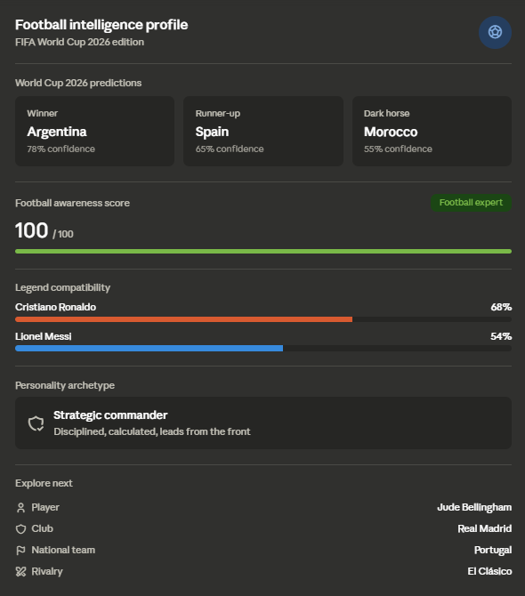

# Day 19 — Football Intelligence Hub

#ABTalksOnAI · 60-Day Claude Challenge

## What was built

A three-stage interactive Football Intelligence experience powered entirely by an uploaded Excel workbook (`ABTalks_WorldCup_Intelligence_Master.xlsx`):

1. **Stage 1 — FIFA World Cup 2026 Prediction Report**: Winner, runner-up, and dark-horse predictions with confidence scores, evidence, and risk factors, derived from historical performance, current contender form, and live 2026 group-stage results.
2. **Stage 2 — Football IQ Quiz**: A 5-question, difficulty-tiered quiz (beginner → advanced) that scored a Football Awareness Score and assigned a fan classification.
3. **Stage 3 — Messi vs Ronaldo Personality Match**: A 12-question trait quiz (ambition, discipline, leadership, teamwork, creativity, risk-taking, confidence, work ethic, learning style, decision-making) that produced compatibility percentages for both legends, a personality archetype, and recommendations.

The final deliverable was a single **Football Intelligence Profile** — rendered as an interactive visual summary card (not just text) using Claude's inline widget capability, combining all three stages into one shareable output.

## Screenshot



## Result summary (this run)

| Category | Result |
|---|---|
| WC 2026 winner pick | Argentina — 78% confidence |
| Runner-up | Spain — 65% confidence |
| Dark horse | Morocco — 55% confidence |
| Football awareness score | 100 / 100 — Football Expert |
| Ronaldo compatibility | 68% |
| Messi compatibility | 54% |
| Personality archetype | Strategic Commander |
| Recommended explore | Jude Bellingham · Real Madrid · Portugal · El Clásico |

## Prompt structure

The build used a single upfront master prompt that pre-defined the entire experience as a persona + staged workflow:

- **Persona stacking**: "Football Intelligence Analyst, Sports Educator, and Personality Assessor" in one role definition
- **Gated staging**: Stage 0 (knowledge calibration) → Stage 1 (prediction report) → Stage 2 (IQ quiz) → Stage 3 (personality match) → Final Output, with explicit "automatically move to next stage" instructions to prevent the model from stalling between sections
- **Output contract specified upfront**: exact fields required per prediction (confidence score, evidence, risks), exact quiz mechanics (present all questions before scoring), and exact personality output fields (compatibility %, archetype, recommendations) — all defined before any data was touched
- **Constraint embedded in the ask**: "without asking direct Messi vs Ronaldo questions" — forced indirect trait-based inference rather than a simple either/or quiz

## Key findings

- **Workbook-only grounding worked well**: every prediction, quiz question, and trait inference was traceable to a specific table (Team Historical Performance, Current Contenders, Live 2026 Standings, Star Players), avoiding hallucinated stats.
- **Calibration step mattered**: asking the knowledge-level question first (via `ask_user_input_v0`) let the same prediction report adjust jargon density without re-running any analysis — the data layer stayed constant, only the explanation layer adapted.
- **Trait-quiz answers don't cleanly sort into one legend**: real answers mixed Ronaldo-leaning (discipline, vocal leadership, calculated decisions) and Messi-leaning (teamwork, instinctive creativity) signals. The honest move was to report both compatibility percentages rather than forcing a binary pick — the lean (68% vs 54%) is more informative than a hard label.
- **Visual artifact elevated the final deliverable**: the same data presented as a structured widget (metric cards, progress bars, archetype badge) communicated faster than the equivalent markdown table block from Stage 1/2.

## Architecture

```
User uploads workbook (.xlsx)
        ↓
Stage 0: ask_user_input_v0 → knowledge level
        ↓
Stage 1: Read Tables 1–4 + 7 (historical, contenders, players, live standings)
        → generate prediction report (winner/runner-up/dark horse/players to watch)
        ↓
Stage 2: ask_user_input_v0-style free text → score against generated quiz key
        → Football Awareness Score + classification
        ↓
Stage 3: 12-question trait quiz → manual trait-to-legend signal mapping
        → compatibility %, archetype, recommendations
        ↓
Final: visualize:show_widget → single Football Intelligence Profile card
```

## Lessons learned

1. **Staged prompts need explicit "auto-advance" instructions** — without it, the model tends to pause and ask "ready for the next stage?" which breaks the intended flow.
2. **Don't force binary outcomes from continuous data** — the Messi/Ronaldo split worked better as two independent percentages than as a single "you are 73% Messi" style output, since real personalities blend both.
3. **A workbook with pre-built input tables (Table 5, Table 6) doubles as both the data source and the implicit answer schema** — it told the model exactly which traits to measure, keeping the quiz from drifting off-spec.
4. **Visual widgets are worth it for "profile/result" style deliverables** — this category (score + badges + comparison bars) benefits more from a rendered card than from a markdown table, unlike pure data/comparison tasks.

## Prompting patterns reused

- Multi-role persona definition in one line (Analyst + Educator + Assessor)
- Staged pipeline with auto-advance instructions
- Output contract specified before generation (exact fields, confidence scores, evidence + risks)
- Indirect trait inference instead of direct either/or questions to avoid leading the model toward a forced answer

## Tech stack

- Claude.ai (chat interface)
- Excel workbook ingestion (`.xlsx`, 7-table structure)
- `ask_user_input_v0` tool for calibration questions
- `visualize:show_widget` for the final interactive profile card

## File tree

```
day19_football_intelligence_hub/
├── day19.md
└── screenshots/
    └── football_intelligence_profile.png
```

## Next actions

- [ ] Write LinkedIn caption variants (story-driven / punchy / educational) for Day 19
- [ ] Consider extending Stage 1 with a bracket-style knockout simulation once group stage completes
- [ ] Revisit Messi/Ronaldo trait-signal mapping as a reusable Claude Skill for future personality-match builds