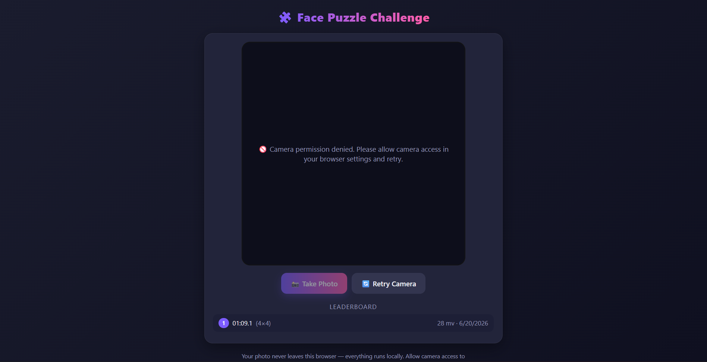
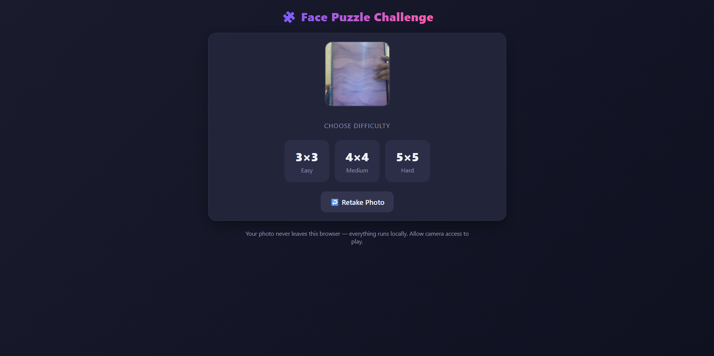
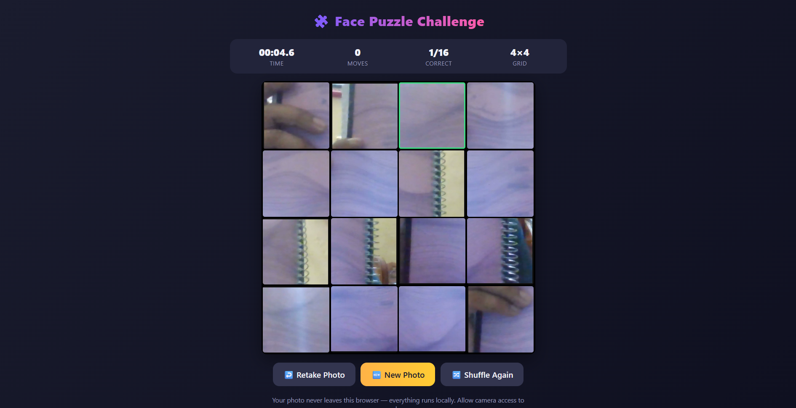
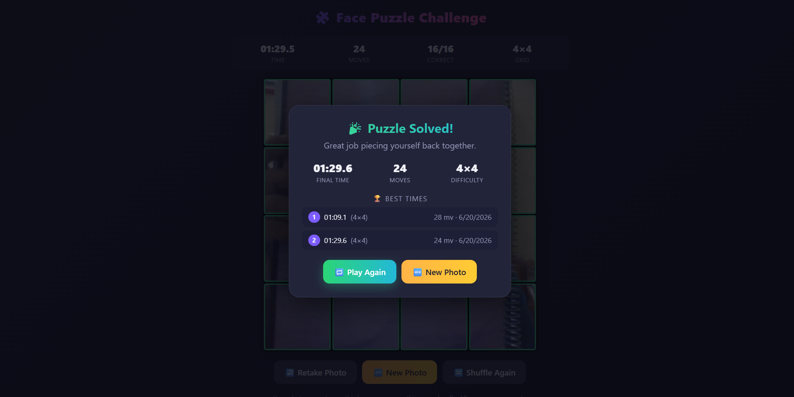

# Day 20 — Face Puzzle Challenge 🧩

**#ABTalksOnAI 60-Day Claude Challenge**

---

## What I Built

A fully self-contained, single-file HTML game that turns your own webcam selfie into a sliding-style drag-and-drop puzzle:

- Live webcam capture via `getUserMedia()` with a mirrored preview
- Center-cropped square snapshot becomes the puzzle source image
- Selectable difficulty — 3×3, 4×4, or 5×5 grids
- Pieces rendered with pure CSS (`background-position` + `background-size`) instead of cutting separate image files
- Full drag-and-drop on desktop **and** manual touch-drag support on mobile (via a floating "ghost" tile + `elementFromPoint`)
- Live timer (`mm:ss.t`), move counter, and correct-piece tracker
- Auto win-detection the instant every tile is in place, with a results overlay
- Top-5 best times leaderboard persisted in `localStorage` (time, moves, difficulty, date)
- Retake Photo / New Photo / Shuffle Again / Play Again flows
- Graceful handling of denied/missing/in-use camera permissions

No frameworks, no build step — just one `.html` file that runs entirely client-side.

---

## Prompt Used (verbatim)

> You are an expert front-end developer. Build me a complete, fully working face puzzle game as a single self-contained HTML file (no external dependencies except what can load from cdnjs.cloudflare.com, cdn.jsdelivr.net, or unpkg.com).
>
> FEATURES REQUIRED — deliver ALL of these in one complete response:
> 1. CAMERA ACCESS — request webcam permission, live preview, Take Photo button to snapshot onto a canvas
> 2. PUZZLE GENERATION — choose 3×3 / 4×4 / 5×5, slice the face image into equal pieces, randomly scramble (guaranteed solvable), render as draggable tiles
> 3. DRAG & TOUCH GESTURE CONTROLS — mouse drag (desktop) and touch drag (mobile/tablet), swap on drop, snap to nearest cell, colored border while dragging, green border when correctly placed
> 4. TIMER & MOVE COUNTER — live elapsed time (mm:ss.t), move count, correctly-placed-out-of-total count
> 5. WIN DETECTION & RESULTS SCREEN — auto-detect completion, stop timer, results overlay (time, moves, difficulty), save top 5 best times to localStorage with date/time/moves/difficulty, display leaderboard
> 6. UI & POLISH — clean modern design, desktop + mobile responsive, Retake Photo / Play Again / New Photo buttons
>
> TECHNICAL REQUIREMENTS: single HTML file, inline CSS/JS, no frameworks, works in Chrome/Firefox/Safari, camera works over HTTPS or localhost, handle permission denial gracefully, no placeholder comments. Output the complete HTML file in one code block, no truncation.

---

## Architecture

```
┌─────────────────────────────────────────────────────────┐
│                     index.html (single file)              │
├─────────────────────────────────────────────────────────┤
│  CAMERA SCREEN                                             │
│   getUserMedia() → <video> live preview (mirrored)         │
│   Take Photo → center-crop to square → <canvas> dataURL    │
├─────────────────────────────────────────────────────────┤
│  DIFFICULTY SCREEN                                          │
│   thumbnail preview + 3×3 / 4×4 / 5×5 selector              │
├─────────────────────────────────────────────────────────┤
│  GAME SCREEN                                                │
│   boardState[] (position → pieceId)                         │
│     ├─ buildBoardState() → Fisher–Yates shuffle             │
│     ├─ renderBoard() → CSS grid tiles, bg-position per piece│
│     ├─ Mouse: HTML5 dragstart/dragover/drop                 │
│     ├─ Touch: touchstart/move/end + ghost element            │
│     └─ swapPieces() → re-render → checks win condition       │
│   Timer: setInterval(100ms) → mm:ss.t display                │
├─────────────────────────────────────────────────────────┤
│  WIN OVERLAY                                                 │
│   stopTimer() → saveScore() → localStorage (top 5)           │
│   renderLeaderboard()                                        │
└─────────────────────────────────────────────────────────┘
```

---

## Key Learnings

- **Swap puzzles don't need solvability checks.** Unlike a classic 15-puzzle with a single blank tile (where only half of all permutations are solvable), a free drag-and-drop swap puzzle is solvable from *any* shuffled state, since two tiles can always be directly swapped. This massively simplifies the shuffle logic — just Fisher–Yates and re-roll only if it lands already-solved.
- **CSS can slice the image — no cropping pipeline needed.** Using one `background-image` per tile with `background-size: N*100% N*100%` and a calculated `background-position` percentage avoids ever generating N² separate image files. Much lighter and easier to reason about than canvas-based slicing.
- **Touch drag-and-drop needs to be built by hand.** The native HTML5 Drag and Drop API barely works on touch devices, so mobile support meant manually tracking `touchstart/touchmove/touchend`, rendering a floating "ghost" tile that follows the finger, and using `document.elementFromPoint()` on release to detect the drop target.
- **`touch-action: none` is essential** on draggable tiles — without it, the browser intercepts touch gestures for scrolling before `touchmove` ever fires cleanly.
- **localStorage leaderboard state survives camera permission failures.** Testing the "permission denied" flow (see screenshot 1) still showed a previously saved best time from an earlier successful run — a good reminder that app state and camera state are independent and shouldn't be coupled.
- **Center-cropping the video feed before puzzle slicing matters.** Webcams default to 4:3 or 16:9 — cropping to a square *before* slicing guarantees every grid cell is genuinely square, instead of stretched.

---

## File Tree

```
day20/
├── day20.md
├── face-puzzle-challenge.html
└── _screenshots/
    ├── 01_camera_permission_denied.png
    ├── 02_difficulty_selection.png
    ├── 03_puzzle_in_progress_4x4.png
    └── 04_puzzle_solved_results.png
```

---

## Screenshots

**1. Camera permission denied — graceful error handling**


**2. Difficulty selection screen with captured photo preview**


**3. 4×4 puzzle in progress — green border on correctly placed tile**


**4. Win overlay with final stats and leaderboard**


---

## Stats

| Metric | Value |
|---|---|
| Difficulty tested | 4×4 (16 pieces) |
| Best time logged | 01:09.1 (28 moves) |
| Second run | 01:29.6 (24 moves) |
| Lines of code | ~650 (single HTML file) |
| External dependencies | 0 |
| Screens | 3 (camera, difficulty, game) + 1 overlay |

---

## Next Actions

- Test 5×5 difficulty end-to-end on a real mobile device for touch responsiveness
- Consider adding a "preview original image" toggle while solving (common puzzle-game affordance)
- Explore filtering the leaderboard per-difficulty instead of one global top 5
- Add this build to the GitHub repo and push today's LinkedIn caption

---

**Day 20 of 60 — #ABTalksOnAI Claude Challenge** 🚀