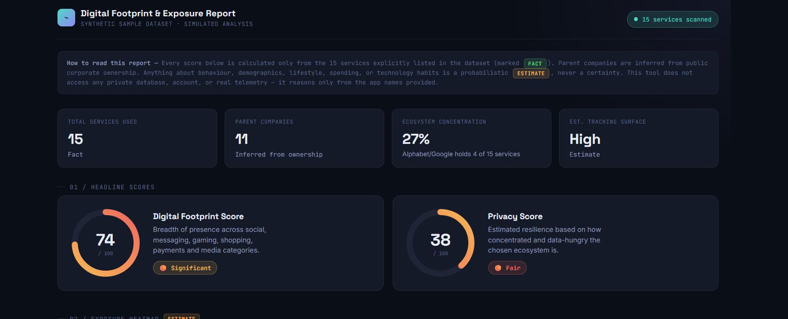
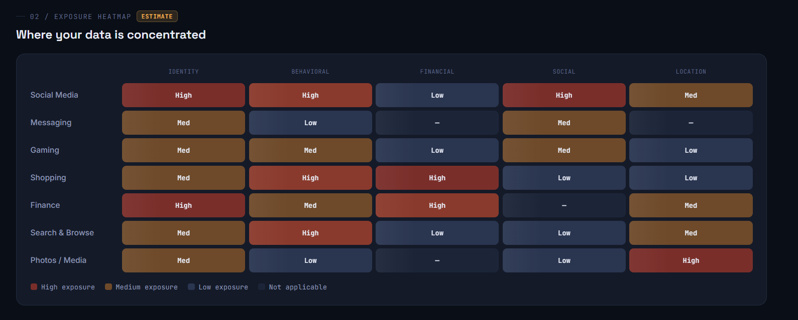
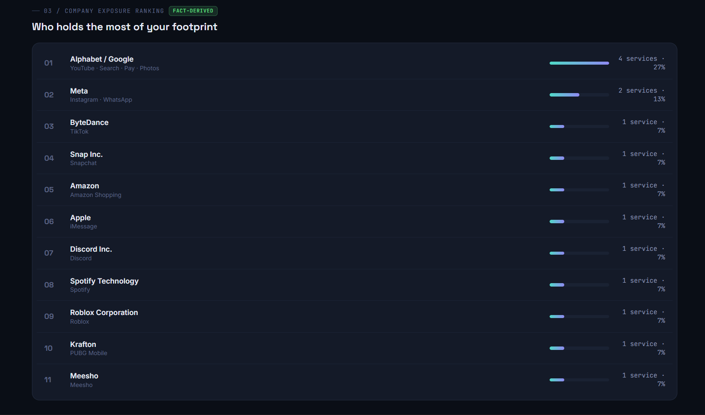
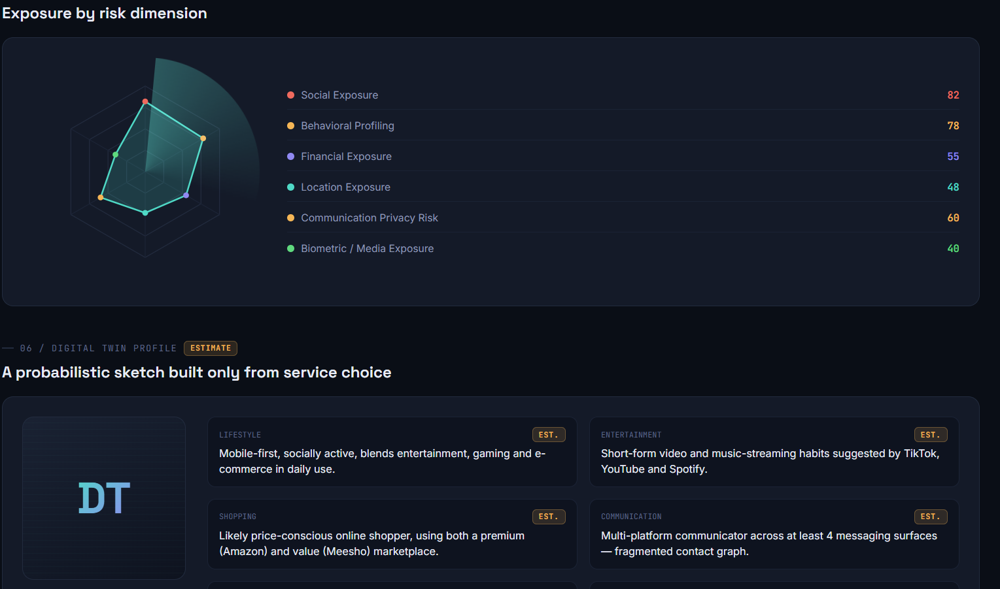
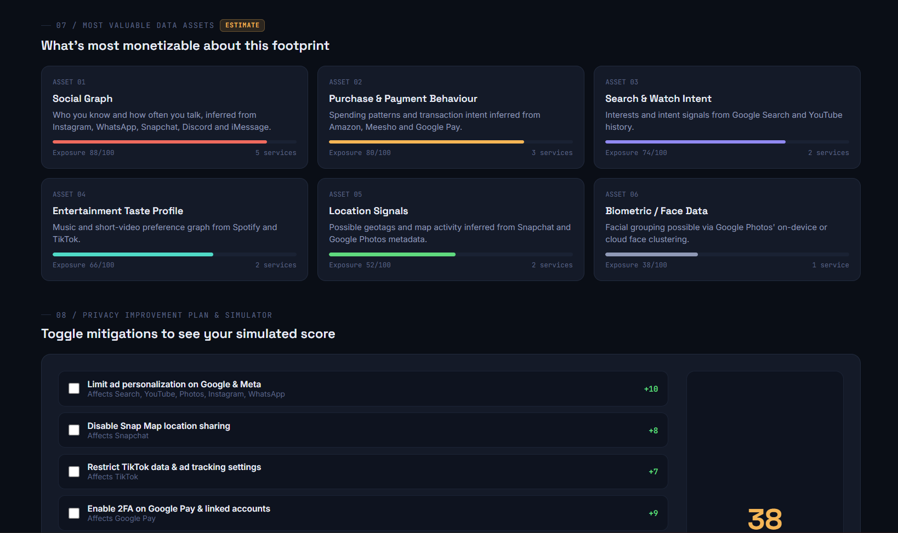

# Day 21 — Digital Footprint & Exposure Report Dashboard

**#ABTalksOnAI 60-Day Claude Challenge**

## What I Built

A single-file, interactive HTML dashboard that takes a list of apps/services a person uses and turns it into a full "digital footprint" exposure report — styled like a premium cybersecurity / privacy-analytics product (think Stripe Dashboard meets Apple Privacy Report meets a SOC console).

The dashboard runs entirely on a **synthetic sample dataset** (15 services: Instagram, Snapchat, TikTok, YouTube, Discord, WhatsApp, iMessage, Spotify, Roblox, PUBG Mobile, Amazon, Meesho, Google Search, Google Pay, Google Photos) and computes/visualizes:

1. **Digital Footprint Score** (0–100, gauge) — 74 / "Significant"
2. **Privacy Score** (0–100, gauge) — 38 / "Fair"
3. **Exposure Heatmap** — category × data-type grid (Social Media, Messaging, Gaming, Shopping, Finance, Search, Photos vs. Identity, Behavioral, Financial, Social, Location)
4. **Company Exposure Ranking** — 15 services rolled up to 11 inferred parent companies, ranked by share (Alphabet/Google leads at 27%)
5. **Data Collection Matrix** — per-service dot-matrix of likely-collected data types
6. **Risk Radar** — animated sonar-sweep SVG radar chart across 6 risk dimensions (Social, Behavioral, Financial, Location, Communication, Biometric)
7. **Digital Twin Profile** — a clearly-labeled *estimate* persona sketch (lifestyle, entertainment, shopping, communication habits)
8. **Most Valuable Data Assets** — ranked cards on what's most "monetizable" about the footprint
9. **Privacy Improvement Plan & Simulator** — interactive checkboxes that recalculate the Privacy Score live as mitigations are toggled
10. **Final Verdict** — fact vs. estimate summary

The whole thing is built as one self-contained HTML/CSS/JS artifact — no external chart libraries. The radar chart, gauges, and heatmap are all hand-rolled with inline SVG and CSS Grid.

## The Core Prompt Used

```
### Sample User Dataset
Use the following dataset as the user's reported digital footprint.
Facts:
Applications: Instagram, Snapchat, TikTok, YouTube, Discord, WhatsApp,
iMessage, Spotify, Roblox, PUBG Mobile, Amazon, Meesho, Google Search,
Google Pay, Google Photos

Dataset Rules:
- Treat all listed services as Facts.
- Use these services to calculate all scores, exposure rankings, heatmaps,
  risk levels, ecosystem concentration, digital twin insights, data
  collection likelihood, and privacy recommendations.
- Infer parent companies from the services.
- Any behavioural, demographic, lifestyle, shopping, spending,
  entertainment, mobility, travel, communication, or technology-related
  conclusions must be labeled as Estimates.
- Never claim certainty.
- Never claim access to private databases.
- If information cannot reasonably be inferred, display:
  'Not enough information provided.'

# Output Requirement
Generate a complete interactive HTML artifact starting with <style>.
Do not output markdown.
The artifact should feel like a premium cybersecurity dashboard.

Design Inspiration: Notion, Stripe Dashboard, Linear, Google Privacy
Checkup, Apple Privacy Reports, Modern SaaS Analytics Platforms.

[+ full section spec: Digital Footprint Score, Privacy Score, Exposure
Heatmap, Company Exposure Ranking, Data Collection Matrix, Risk Radar,
Digital Twin Profile, Most Valuable Data Assets, Privacy Improvement
Plan, WOW Insights, Final Verdict — with explicit Fact/Estimate
separation rules and color-coded score bands]
```

## Architecture

```
User dataset (15 services, plain text)
        │
        ▼
Claude reasons over services → infers parent companies,
data categories, and risk weights (clearly tagged FACT / ESTIMATE)
        │
        ▼
Single HTML artifact
 ├─ <style>  → design tokens (dark cyber palette, Space Grotesk +
 │             Inter + JetBrains Mono, cyan/amber/red/green accents)
 ├─ <body>   → 9 sections, KPI strip, dual score gauges
 └─ <script> → renders Data Collection Matrix, Risk Radar (SVG),
               Most Valuable Data Assets, and the live
               Privacy Improvement Simulator from JS data arrays
```

## Key Learnings

1. **Fact/Estimate separation has to be a UI primitive, not just a disclaimer.** A single banner at the top isn't enough — tagging every section header and every twin-profile attribute with a `FACT` / `ESTIMATE` pill makes the distinction impossible to miss, even mid-scroll.
2. **Parent-company rollups change the whole narrative.** 15 apps feels diffuse; 11 parent companies with Google alone holding 27% (4 services) is the actually alarming number — rollup-before-visualize matters more than raw counts.
3. **Hand-rolled SVG radar charts are cheap.** A 6-axis radar chart is just trig: `angle = 2π·i/N - π/2`, `point = (cx + r·cos(angle), cy + r·sin(angle))`. No charting library needed for a fixed small N.
4. **`conic-gradient` + `mix-blend-mode: screen` rotated via CSS animation** gives a convincing radar "sonar sweep" for near-zero JS cost — good signature element for a cybersecurity-themed brief.
5. **An interactive simulator earns more trust than a static recommendation list.** Letting the user toggle mitigations and watch the Privacy Score move live (38 → up to ~94) makes the "improvement plan" section feel like a tool, not a listicle.
6. **Synthetic/sample datasets still need the same guardrails as real ones.** Even with placeholder data, every inferred trait (lifestyle, demographic signal, shopping behavior) stayed labeled as an Estimate — good practice to carry into any future version of this pointed at a real user's actual app list.

## File Tree

```
day21_digital_footprint_dashboard/
├── digital_footprint_dashboard.html
├── day21.md
└── _screenshots/
    ├── 01_headline_scores.png
    ├── 02_exposure_heatmap.png
    ├── 03_company_ranking.png
    ├── 04_risk_radar_and_twin_profile.png
    └── 05_data_assets_and_simulator.png
```

## Screenshots











## Stats

| Metric | Value |
|---|---|
| Services in dataset | 15 |
| Parent companies inferred | 11 |
| Top ecosystem concentration | Alphabet/Google — 27% |
| Digital Footprint Score | 74/100 (Significant) |
| Privacy Score (baseline) | 38/100 (Fair) |
| Privacy Score (all mitigations toggled) | ~94/100 |
| Sections in dashboard | 9 |
| External dependencies | 0 (vanilla HTML/CSS/JS + Google Fonts) |
| File size | Single-file artifact, ~600 lines |

## Next Actions

- [ ] Swap the synthetic dataset for a real (consenting, anonymized) digital footprint to stress-test the inference rules
- [ ] Add a "Not enough information provided" empty-state demo for sparse inputs
- [ ] Extract the radar-chart + gauge components into a reusable mini-library for future dashboard builds
- [ ] Explore adding LangChain-based dynamic risk-weighting (ties into the RAG skill-gap goal)

## Tags

`#ABTalksOnAI` `#60DayClaudeChallenge` `#BuildInPublic` `#PrivacyTech` `#DataPrivacy` `#CybersecurityDashboard` `#ClaudeAI` `#AIBuilders` `#FrontendDevelopment` `#JavaScript` `#SVG` `#PromptEngineering`