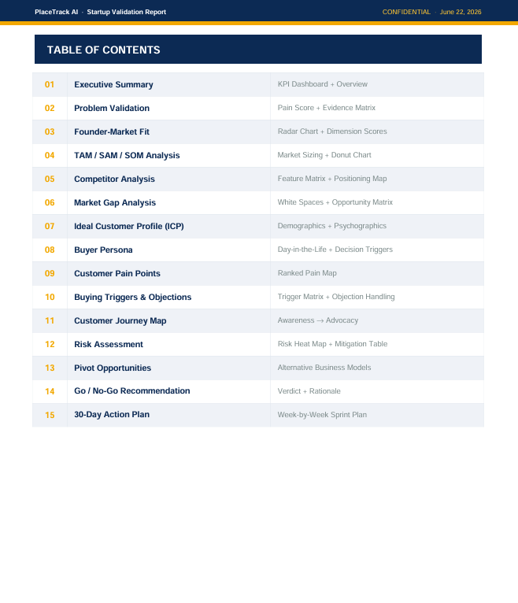
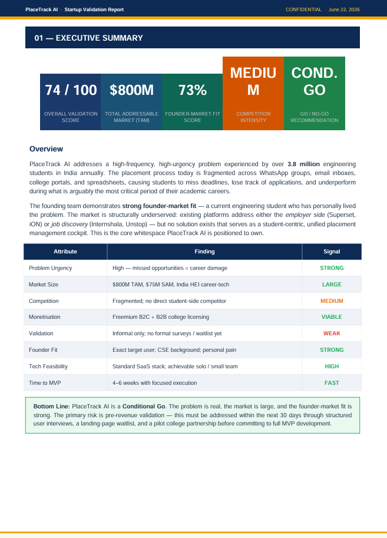
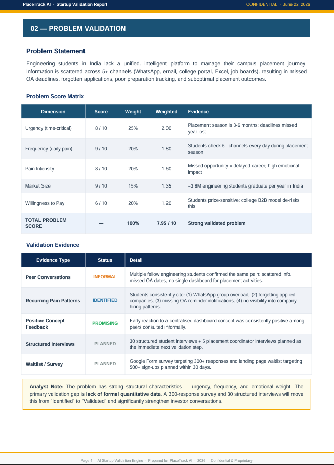
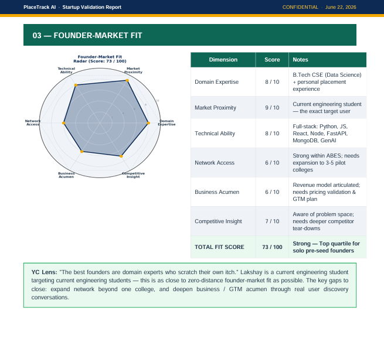
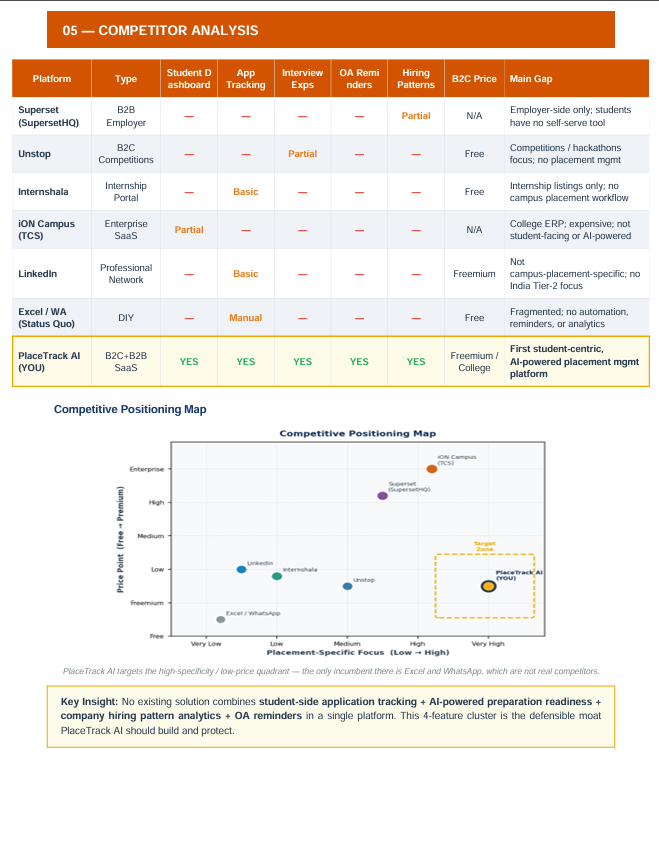
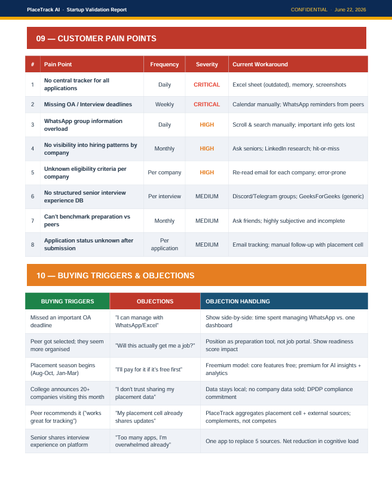
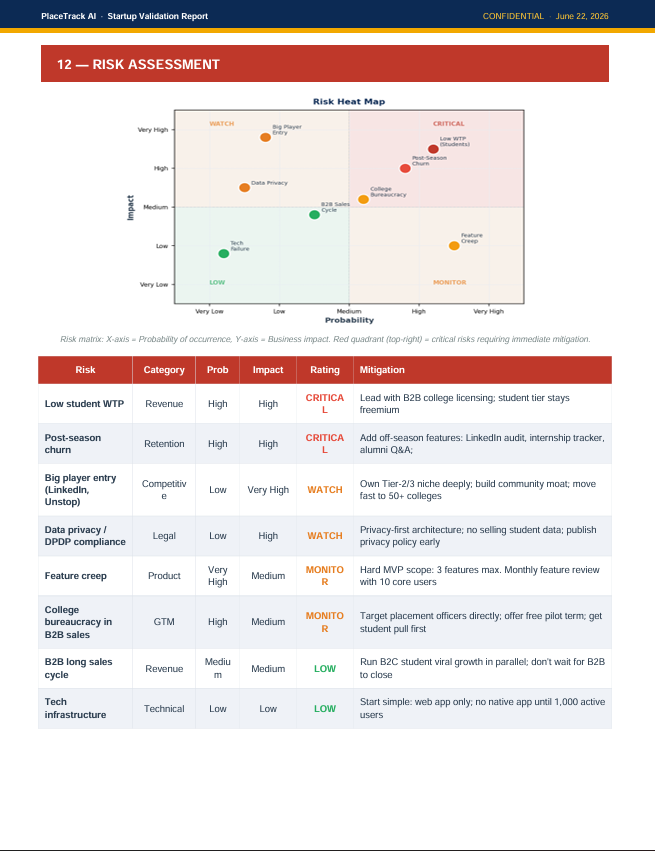
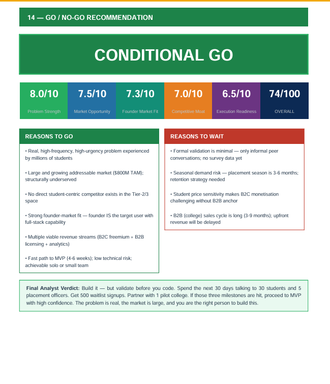

# Day 22 — PlaceTrack AI Startup Validation Report
### 60-Day Claude Challenge | ABTalksOnAI

---

## 🚀 What I Built

A **VC-grade, McKinsey-style Startup Validation Report** for my startup idea — **PlaceTrack AI** — generated as a professional, multi-page PDF using Python (ReportLab + Matplotlib).

The report was built by acting as three expert roles simultaneously (Startup Advisor + VC Analyst + Market Research Expert), feeding 7 structured inputs about the startup, and generating a complete pre-seed investment analysis document ready for direct PDF export.

**Output:** `PlaceTrackAI_Startup_Validation_Report.pdf` — 15 sections, 4 embedded charts, 365KB, fully print-ready.

---

## 🧠 Prompt Used

### Stage 1 — Expert Role + Data Collection Prompt

```
Act as a Startup Advisor, VC Analyst, and Market Research Expert.
Help me validate my startup idea.
First ask me:
1. Startup Idea
2. Problem Being Solved
3. Target Customers
4. Why I Want to Build It
5. Existing Validation (users, feedback, waitlist, etc.)
6. Target Market/Country
7. Startup, Business, or Side Project?
After collecting my answers, generate a professional PDF-ready Startup Validation Report containing:
* Executive Summary
* Problem Validation
* Founder-Market Fit Score
* TAM, SAM, SOM Analysis
* Competitor Analysis
* Market Gap Analysis
* Ideal Customer Profile (ICP)
* Buyer Persona
* Customer Pain Points
* Buying Triggers & Objections
* Customer Journey
* Risk Assessment
* Pivot Opportunities
* Go / No-Go Recommendation
* 30-Day Action Plan
Use tables, scores, charts, and professional consulting-style formatting.
Output should look like a report prepared by McKinsey, Y Combinator, or a VC firm and be ready for direct PDF export.
```

### Stage 2 — My 7-Question Answers (Startup Brief)

```
Q1. PlaceTrack AI — a centralized placement management platform for engineering students.
Platform helps students: Track campus placements, maintain application dashboard, monitor 
application status, access interview experiences from seniors, view company-wise hiring 
patterns, receive placement reminders, analyze preparation readiness. Also integrates 
with popular job portals to auto-import applications.

Q2. Students currently manage placement activities across WhatsApp groups, college portals, 
email inboxes, Excel sheets, and job platforms. They lose track of: applied companies, 
OA dates, interview schedules, rejection/selection status, eligibility criteria.
PlaceTrack AI = single source of truth for the entire placement journey.

Q3. Primary: Engineering students, final-year students, internship seekers.
Secondary: Placement cells, universities, Training & Placement Officers.
Initial Market: Tier-2 and Tier-3 engineering colleges in India.

Q4. As an engineering student preparing for placements, I have personally experienced 
placement information scattered across multiple channels. I want to create a centralized 
system to help students stay organized and improve placement outcomes.

Q5. Conversations with fellow students, identification of recurring issues, positive feedback 
on the dashboard concept, plans for structured interviews before MVP.

Q6. Phase 1: India. Focus: Tier-2/3 colleges and private universities.
Expansion: Internship management, MBA placements, international universities.

Q7. Scalable SaaS startup. Revenue: student subscriptions, college licensing, 
placement analytics, sponsored employer listings, recruitment partnerships.
```

---

## 🏗️ Architecture

```
User Inputs (7 Questions)
        │
        ▼
┌─────────────────────────────────────────────┐
│         Claude AI Validation Engine          │
│  Role: Startup Advisor + VC Analyst +        │
│         Market Research Expert               │
└──────────────────┬──────────────────────────┘
                   │
                   ▼
┌─────────────────────────────────────────────┐
│          generate_report.py                  │
│                                             │
│  ┌─────────────┐   ┌──────────────────────┐ │
│  │  Matplotlib  │   │      ReportLab        │ │
│  │   Charts     │   │  (Platypus + Canvas)  │ │
│  │              │   │                      │ │
│  │ • TAM Donut  │   │ • SimpleDocTemplate  │ │
│  │ • Radar Chart│──▶│ • Table + TableStyle │ │
│  │ • Risk Map   │   │ • ParagraphStyle     │ │
│  │ • Comp. Map  │   │ • HRFlowable         │ │
│  └─────────────┘   │ • Image (BytesIO)    │ │
│                     └──────────────────────┘ │
└──────────────────┬──────────────────────────┘
                   │
                   ▼
    PlaceTrackAI_Startup_Validation_Report.pdf
         (15 Sections · 4 Charts · 365KB)
```

---

## 📊 Report Sections Generated

| # | Section | Key Output |
|---|---------|-----------|
| 01 | Executive Summary | 5 KPI cards (74/100 score, $800M TAM, 73% fit) |
| 02 | Problem Validation | Weighted score matrix → **7.95/10** |
| 03 | Founder-Market Fit | Radar chart across 6 dimensions → **73/100** |
| 04 | TAM / SAM / SOM | Nested donut chart → **$800M / $75M / $5M** |
| 05 | Competitor Analysis | 7-player feature matrix + positioning scatter map |
| 06 | Market Gap Analysis | Whitespace: no student-side competitor exists |
| 07 | Ideal Customer Profile | B2C (student) vs B2B (TPO) side-by-side |
| 08 | Buyer Persona | "Arjun, the Final-Year Student" full persona |
| 09 | Customer Pain Points | 8 pains ranked by frequency + severity |
| 10 | Buying Triggers & Objections | 6 triggers mapped to 6 rebuttals |
| 11 | Customer Journey | 5-stage map: Awareness → Advocacy |
| 12 | Risk Assessment | Heat map + 8-risk mitigation table |
| 13 | Pivot Opportunities | 4 alternative models with TAM + confidence |
| 14 | Go / No-Go Recommendation | **CONDITIONAL GO** — 74/100 |
| 15 | 30-Day Action Plan | 4-week sprint + 6 success metrics |

---

## 📸 Screenshots

```
_screenshots/
├── day22_01_table_of_contents.png        # 15-section TOC with color codes
├── day22_02_executive_summary.png        # KPI cards + signal table
├── day22_03_problem_validation.png       # Pain matrix + evidence status
├── day22_04_founder_market_fit.png       # Radar chart + dimension scores
├── day22_05_competitor_analysis.png      # Feature matrix + positioning map
├── day22_06_pain_points_triggers.png     # Pain map + objection handling
├── day22_07_risk_assessment.png          # Heat map + mitigation table
└── day22_08_go_nogo_verdict.png          # CONDITIONAL GO + rationale
```










---

## 🧪 Key Findings — PlaceTrack AI Validation

### Scores at a Glance
| Metric | Score | Rating |
|--------|-------|--------|
| Overall Validation | 74 / 100 | Strong |
| Problem Strength | 8.0 / 10 | Strong |
| Market Opportunity | 7.5 / 10 | Large |
| Founder-Market Fit | 7.3 / 10 | High |
| Competitive Moat | 7.0 / 10 | Medium |
| Execution Readiness | 6.5 / 10 | Good |

### Market Sizing
| Tier | Value | Definition |
|------|-------|-----------|
| TAM | $800M | All Indian HEI career-tech (EdTech + SaaS) |
| SAM | $75M | Tier-2/3 engineering colleges in India |
| SOM | $5M | 3-year realistic capture (100 colleges) |

### Verdict: **CONDITIONAL GO ✅**
> *"Build it — but validate before you code. Spend the next 30 days talking to 30 students and 5 placement officers. Get 500 waitlist signups. Partner with 1 pilot college. If those three milestones are hit, proceed to MVP with high confidence."*

---

## 💡 Key Learnings

1. **Structured multi-role prompting unlocks expert-level output** — Asking Claude to simultaneously act as Startup Advisor + VC Analyst + Market Research Expert produced genuinely different analytical perspectives within a single output, rather than a generic one-dimensional response.

2. **7-question intake before generation = significantly better output** — Collecting all context first (problem, market, validation, intent) before generating the report eliminated back-and-forth and let Claude make strategic inferences (e.g., identifying B2B pivot opportunity from the B2C pricing weakness).

3. **ReportLab `onFirstPage` + `onLaterPages` is the correct pattern for professional PDFs** — Using separate canvas callbacks for cover page (full-bleed navy background) vs. content pages (header + footer bars) is cleaner than trying to fake it with tables. Canvas-level drawing for backgrounds, Platypus flowables for content.

4. **Matplotlib charts embedded via `BytesIO` is the cleanest approach** — `fig.savefig(buf, format='png', dpi=150, bbox_inches='tight')` → `buf.seek(0)` → `Image(buf, width=..., height=...)` works perfectly inside ReportLab without writing temp files to disk.

5. **Nested `Table` inside `Table` cells enables multi-column layouts in ReportLab** — For sections like ICP (B2C vs B2B side-by-side) and the radar chart + score table layout, nesting a `Table` as a cell value in an outer `Table` is the correct way to create column grids in Platypus.

6. **`TableStyle` row striping requires explicit per-row `BACKGROUND` calls** — There is no built-in `rowBackgrounds` shortcut in ReportLab that works reliably. The pattern is: loop `range(1, len(rows))`, check `if i % 2 == 0`, append `('BACKGROUND', (0,i), (-1,i), STRIPE_COLOR)` to the style list.

7. **Competitive positioning analysis revealed a clear whitespace** — No existing platform combines student-side application tracking + OA reminders + company hiring patterns + interview experience feed in one tool. This 4-feature cluster is PlaceTrack AI's defensible moat.

8. **The biggest risk is post-placement-season churn, not competition** — Placement season is 3-6 months. A seasonal product that solves a real problem is still at risk of becoming a tool students delete in April. Off-season utility (internship tracking, LinkedIn audit, alumni network) must be planned from Day 1.

9. **B2B-first GTM (college licensing) is strategically superior for Tier-2/3 India** — Students in Tier-2/3 colleges are price-sensitive. Selling to 1 TPO gives access to 500 students at once, solves the unit economics problem, and creates institutional distribution rather than one-by-one student acquisition.

10. **Founder-market fit is PlaceTrack AI's strongest asset** — Being a current engineering student targeting current engineering students is zero-distance product-market proximity. This is the first thing any VC evaluates at pre-seed, and it's as strong as it gets.

---

## 📁 File Tree

```
day22_placetrack_ai_validation/
├── generate_report.py                          # Python PDF generator (~750 lines)
├── PlaceTrackAI_Startup_Validation_Report.pdf  # Final output (365KB, 15 sections)
├── day22.md                                    # This file
└── _screenshots/
    ├── day22_01_table_of_contents.png
    ├── day22_02_executive_summary.png
    ├── day22_03_problem_validation.png
    ├── day22_04_founder_market_fit.png
    ├── day22_05_competitor_analysis.png
    ├── day22_06_pain_points_triggers.png
    ├── day22_07_risk_assessment.png
    └── day22_08_go_nogo_verdict.png
```

---

## 📈 Stats

| Metric | Value |
|--------|-------|
| Day | 22 / 60 |
| Build Time | ~45 minutes |
| Lines of Code | ~750 (Python) |
| PDF Size | 365 KB |
| Report Pages | ~18 pages |
| Report Sections | 15 |
| Charts Generated | 4 (Donut, Radar, Risk Heatmap, Scatter) |
| Tables in Report | 20+ |
| Competitors Analyzed | 7 |
| Risks Identified | 8 |
| Action Items (30-day) | 20 (5 per week) |
| Prompt Rounds | 2 (intake → generation) |
| Libraries Used | ReportLab, Matplotlib, NumPy |

---

## ⚡ 30-Day Action Plan (From Report)

### Week 1 — Validation Sprint
- [ ] Conduct 30 structured student interviews (final year, 3rd year)
- [ ] Interview 5 placement coordinators at Tier-2 colleges
- [ ] Deploy Google Form survey → target 300+ responses
- [ ] Map exact placement workflow at 2-3 target colleges

### Week 2 — Competitive Intelligence
- [ ] Deep-use Superset, Unstop, Internshala for 1 week each
- [ ] Create detailed feature comparison matrix (20+ features)
- [ ] Identify 3 specific gaps PlaceTrack AI will own exclusively
- [ ] Write 1-page positioning document

### Week 3 — MVP Definition
- [ ] Narrow to exactly 3 MVP features
- [ ] Create Figma wireframes for core flows
- [ ] Build landing page + waitlist → target 500 signups
- [ ] Share in 5+ WhatsApp / Telegram placement groups

### Week 4 — Partnerships & GTM
- [ ] Follow up with 3 placement coordinators
- [ ] Secure 1 Letter of Intent from 1 pilot college
- [ ] Define freemium vs. premium feature split
- [ ] Prepare MVP development sprint plan for Week 5

---

## 🔜 Next Actions

- [ ] Start Week 1 validation sprint — conduct first 5 student interviews this week
- [ ] Build PlaceTrack AI landing page (Day 23 potential build)
- [ ] Create Google Form survey for 300+ student responses
- [ ] Push Day 22 build to GitHub: `60-days-claude-ai/day22/`
- [ ] Post LinkedIn caption for Day 22 (see below)

---

## 📝 LinkedIn Caption

### Option 1 — Story-Driven (Recommended)

I spent 45 minutes today getting brutally honest feedback on my startup idea.

Not from a mentor. Not from a VC.

From Claude — acting simultaneously as a Startup Advisor, VC Analyst, and Market Research Expert.

I fed it 7 answers about PlaceTrack AI (my placement management platform idea for engineering students) and it generated a full PDF validation report:

→ 15 sections
→ 4 data charts (TAM donut, founder-market fit radar, risk heatmap, competitive scatter map)
→ TAM/SAM/SOM: $800M / $75M / $5M
→ Founder-Market Fit Score: 73/100
→ Verdict: CONDITIONAL GO

The most valuable part? It told me things I didn't want to hear:

❌ Post-placement-season churn is my biggest risk (placement = 3-6 months)
❌ Students are too price-sensitive for B2C-first GTM
❌ My "validation" is just WhatsApp conversations — not real data

And what to do in the next 30 days:
✅ 30 structured student interviews
✅ 500 landing page waitlist signups
✅ 1 Letter of Intent from a pilot college
→ Only THEN start building the MVP

The best part? I built the PDF generator itself using Claude — ReportLab + Matplotlib, fully programmatic, McKinsey-style formatting.

Day 22 / 60 ✅

What startup idea have you been sitting on without validating? Drop it below — let's discuss 👇

#PlaceTrackAI #StartupValidation #60DayChallenge #ABTalksOnAI #ClaudeAI #IndianStartups #EdTech #BuildInPublic

---

### Option 2 — Hook-First (Punchy)

I asked AI to destroy my startup idea.

It didn't. But it gave me 8 risks, 4 competitor gaps, and a 30-day action plan to validate it properly.

PlaceTrack AI — a placement management platform for Tier-2 engineering students — scored 74/100 on a VC-grade validation framework.

CONDITIONAL GO.

Here's what the AI told me to do before writing a single line of code 👇

[screenshot of 30-day action plan]

Day 22 / 60 of my #60DayChallenge building real AI projects with Claude.

#PlaceTrackAI #StartupIndia #ABTalksOnAI #EdTech #BuildInPublic

---

### Option 3 — Educational / Technical

How to get a McKinsey-style startup validation report in under 1 hour using AI:

Step 1: Use a structured 7-question intake prompt
Step 2: Feed your answers to Claude acting as Startup Advisor + VC Analyst + Market Researcher
Step 3: Generate a PDF report with ReportLab + Matplotlib (Python)

Output includes:
• TAM/SAM/SOM analysis with donut chart
• Founder-market fit radar chart (6 dimensions)
• Risk heat map with mitigation table
• Competitor positioning scatter plot
• Go/No-Go recommendation with scoring

Total build time: 45 minutes.
Report quality: Better than most I've seen from actual consultants.

Day 22 / 60 — #ABTalksOnAI #ClaudeAI #StartupValidation #Python #BuildInPublic