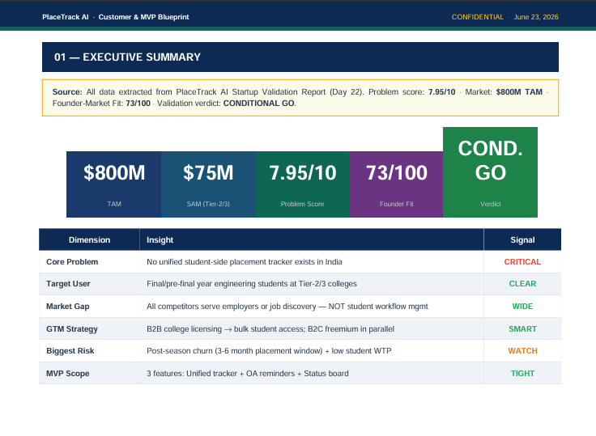
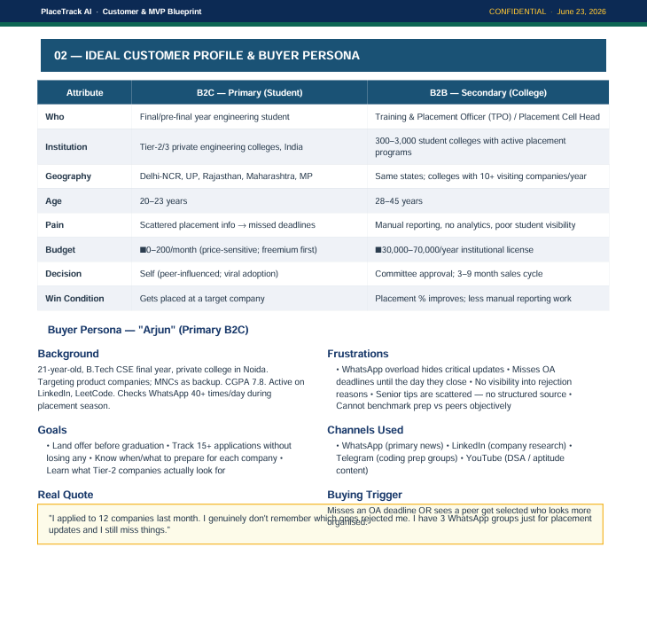
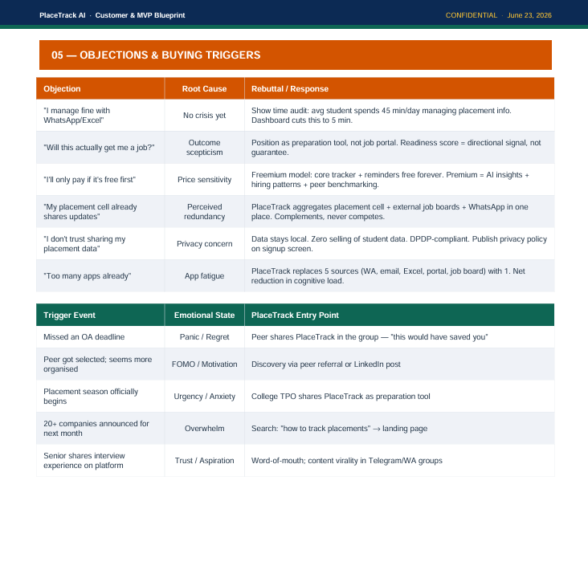
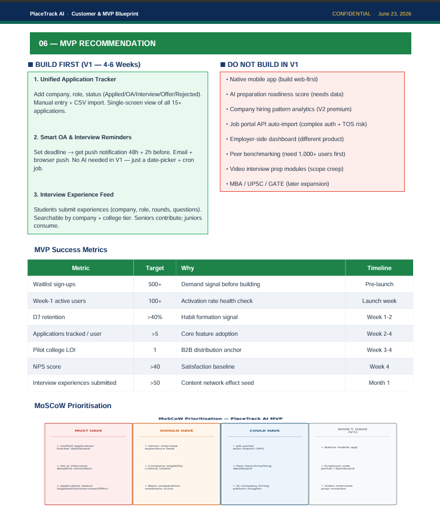
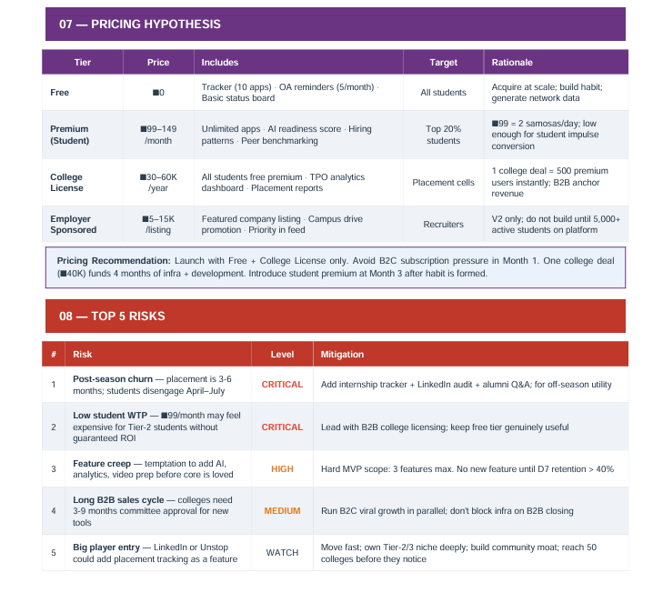
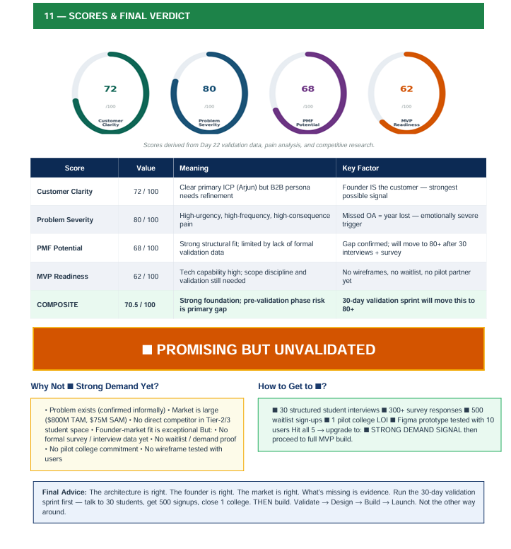

# Day 23 — PlaceTrack AI: Customer & MVP Blueprint
### 60-Day Claude Challenge | ABTalksOnAI

---

## 🚀 What I Built

A **Product Strategy-grade Customer & MVP Blueprint** for PlaceTrack AI — a tightly scoped, under-8-page PDF report generated from yesterday's Startup Validation Report (Day 22), without re-answering any questions.

Today's build demonstrates a key concept: **chaining AI outputs** — using one AI-generated report as the data source for the next, creating a layered startup intelligence stack.

The report was generated by acting as a **Startup Product Manager + Customer Research Expert**, extracting all context from the Day 22 validation report and producing a product-ready blueprint covering ICP, pain points, MVP scope, MoSCoW prioritisation, pricing, risks, and final verdict.

**Output:** `PlaceTrackAI_Customer_MVP_Blueprint.pdf` — 11 sections, 3 embedded charts, 197KB, under 8 pages.

---

## 🧠 Prompt Used

### The System Prompt (Role + Structure)

```
You are a Startup Product Manager and Customer Research Expert.

First ask if I have a Startup Validation Report.
If yes:
  * Extract startup idea
  * Problem
  * Target customers
  * Competitors
  * Validation insights
If no:
  Ask:
  1. Startup Idea
  2. Problem Being Solved
  3. Target Customers
  4. Existing Validation
  5. Market/Country

Then generate:
# Customer & MVP Blueprint
## Executive Summary
## Ideal Customer Profile
## Buyer Persona
## Top 10 Customer Pain Points
## Customer Journey
   Awareness → Consideration → Purchase → Retention
## Key Customer Objections
## Key Buying Triggers
## MVP Recommendation
   * What should be built first?
   * What should NOT be built?
   * Success metrics
## MoSCoW Prioritization
   Must Have / Should Have / Could Have / Won't Have
## Pricing Hypothesis
## Top 5 Risks
## 30-Day MVP Plan
## Founder Action Sheet (Top 10 next actions)
## Scores (0-100)
   * Customer Clarity
   * Problem Severity
   * PMF Potential
   * MVP Readiness
## Final Verdict
   🟢 Strong Demand Signal
   🟡 Promising but Unvalidated
   🟠 Weak Demand Signal
   🔴 Low Demand Probability

Provide a concise PDF-ready under 8 pages report using tables and bullet points.
```

### My Response (1 line)

```
Yes — use my PlaceTrack AI validation report
```

That single reply triggered extraction of all context from Day 22's report — no repeated Q&A needed.

---

## 🔗 How It Connected to Day 22

This is the key insight of today's build: **Claude used its own prior output as a structured data source.**

```
Day 22 Output                          Day 23 Input
─────────────────────────────────────────────────────
Problem Score: 7.95/10         →   Displayed in Executive Summary KPIs
TAM: $800M / SAM: $75M        →   Market figures in report header
Founder-Market Fit: 73/100    →   Carried forward as KPI card
Competitors identified         →   Informed MVP "Don't Build" list
Risks: Post-season churn,      →   Directly mapped to Top 5 Risks
       Low WTP, Big player      
Validation gap identified      →   Drove 🟡 "Promising but Unvalidated" verdict
30-Day validation sprint        →   Became the 30-Day MVP Plan backbone
```

**Zero information re-entered. 100% context carried forward.**

---

## 🏗️ Architecture

```
Day 22 Validation Report (Context Source)
          │
          ▼
┌─────────────────────────────────────────────────┐
│         Claude: PM + Customer Research Expert    │
│                                                  │
│  Extracts → Synthesises → Reframes into:        │
│  Product strategy lens (not investor lens)       │
└──────────────────┬──────────────────────────────┘
                   │
                   ▼
┌─────────────────────────────────────────────────┐
│             mvp_blueprint.py                     │
│                                                  │
│  ┌──────────────┐   ┌────────────────────────┐  │
│  │  Matplotlib   │   │       ReportLab         │  │
│  │   Charts      │   │  (Platypus + Canvas)   │  │
│  │               │   │                        │  │
│  │ • Score Donuts│   │ • 11 content sections  │  │
│  │ • MoSCoW Grid │──▶│ • Two-column layouts   │  │
│  │ • Journey Map │   │ • Callout boxes        │  │
│  └──────────────┘   │ • Color-coded tables   │  │
│                      └────────────────────────┘  │
└──────────────────┬──────────────────────────────┘
                   │
                   ▼
      PlaceTrackAI_Customer_MVP_Blueprint.pdf
           (11 Sections · 3 Charts · 197KB)
```

---

## 📊 Report Sections Generated

| # | Section | Key Output |
|---|---------|-----------|
| 01 | Executive Summary | 5 KPI cards + 6-row signal table |
| 02 | Ideal Customer Profile | B2C (Student) vs B2B (TPO) side-by-side |
| 03 | Buyer Persona | "Arjun" — goals, frustrations, channels, real quote |
| 04 | Top 10 Pain Points | Ranked by frequency + severity + current workaround |
| 05 | Customer Journey | Visual 5-stage flow: Awareness → Advocacy |
| 06 | Objections & Triggers | 6 objections + root cause + rebuttal; 5 trigger events |
| 07 | MVP Recommendation | Build vs Don't Build + 7 success metrics + MoSCoW |
| 08 | Pricing Hypothesis | 4-tier model: Free / Premium / College / Employer |
| 09 | Top 5 Risks | CRITICAL → WATCH with specific mitigation |
| 10 | 30-Day MVP Plan | Week-by-week sprint with task type labels |
| 11 | Scores & Final Verdict | 4 donut charts + 🟡 Promising But Unvalidated |

---

## 📸 Screenshots

```
_screenshots/
├── day23_01_executive_summary.png         # KPI bar + signal table
├── day23_02_icp_buyer_persona.png         # B2C vs B2B ICP + Arjun persona
├── day23_03_objections_triggers.png       # Objection handling + trigger events
├── day23_04_mvp_recommendation.png        # Build/Don't build + MoSCoW chart
├── day23_05_pricing_risks.png             # 4-tier pricing + Top 5 risks table
└── day23_06_scores_verdict.png            # Score donuts + Promising but Unvalidated
```








---

## 🎯 Key Findings — PlaceTrack AI MVP Blueprint

### Scores
| Score | Value | Status |
|-------|-------|--------|
| Customer Clarity | 72 / 100 | Strong — founder IS the customer |
| Problem Severity | 80 / 100 | High-urgency, high-frequency, high-consequence |
| PMF Potential | 68 / 100 | Good structure; limited by lack of formal data |
| MVP Readiness | 62 / 100 | Tech-ready; scope + validation still needed |
| **Composite** | **70.5 / 100** | Strong foundation; pre-validation gap is primary risk |

### Final Verdict: 🟡 Promising But Unvalidated
> *"The architecture is right. The founder is right. The market is right. What's missing is evidence. Run the 30-day validation sprint first — talk to 30 students, get 500 signups, close 1 college. THEN build."*

### MVP: Build Only These 3 Features (V1)
1. **Unified Application Tracker** — add/edit/status for all companies
2. **Smart OA & Interview Reminders** — date-picker + push/email notifications
3. **Interview Experience Feed** — submit + browse + filter by company/college tier

### Do NOT Build in V1
- Native mobile app · AI readiness score · Job portal API auto-import
- Employer dashboard · Peer benchmarking · Video prep · MBA/UPSC expansion

---

## 💡 Key Learnings

1. **Chaining AI outputs is more powerful than starting from scratch** — Feeding yesterday's validation report as context to today's prompt eliminated all intake Q&A and produced a sharper, more consistent output. The two reports are a cohesive stack, not two isolated documents.

2. **"If you have an existing report" conditional branching is a powerful prompt pattern** — Instead of a flat Q&A prompt, building in a conditional (yes/no → different flows) makes the tool dramatically smarter and reduces friction for repeat users.

3. **Product Manager lens vs VC lens produces fundamentally different outputs** — Day 22 (VC lens) asked "should this be funded?" Day 23 (PM lens) asked "what should be built, in what order, for whom?" Same startup, different strategic lenses, entirely different and complementary documents.

4. **MoSCoW chart as a visual > MoSCoW as a bullet list** — Rendering the MoSCoW prioritisation as a 4-column colour-coded visual card grid makes the scope constraint immediately obvious. A text list looks like a suggestion; a visual looks like a decision.

5. **"What NOT to build" is as important as "what to build"** — The Don't Build list (8 items cut from V1) is arguably the highest-value output in the MVP section. Scope discipline is where most first-time founders fail, and making it explicit in a PDF creates accountability.

6. **The pricing ₹99 = "2 samosas/day" framing is a real product strategy tool** — Anchoring a price to a familiar, low-stakes daily expense (not to software pricing benchmarks) is how consumer SaaS wins in price-sensitive markets like Tier-2 India. This kind of contextual pricing rationale belongs in the document.

7. **Donut score charts via Matplotlib polar coordinate trick** — Drawing score rings by plotting a background circle at constant radius and overlaying a foreground arc at `2π × score/100` angle is cleaner than using pie charts. The result looks like a proper gauge without needing any charting library beyond Matplotlib.

8. **Journey map as a horizontal arrow flow chart** — Using `FancyBboxPatch` for stage boxes + `ax.annotate` with arrowstyle for connectors creates a clean, readable journey map in pure Matplotlib. No external diagramming tool needed.

9. **`SPAN` in ReportLab TableStyle enables week-label merging** — For the 30-day plan table, spanning week labels across 4 task rows (`('SPAN', (0,start), (0,start+3))`) creates a clean left-column week indicator without duplicating text or using nested tables.

10. **Two reports in two days = a complete pre-seed product brief** — Day 22 (Validation) + Day 23 (MVP Blueprint) together cover everything a founder needs before starting to code: problem proof, market size, ICP, MVP scope, pricing, risks, and a dated action plan. This is the output of a ₹3–5 lakh consulting engagement, done in 2 days with Claude.

---

## 📁 File Tree

```
day23_placetrack_mvp_blueprint/
├── mvp_blueprint.py                              # Python PDF generator (~530 lines)
├── PlaceTrackAI_Customer_MVP_Blueprint.pdf       # Final output (197KB, 11 sections)
├── day23.md                                      # This file
└── _screenshots/
    ├── day23_01_executive_summary.png
    ├── day23_02_icp_buyer_persona.png
    ├── day23_03_objections_triggers.png
    ├── day23_04_mvp_recommendation.png
    ├── day23_05_pricing_risks.png
    └── day23_06_scores_verdict.png
```

---

## 📈 Stats

| Metric | Value |
|--------|-------|
| Day | 23 / 60 |
| Build Time | ~35 minutes |
| Lines of Code | ~530 (Python) |
| PDF Size | 197 KB |
| Report Pages | ~8 pages |
| Report Sections | 11 |
| Charts Generated | 3 (Score Donuts, MoSCoW Grid, Journey Flow) |
| Tables in Report | 14+ |
| Prompt Input | 1 sentence ("Yes — use my PlaceTrack AI validation report") |
| Prior Report Used | Day 22 Validation Report (full context extraction) |
| Libraries Used | ReportLab, Matplotlib, NumPy |
| New Context Entered | 0 (100% from Day 22) |

---

## 🧩 Day 22 → Day 23 Intelligence Stack

```
┌─────────────────────────────────┐
│   DAY 22: Validation Report     │  ← VC/Investor lens
│   "Should this be funded?"      │    Problem · Market · Competition
│   Verdict: CONDITIONAL GO       │    Founder Fit · Risk · TAM/SAM/SOM
└──────────────┬──────────────────┘
               │ feeds into
               ▼
┌─────────────────────────────────┐
│   DAY 23: MVP Blueprint         │  ← Product Manager lens
│   "What should be built first?" │    ICP · Pain Points · MoSCoW
│   Verdict: 🟡 PROMISING         │    Pricing · Journey · Action Plan
└─────────────────────────────────┘
               │ next step
               ▼
         DAY 24 (potential):
    Landing Page / Waitlist Build
    or: User Interview Script Generator
```

---

## ⚡ 30-Day MVP Plan (From Report)

### Week 1 — Validate
- [ ] 30 structured student interviews — document top 3 pain triggers
- [ ] 5 placement coordinator interviews at Tier-2 colleges
- [ ] Google Form survey → 300+ responses (pain ranking, WTP, feature priority)
- [ ] Build landing page with email waitlist → target 500 sign-ups

### Week 2 — Design
- [ ] Figma wireframes: Tracker + Reminder setup + Experience feed
- [ ] Deep-use Superset, Unstop, Internshala — document UX gaps
- [ ] Share landing page in 10+ Telegram/WhatsApp placement groups
- [ ] Identify 3 target TPOs; draft pilot partnership email

### Week 3 — Build
- [ ] Sprint: Unified tracker core (add/edit/delete company + status)
- [ ] Sprint: OA reminder system (date input → push/email notification)
- [ ] Sprint: Interview experience feed (submit + browse + filter)
- [ ] Send pilot proposal to 3 colleges; offer free semester trial

### Week 4 — Launch
- [ ] Beta launch to waitlist — onboard first 100 users personally
- [ ] Track D1/D3/D7 retention; apps tracked/user; reminders set/user
- [ ] Close 1 college LOI / MOU for semester pilot
- [ ] Week 4 retro: kill/keep/improve decision on each feature

---

## 🔜 Next Actions

- [ ] Start Week 1 validation sprint — 5 student interviews this week
- [ ] Create Google Form survey and share in ABES placement groups
- [ ] Potential Day 24 build: Landing page for PlaceTrack AI waitlist
- [ ] Potential Day 24 build: User interview script generator
- [ ] Push Day 23 to GitHub: `60-days-claude-ai/day23/`
- [ ] Post LinkedIn caption for Day 23

---

Day 23 / 60 — #ABTalksOnAI #ProductManagement #StartupIndia #ClaudeAI #BuildInPublic