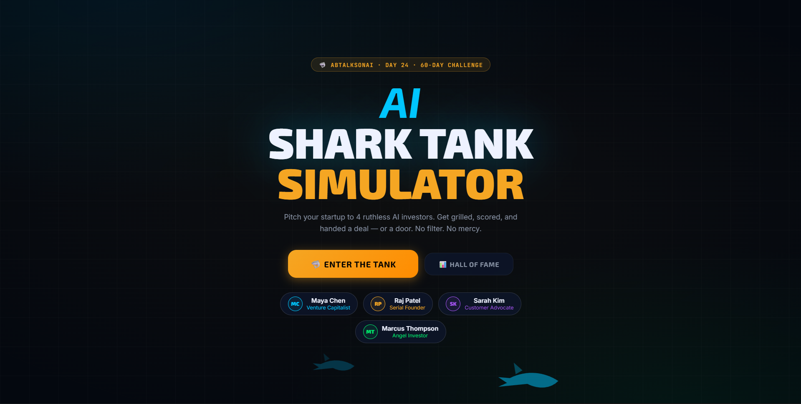
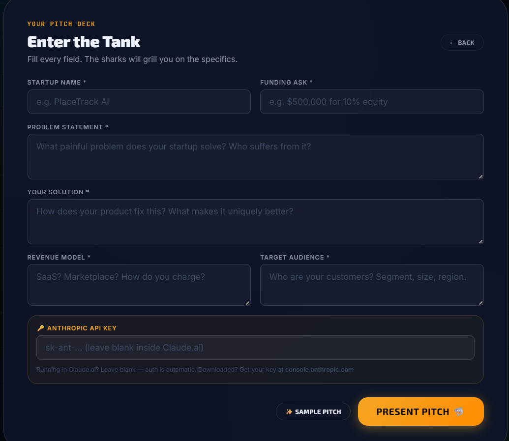
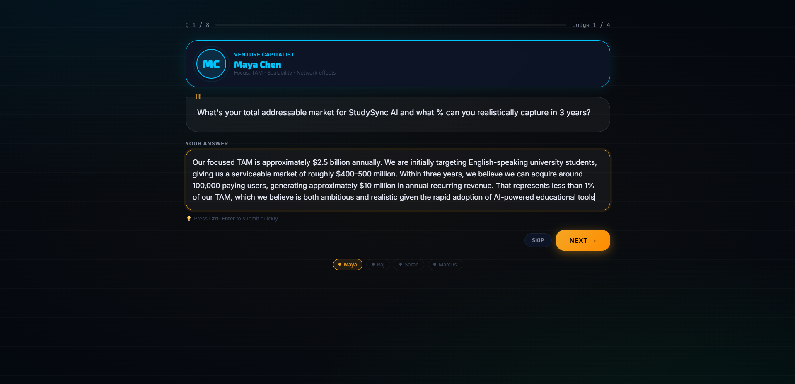
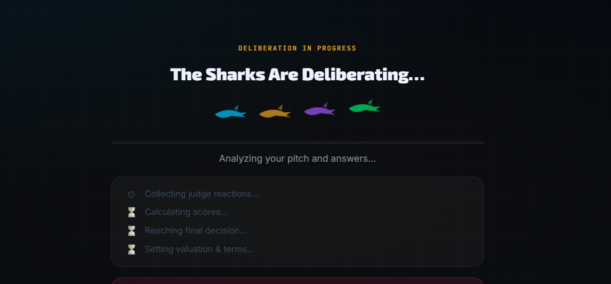

# Day 25 — AI Shark Tank Simulator 🦈

## What We Built

A fully self-contained, single-file AI Shark Tank Simulator where users pitch their startup to 4 distinct AI investor judges, answer 8 real questions under pressure, and receive a scored verdict — Invest, Reject, Acquire, or Come Back Later — complete with valuation, funding terms, judge reactions, and a downloadable pitch report.

No backend. No framework. No build step. One HTML file.

---

## Build Summary

| Property | Detail |
|---|---|
| Type | Single-file HTML application |
| AI | Claude Sonnet 4.6 via Anthropic Messages API |
| API Mode | Streaming (`stream: true`) + standard call |
| Storage | `localStorage` for leaderboard persistence |
| File Size | ~1,084 lines |
| Dependencies | Canvas Confetti (CDN), Google Fonts (CDN) |
| Backend | None |

---

## How It Works

### Flow Overview

```
Form Input → Pitch Stage → Q&A Round (8 questions) → Deliberation → Scoring → Decision
```

### Screens

1. **Intro** — Animated shark fins swim across the background. Entry point to the simulator.
2. **Form** — User fills in 6 startup fields: Name, Funding Ask, Problem, Solution, Revenue Model, Target Audience. Optional API key field for downloaded use.
3. **Pitch Stage** — Startup details displayed in a formatted card. All 4 judge cards appear with stagger animation. Question generation fires in the background the moment this screen loads.
4. **Q&A Round** — 8 questions total (2 per judge), delivered one at a time with a typewriter effect. User types answers. Progress bar and judge indicator row update after each answer. `Ctrl+Enter` submits.
5. **Deliberation** — Streams the evaluation response from Claude in real-time. A live checklist ticks off four sections (Reactions → Scores → Decision → Valuation) as the JSON streams in. A progress bar fills based on characters received.
6. **Scoring** — Animated score bars for 5 metrics. Overall score counts up. Judge reactions stagger in. Auto-advances to Decision screen after 3 seconds.
7. **Decision** — Full-screen verdict card color-coded by outcome. Valuation, funding amount, and panel reasoning displayed.
8. **Leaderboard** — Sorted by overall score, persisted to `localStorage`, stores top 10 pitches across sessions.

---

## The 4 AI Judges

Each judge has a distinct system prompt, color, focus area, and score ownership:

| Judge | Role | Color | Focus | Scores |
|---|---|---|---|---|
| Maya Chen | Venture Capitalist | `#00c6ff` | TAM, scalability, network effects | Market Potential |
| Raj Patel | Serial Founder | `#f5a623` | Execution, team, traction, roadmap | Execution |
| Sarah Kim | Customer Advocate | `#a855f7` | Real pain, PMF, UX quality | Innovation |
| Marcus Thompson | Angel Investor | `#00e96a` | Unit economics, burn rate, profitability | Business Model |

---

## API Architecture

### Call 1 — Question Generation (standard call, fires on form submit)

Sends all startup details in a single prompt and requests a JSON object with 2 questions per judge keyed by judge ID. Starts immediately when the user lands on the Pitch Stage screen, running in parallel while they read their pitch card. By the time they click "Begin Q&A", questions are almost always already ready.

```js
S.qPromise = API.genQuestions(); // fires immediately on Pitch.submit()
```

**Prompt strategy:** Compact and specific. Instructs the model to reference this startup's details directly, not generate generic investor questions. Rules embedded in the prompt prevent question overlap between judges.

**Output:**
```json
{
  "vc": ["q1", "q2"],
  "founder": ["q1", "q2"],
  "customer": ["q1", "q2"],
  "angel": ["q1", "q2"]
}
```

**Fallback:** If the API call fails for any reason, 8 hardcoded but contextual questions are injected using the startup name/details from state. The app never blocks.

---

### Call 2 — Evaluation (streaming call, fires after final Q&A answer)

Sends the full startup pitch + all 8 Q&A pairs as a transcript, and requests a structured JSON evaluation. Uses the Anthropic streaming API (`stream: true`) so the response starts appearing within ~500ms instead of after the full generation completes.

**Streaming implementation:**

```js
async stream(prompt, sys, maxTok, onChunk) {
  const res = await fetch('https://api.anthropic.com/v1/messages', {
    body: JSON.stringify({ ...params, stream: true }),
  });
  const reader = res.body.getReader();
  let buf = '', full = '';
  while (true) {
    const { done, value } = await reader.read();
    if (done) break;
    buf += decoder.decode(value, { stream: true });
    // Parse SSE lines, extract text_delta events
    full += delta.text;
    onChunk?.(full); // fires on every chunk
  }
  return full; // parse JSON at the end
}
```

**Live progress via string detection:** The `onChunk` callback scans the partial text for JSON field names to determine how far along the response is:

```js
if (text.includes('"angel"'))                  → tick "Reactions collected"
if (text.includes('"investmentWorthiness"'))   → tick "Scores calculated"
if (text.includes('"decision"'))               → tick "Decision reached"
if (text.includes('"valuation"'))              → tick "Terms set"
```

This gives users a real-time sense of progress without requiring the full response to arrive first.

**Output:**
```json
{
  "reactions": { "vc": "...", "founder": "...", "customer": "...", "angel": "..." },
  "scores": {
    "marketPotential": 72,
    "innovation": 68,
    "businessModel": 55,
    "execution": 61,
    "investmentWorthiness": 64
  },
  "decision": "INVEST | REJECT | ACQUIRE | COME BACK LATER",
  "valuation": "$2.5M pre-money",
  "fundingAmount": "$200,000",
  "reasoning": "..."
}
```

**JSON cleaning before parse:**
```js
clean(t) { return t.replace(/```json\s*/g,'').replace(/```\s*/g,'').trim(); }
```

---

## Scoring System

5 metrics, each out of 100:

| Metric | Owner |
|---|---|
| Market Potential | Maya Chen (VC) |
| Innovation | Sarah Kim (Customer) |
| Business Model | Marcus Thompson (Angel) |
| Execution | Raj Patel (Founder) |
| Investment Worthiness | Panel collective |

Overall score = average of all 5. Stored in leaderboard alongside decision and valuation.

Score bars animate using a cubic ease-out curve:
```js
const ease = 1 - Math.pow(1 - progress, 3);
el.textContent = Math.round(from + (to - from) * ease);
```

---

## UI & Design

- **Theme:** Deep navy dark (`#04080f`) with layered radial gradients for ambient color
- **Grid background:** 56px CSS grid via `body::after` pseudo-element
- **Typography:** Exo 2 (headings/numbers, 900 weight), Inter (body), JetBrains Mono (labels/badges)
- **Accent colors:** Gold (`#f5a623`), Cyan, Purple, Green, Red — one per judge
- **Animations:** Swimming shark SVGs (CSS `translateX` keyframe), judge card stagger (`cIn`), avatar pulse ring (`avp`), score bar fill (CSS transition + JS ease), typewriter effect (character-by-character `setInterval`)
- **Glassmorphism cards:** `backdrop-filter: blur()` + semi-transparent background
- **Decision card:** Color changes border, glow, and verdict text color based on outcome type
- **Confetti:** Canvas Confetti CDN, fires 4 bursts at staggered positions for INVEST and ACQUIRE outcomes

---

## Performance Decisions

| Optimization | Effect |
|---|---|
| Question generation fires on form submit, not on Q&A button click | Zero wait at the Q&A screen start |
| Streaming API for deliberation | First visible output in ~500ms vs 8-10s blank wait |
| `max_tokens: 800` for questions, `1100` for evaluation | Shorter generation time vs previous 1600-1800 |
| Shorter prompts (~35% fewer input tokens) | Reduces time-to-first-token |
| CSS transitions at 0.2s (was 0.35s) | Snappier screen changes |
| Score animations at 750ms (was 1000ms) | Faster reveal without losing feel |
| Auto-advance from scoring → decision after 3s | Removes one unnecessary button click |
| `Ctrl+Enter` keyboard shortcut in Q&A | Faster answer submission |
| API failure → hardcoded fallback questions | App never blocks on network error |

---

## Key Learnings

1. **Streaming transforms the UX of long AI calls.** A deliberation that takes 6-8 seconds feels completely different when the first characters appear in 500ms. The wait is identical in wall-clock time, but the perceived wait drops dramatically. Streaming should be the default for any response taking more than 2 seconds.

2. **Tie live UI feedback to what's actually happening, not to a timer.** The checklist ticks off by detecting real field names in the streaming JSON (`"angel"`, `"investmentWorthiness"`) rather than on a fake timer. This means the UI is accurate — if the model is slow on scores, the checklist waits too. Timer-based fake progress is always a lie; string-detection-based progress is real.

3. **Parallel prefetching eliminates perceived latency between screens.** Questions are generated the moment the form is submitted — not when the user clicks "Begin Q&A". By running the API call during the time the user spends reading the pitch stage screen, the wait disappears entirely. Any time a user will spend on an intermediate screen is free time to prefetch the next screen's data.

4. **Prompt compactness is a meaningful speed lever.** Reducing input tokens by ~35% (through tighter prompt phrasing, no redundant context) noticeably cuts time-to-first-token. The model's output quality was not affected for this use case. Verbose prompts don't make better output; they make slower output.

5. **Single-file HTML is a legitimate production pattern for demos.** No build step, no server, no deploy pipeline. The entire application — state management, API calls, streaming, animations, leaderboard persistence, PDF-style report generation — fits in one file. For demos and challenge projects, this is the right default.

6. **State machines beat ad-hoc conditionals for multi-screen apps.** Defining a clean `S` (state) object and `Nav.to()` routing function early made adding screens, transitions, and data flow straightforward. Without it, passing data between 8 screens would have become unmanageable.

7. **Graceful degradation should be the first thing you build, not the last.** The fallback questions (`API.fallbackQ()`) were added before any real testing, not after. Because of this, the app worked end-to-end during development even when the API wasn't responding. Every AI call in a demo should have a hardcoded fallback.

---

## File Structure

```
day25/
├── ai_shark_tank_simulator.html   ← complete application (single file)
└── day25.md                       ← this document
```

Internal JS module structure (all in one `<script>` tag):

```
JUDGES[]       ← judge config array
S{}            ← global application state
Nav            ← screen routing
API            ← Anthropic API calls (call, stream, genQuestions, deliberate)
Pitch          ← form submission and reset
QA             ← Q&A flow (begin, render, submit, skip, advance)
UI             ← render functions (introJudges, stage, scoring, decision)
LB             ← leaderboard (save, load, render)
Report         ← HTML report generation and download
Util           ← helpers (toast, typewriter, animated number, confetti, share)
```

---

## Screenshots : 









---

## Prompt Used

### Question Generation Prompt

```
Generate 2 sharp investor questions per judge for this startup:
Name:{name} | Ask:{ask}
Problem:{problem}
Solution:{solution}
Revenue:{revenue} | Audience:{audience}

Judges: Maya Chen (VC, focus:TAM+scale), Raj Patel (Founder, focus:execution+traction),
Sarah Kim (Customer, focus:real pain+PMF), Marcus Thompson (Angel, focus:unit economics+burn)

Rules: Each question must reference THIS startup specifically. Be challenging. No overlap between judges.

JSON only, no markdown:
{"vc":["q1","q2"],"founder":["q1","q2"],"customer":["q1","q2"],"angel":["q1","q2"]}
```

### Evaluation Prompt (streamed)

```
Evaluate this startup pitch and Q&A as a 4-person investor panel.

STARTUP: {name} | ASK: {ask}
Problem: {problem} | Solution: {solution}
Revenue: {revenue} | Audience: {audience}

Q&A:
{full transcript}

Return ONLY valid JSON:
{
  "reactions": {"vc":"...","founder":"...","customer":"...","angel":"..."},
  "scores": {"marketPotential":<0-100>,...,"investmentWorthiness":<0-100>},
  "decision": "<INVEST|REJECT|ACQUIRE|COME BACK LATER>",
  "valuation": "...", "fundingAmount": "...", "reasoning": "..."
}
```

---

*Day 25 of 60 — ABTalksOnAI Claude Challenge*
*Built by Lakshay Aggarwal — github.com/LakshayAggarwal12*