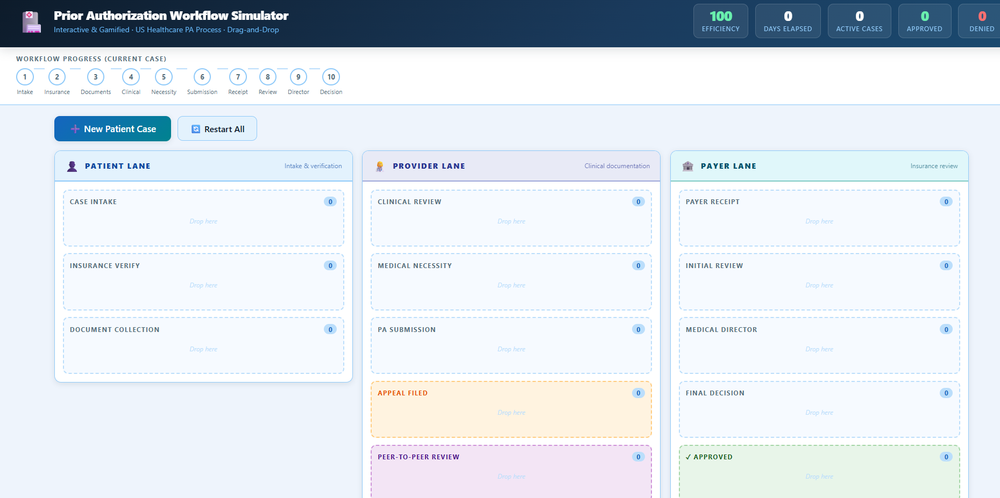
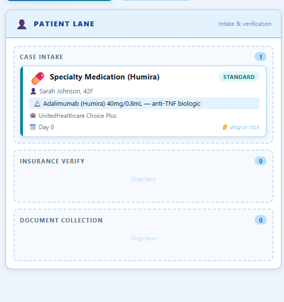
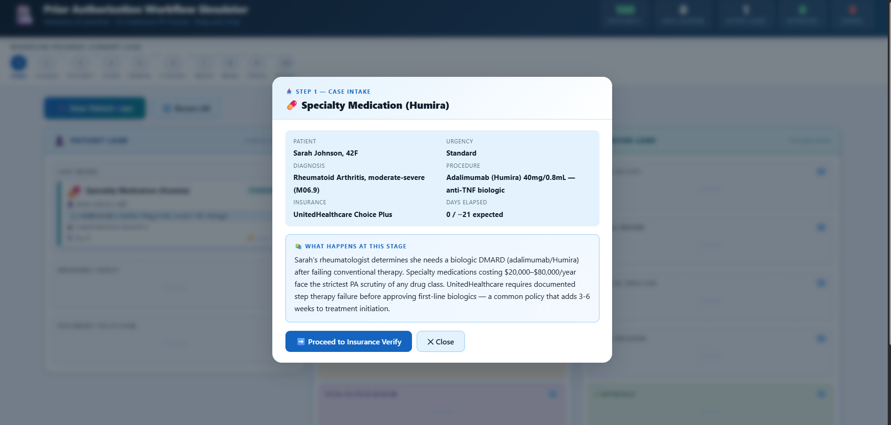
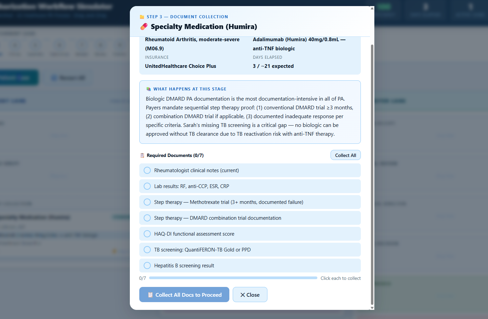
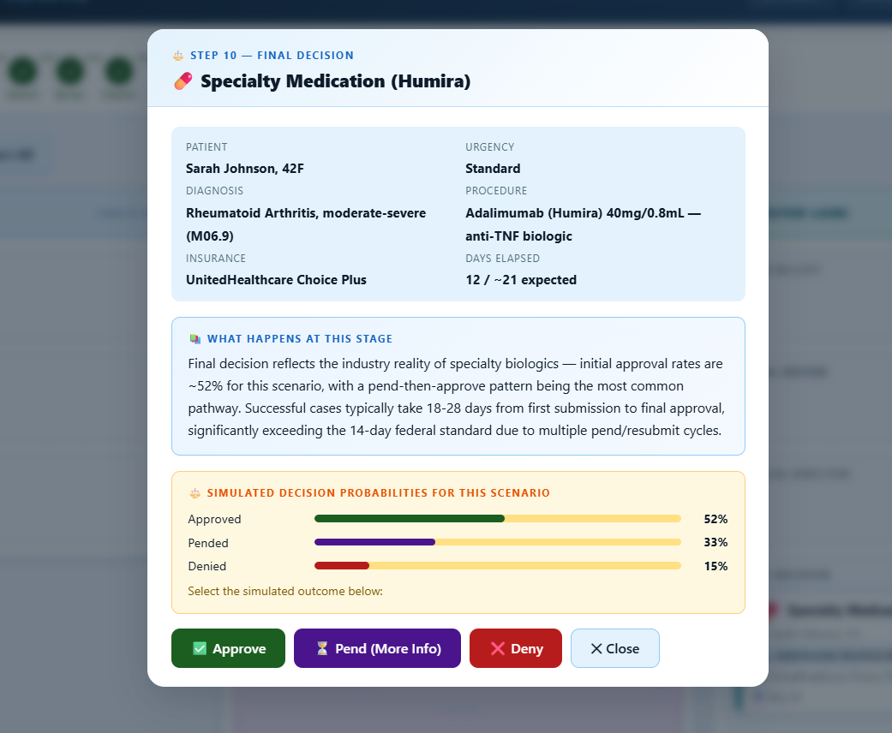
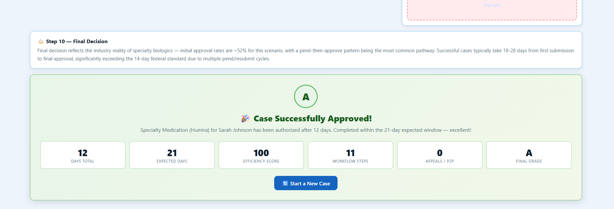

# Day 26 — Prior Authorization Workflow Simulator 🏥

## What We Built

A fully self-contained, single-file Prior Authorization (PA) Workflow Simulator that teaches the US healthcare authorization process through a gamified drag-and-drop experience.

Users can create patient cases, move them through Patient, Provider, and Payer workflow lanes, collect required documentation, evaluate medical necessity, submit prior authorizations, handle appeals, peer-to-peer reviews, and receive final approval or denial outcomes while learning the real-world healthcare workflow at every step.

No backend. No framework. No build step. One HTML file.

---

## Build Summary

| Property | Detail |
|---|---|
| Type | Single-file HTML application |
| Architecture | HTML + CSS + Vanilla JavaScript |
| Dependencies | None |
| Storage | In-memory JavaScript state only |
| Backend | None |
| UI Pattern | Drag-and-Drop Workflow Board |
| Domain | US Healthcare Prior Authorization |
| Responsive | Yes |
| File Format | Single HTML File |

---

## How It Works

### Workflow Overview

```text
Case Intake
    ↓
Insurance Verification
    ↓
Document Collection
    ↓
Clinical Review
    ↓
Medical Necessity Review
    ↓
PA Submission
    ↓
Payer Receipt
    ↓
Initial Review
    ↓
Medical Director Review
    ↓
Final Decision
    ├── Approved
    ├── Denied
    ├── Appeal
    └── Peer-to-Peer Review
```

---

## Core Features

### 1. Multi-Lane Workflow Board

The simulator is divided into three operational lanes:

| Lane | Purpose |
|--------|----------|
| Patient Lane | Intake, insurance verification, document gathering |
| Provider Lane | Clinical review, medical necessity validation, PA submission |
| Payer Lane | Insurance review, medical director review, final decision |

Each stage acts as a drag-and-drop destination where patient cases move through the authorization lifecycle.

---

### 2. Scenario-Based Learning

Four complete healthcare scenarios are included:

| Scenario | Category |
|-----------|------------|
| Elective Knee Surgery | Surgical PA |
| Brain MRI with Contrast | Advanced Imaging |
| Humira (Adalimumab) | Specialty Medication |
| Inpatient Cardiac Admission | Acute Care Admission |

All scenarios contain:

- Patient information
- Diagnosis
- Procedure details
- Insurance information
- Required documentation
- Medical necessity score
- Approval probabilities
- Educational explanations

Scenario data is stored in an editable JavaScript array near the top of the application.

---

### 3. Interactive Drag-and-Drop Workflow

Cases can be:

- Dragged between valid workflow stages
- Prevented from moving into invalid stages
- Routed through appeals after denials
- Sent for peer-to-peer review
- Progressed manually through the authorization lifecycle

This creates an experience similar to real healthcare utilization management workflows.

---

### 4. Medical Necessity Evaluation

Each scenario contains a predefined medical necessity score.

The simulator explains:

- Clinical justification
- Guideline requirements
- Coverage criteria
- Documentation expectations
- Risk factors affecting approval

The medical necessity stage visually demonstrates how clinical evidence impacts payer decisions.

---

### 5. Document Collection System

Each scenario includes a unique documentation checklist.

Examples include:

- Imaging reports
- Physician notes
- Lab results
- Therapy history
- Screening tests
- Referral documentation

Users must collect documents before progressing through the workflow.

---

### 6. Educational Walkthroughs

Every stage contains detailed educational content explaining:

- What happens operationally
- Why the step exists
- Regulatory considerations
- Common denial causes
- Real-world healthcare processes

The simulator functions as both a workflow tool and a learning platform.

---

### 7. Decision Engine

Cases can end in:

- Approval
- Denial
- Pend
- Appeal
- Peer-to-Peer Review

Outcome probabilities vary by scenario and reflect realistic authorization behavior.

---

### 8. Progress Tracking

The application includes a top workflow tracker showing:

1. Intake
2. Insurance
3. Documents
4. Clinical Review
5. Medical Necessity
6. Submission
7. Receipt
8. Review
9. Medical Director
10. Decision

The tracker updates dynamically as the case progresses.

---

### 9. Performance Metrics

Header statistics update in real time:

| Metric | Description |
|----------|-------------|
| Efficiency Score | Workflow performance indicator |
| Days Elapsed | Simulated turnaround time |
| Active Cases | Cases currently in progress |
| Approved | Total approved cases |
| Denied | Total denied cases |

---

### 10. Completion Summary

When a case reaches completion:

- Final outcome is displayed
- Performance grade is calculated
- Workflow statistics are summarized
- Educational feedback is provided
- Users can restart with a new scenario

---

## Technical Architecture

### State Management

All workflow data is managed entirely in JavaScript memory.

```js
const STATE = {
    cases: [],
    metrics: {},
    activeCase: null
}
```

No:

- Backend
- Database
- LocalStorage
- External APIs

---

### Workflow Configuration

The application uses structured configuration objects:

```js
SCENARIOS[]
STAGES[]
TRANSITIONS[]
PROGRESS_STEPS[]
```

This makes the workflow easy to modify without changing core logic.

---

### Drag-and-Drop System

Implemented using native browser drag-and-drop events:

```js
dragstart
dragover
drop
dragend
```

No third-party libraries are used.

---

### Responsive Design

The interface adapts across:

- Desktop
- Tablet
- Mobile

The three-lane board collapses into a scrollable responsive layout on smaller screens.

---

## Key Learnings

### 1. Workflow Simulation Requires Strong State Design

Representing healthcare workflows becomes significantly easier when stages and transitions are defined as configuration rather than hardcoded conditions.

### 2. Educational Software Benefits from Contextual Learning

Showing explanations exactly when users interact with a workflow stage creates a stronger learning experience than presenting documentation separately.

### 3. Drag-and-Drop Improves Process Understanding

Users understand authorization dependencies more effectively when physically moving cases through workflow stages.

### 4. Domain Modeling Matters

Healthcare prior authorization contains many branching paths including approvals, denials, appeals, and peer reviews. Accurate workflow modeling improves realism.

### 5. Single-File Applications Can Still Be Complex

A complete educational simulation can be delivered using only HTML, CSS, and JavaScript when the architecture is planned carefully.

---

## File Structure

```text
day26/
├── pa_workflow_simulator.html
└── day26.md
```

---

## Screenshots

### Screenshot 01 — Main Workflow Dashboard



---

### Screenshot 02 — Patient Case Created



---

### Screenshot 03 — Educational Stage Modal



---

### Screenshot 04 — Document Collection Workflow



---

### Screenshot 05 — Final Decision



---

### Screenshot 06 — Archived



---

## Prompt Used

```text
Prior Authorization Workflow Simulator (gamified, drag-and-drop)

Build a single-file, self-contained HTML application (HTML + CSS + vanilla JavaScript, no external dependencies, no build step) that visually simulates the US healthcare Prior Authorization (PA) workflow as an interactive, gamified, drag-and-drop experience.

The simulator should include:

• Three workflow lanes: Patient, Provider, and Payer.
• Interactive drag-and-drop movement of cases between stages.
• Multiple patient scenarios (elective surgery, MRI, specialty medication, inpatient admission).
• Medical necessity evaluation.
• Prior Authorization document collection.
• Submission to payer.
• Review outcomes including Approval, Pend, Denial, Appeal, and Peer-to-Peer Review.
• Educational explanations after every step.
• Progress tracker across the top.
• Days elapsed counter.
• Efficiency score.
• Celebration animation on approval.
• Workflow summary on completion.
• Responsive modern UI using shades of blue with black text.
• Working Restart / New Patient button.
• Fully functional buttons and interactions.

Technical Requirements:
- Single HTML file.
- HTML, CSS and Vanilla JavaScript only.
- No frameworks.
- No CDNs.
- No localStorage.
- All workflow state managed in JavaScript memory.
- Well-commented code.
- Scenario data stored in an editable array near the top.
- Output only the complete HTML file without truncation.
```

---

*Day 26 of 60 — ABTalksOnAI Claude Challenge*
*Built by Lakshay Aggarwal — github.com/LakshayAggarwal12*