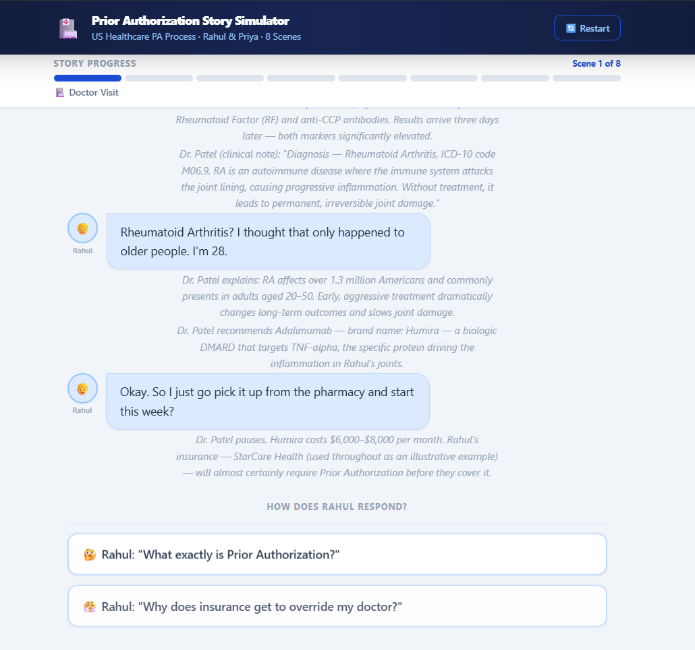
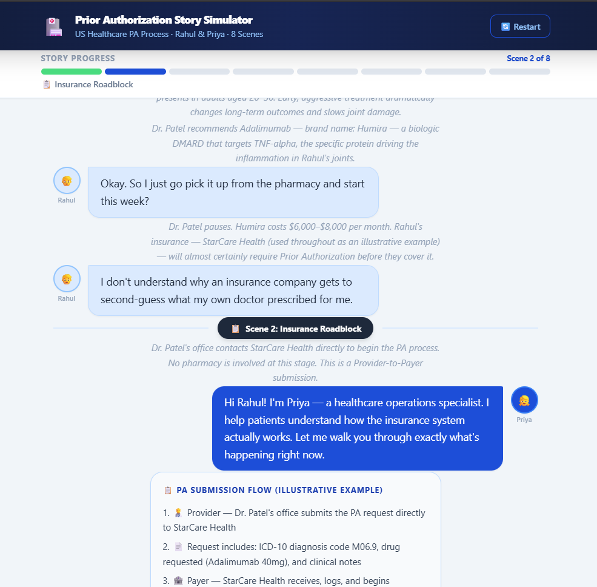
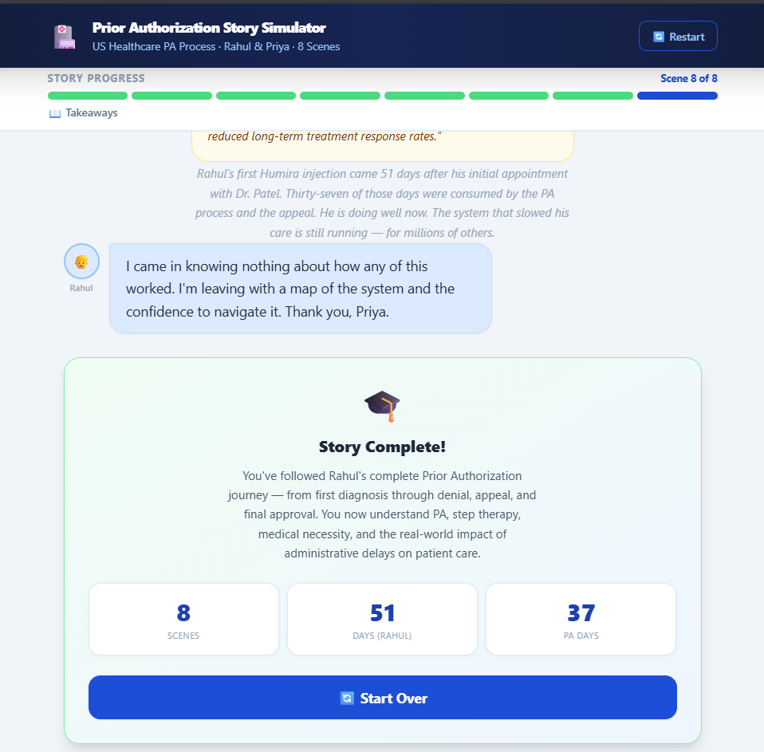

# Day 27 — Prior Authorization Story Simulator

**Challenge:** ABTalksOnAI · 60-Day Claude Challenge
**Builder:** Lakshay Aggarwal · [@lakshay-aggarwal-dev](https://linkedin.com/in/lakshay-aggarwal-dev)
**GitHub:** [LakshayAggarwal12](https://github.com/LakshayAggarwal12)

> **Context note:** This project was built in a continuation of the Day 26 session, using the same Claude conversation for prior context. Day 26 delivered the **PA Workflow Simulator** (gamified Kanban drag-and-drop). Day 27 extends the same healthcare education design system into a story format — same palette, same card language, different interaction model.

---

## What I Built

A single-file, story-driven educational simulator that walks users through the complete US healthcare **Prior Authorization (PA)** process — told as a conversation between two characters across 8 interactive scenes.

**Characters:**
- 👦 **Rahul** — a 28-year-old patient newly diagnosed with Rheumatoid Arthritis, prescribed Humira (Adalimumab). Appears as **left-aligned** chat bubbles.
- 👧 **Priya** — a healthcare operations specialist who explains the system in plain language. Appears as **right-aligned** chat bubbles.
- Doctors and narrators appear as **centered italic text only** — never as chat bubbles. A deliberate character constraint that mirrors how story narration works.

**8 Scenes:**
1. 🏥 **Doctor Visit** — Rahul diagnosed with RA (ICD-10 M06.9), Humira prescribed
2. 📋 **Insurance Roadblock** — Provider → PA Request → StarCare Health (illustrative payer). Priya introduced.
3. 💡 **What is PA?** — Priya explains PA and step therapy in beginner-friendly language. Cites AMA 2023 survey.
4. 🔎 **Insurance Review** — StarCare Health checks eligibility, ICD-10 match, clinical docs, step therapy
5. ❌ **Denial** — PA denied: missing step therapy documentation. Denial costs 2+ staff hours to resolve.
6. ⚔️ **Appeal** — Letter of Medical Necessity, ACR guideline citation, full appeal package
7. ✅ **Approval** — PA approved, reference number issued, saved on file permanently
8. 📖 **Takeaways** — Patient perspective (Rahul) + System analytics (denial rate, appeal overturn rate, avg delay)

After each scene: **2 interactive choices** that add Rahul's response as a chat bubble before the story continues.

---

## Screenshots

### Scene 1 — Doctor Visit (with interactive choices)
Rahul's first bubbles appear with typing indicators. Narrator lines (Dr. Patel's notes) appear centered and italic. Two choice buttons surface after all scene messages are delivered.



---

### Scene 2 — Insurance Roadblock (Priya's introduction)
Rahul's choice response from Scene 1 appears first (`"I don't understand why an insurance company gets to second-guess..."`) — showing the append-only feed working across scene boundaries. Then the Scene 2 divider pill appears, followed by Priya's first right-aligned bubble and the PA Submission Flow info card.



---

### Scene 8 — Completion Card (Story Complete)
All 8 progress segments are green. The final narrator line reads: *"Rahul's first Humira injection came 51 days after his initial appointment. Thirty-seven of those days were consumed by the PA process and the appeal."* Rahul's final response bubble is visible. The completion card shows the 3-stat summary (8 scenes · 51 days · 37 PA days) and the Start Over button.



---

## Prompt Used

```
Prior Authorization Story Simulator
Single-file HTML app. HTML, Tailwind CSS CDN, Vanilla JavaScript.

Use createElement + appendChild for every new chat bubble.
Never call innerHTML = on the chat container.

Design: same as previously established.

Characters:
👦 Rahul — patient. Appears left.
👧 Priya — healthcare operations specialist. Appears right.
Narrators and doctors appear as centered italic text only, never chat bubbles.

Story — 8 scenes with append-only chat feed and progress bar:
1. Doctor Visit — Rahul visits City Medical Center. Dr. Patel diagnoses Rheumatoid Arthritis, prescribes Humira.
2. Insurance Roadblock — Dr. Patel's office submits PA directly to StarCare Health (payer). No pharmacy involved.
   Flow: Provider → PA Request → Payer. Approved PA is saved on file permanently.
3. What is PA? — Priya explains in plain language. Include: step therapy isn't just bureaucracy — for aggressive
   diagnoses, delays can affect disease progression. Cite: 'AMA 2023 PA Survey: PA causes treatment delays
   in the majority of cases.'
4. Insurance Review — Priya walks through what StarCare Health checks: eligibility, clinical documentation,
   ICD-10 diagnosis match, step therapy history. Explain why each matters.
5. Denial — Denied: missing step therapy documentation. Denial ≠ permanent. Priya notes:
   'PA denials cost physician offices 2+ staff hours to resolve.'
6. Appeal — Gather documents, Letter of Medical Necessity, formal appeal filing.
7. Approval — PA approved, saved on file. Reference number issued. No repeat PA needed for Humira.
8. Takeaways — Two perspectives: Patient (what Rahul learned) + System (how health systems track
   denial rate, appeal rate, resolution time).

After each scene show 2 choices that influence dialogue and progression.
Label StarCare Health as an illustrative example throughout.
Beginner-friendly language. Healthcare education design system.
```

---

## Architecture

```
pa_story_simulator.html  (941 lines / ~53 KB, single file)
│
├── <style>              Custom animations (fadeUp, dotBounce), scrollbar skin
├── Tailwind CDN         All utility classes — no build step required
│
├── #chat-feed           Append-only chat container
│   └── RULE: innerHTML= is NEVER set on this element
│       Every child built with createElement + appendChild
│
├── #choice-area         2 interactive choice buttons per scene
│   └── Cleared with removeChild — never innerHTML=
│
├── #prog-track          8-segment progress bar, updated per scene
│
└── <script>
    ├── STORY[]          8 scene objects with messages[] + choices[]
    ├── state {}         scene index, message queue, playing flag
    ├── Element Creators (8 mk* functions, all createElement)
    │   ├── mkRahul()    Left bubble — bg-blue-100, border-blue-300
    │   ├── mkPriya()    Right bubble — bg-blue-700, white text
    │   ├── mkNarrator() Centered italic — never a bubble
    │   ├── mkFact()     Amber citation card (AMA / JAMA data)
    │   ├── mkInfo()     Blue checklist / flow card
    │   ├── mkStatus()   Color-coded PA status badge (pending/denied/approved)
    │   ├── mkTyping()   Animated 3-dot typing indicator
    │   └── mkDivider()  Scene chapter marker with dark pill badge
    ├── appendToFeed()   ONLY entry point for chat DOM — guarantees no innerHTML=
    ├── processNext()    Queue-based message reveal with setTimeout stagger
    ├── showChoices()    2 staggered choice buttons after queue empties
    ├── handleChoice()   Disables buttons, highlights selected, appends response
    ├── showContinue()   Continue button → next scene, or completion card
    ├── updateProgress() Recomputes all 8 segment classes on every scene change
    └── restartStory()   removeChild loop clears feed, resets state, scrolls top
```

---

## Key Architecture Flow

```
startScene(idx)
    │
    ├── appendToFeed(mkDivider())
    ├── state.queue = scene.messages.slice()
    └── processNext()
            │
            ├── msg.t === 'rahul' | 'priya'
            │       └── appendToFeed(mkTyping(who))
            │           wait 660ms
            │           removeTypingIndicator()
            │           appendToFeed(mkRahul/Priya())
            │           setTimeout(processNext, 200ms)
            │
            ├── msg.t === 'narrator' | 'fact' | 'info' | 'status'
            │       └── wait 340ms
            │           appendToFeed(mk*())
            │           setTimeout(processNext, 220ms)
            │
            └── queue empty → showChoices(sceneIdx)
                    │
                    └── user clicks choice
                            │
                            ├── handleChoice()
                            │       ├── disable all buttons
                            │       ├── highlight selected (blue-700)
                            │       ├── wait 420ms → appendToFeed(response bubble)
                            │       └── wait 750ms → showContinue()
                            │
                            └── showContinue()
                                    ├── sceneIdx < 7 → Continue button → startScene(idx+1)
                                    └── sceneIdx === 7 → mkCompletionCard()
```

---

## Key Technical Learnings

1. **`innerHTML=` on a live append-only chat feed breaks everything.** Using only `appendChild` + `removeChild` forces each element to be a self-contained DOM node. When you can't wipe and redraw, you have to think about what each creator actually does. The code becomes naturally modular.

2. **A queue + `setTimeout` chain is simpler than async/await for sequential UI reveals.** `state.queue` is a plain array. `processNext()` pops one item, creates the element, appends it, and schedules itself again. No Promises, no `.then()` chains. Trivial to debug with `console.log(state.queue)`.

3. **Typing indicators must be removed by `id`, not by `querySelector`.** The indicator's `id="typing-indicator"` + `getElementById` is safer than a class selector — selectors silently fail if the element is already gone; `getElementById` always returns `null` cleanly.

4. **Tailwind play CDN picks up classes set in JavaScript strings.** Classes assigned via `el.className = 'bg-blue-700 ...'` in JS are processed by Tailwind's in-browser scanner at runtime. No need to pre-declare any class in the HTML markup.

5. **`textContent` over `innerHTML` everywhere, even for emoji.** Emoji like `👦`, `✅`, `❌` render correctly via `textContent`. No HTML parsing overhead, no XSS surface, no accidental entity encoding bugs.

6. **Recompute, don't diff.** `updateProgress()` iterates all 8 segments every call and assigns the correct class from scratch. This is faster to write and less bug-prone than tracking previous state and doing diffs. At 8 segments it costs microseconds.

7. **`requestAnimationFrame` before `window.scrollTo`** ensures the newly appended element is painted before the scroll position is calculated. Without it, `scrollHeight` may be stale and the scroll undershoots by exactly one element height.

8. **Educational scaffolding is stronger with Socratic dialogue.** Rahul's naive questions ("What's an ICD-10 code?") pull information from Priya naturally. The user feels like they're asking the questions, not being lectured to. This makes complex healthcare information genuinely accessible.

---

## File Tree

```
day27_pa_story_simulator/
├── pa_story_simulator.html           ← complete build (941 lines, ~53 KB)
├── day27.md                          ← this file
├── linkedin_captions.md              ← 3 caption variants (A/B/C)
└── _screenshots/
    ├── 01_scene1_doctor_visit_choices.png
    ├── 02_scene2_insurance_roadblock_priya_intro.png
    └── 03_scene8_completion_card.png
```

---

## Stats

| Metric | Value |
|--------|-------|
| File size | ~53 KB / 941 lines |
| External dependencies | Tailwind CDN only |
| Scenes | 8 |
| Total story messages | ~80 |
| Interactive choices | 16 (2 per scene) |
| Message types | 6 (`rahul`, `priya`, `narrator`, `fact`, `info`, `status`) |
| Citations | 2 (AMA 2023 PA Survey, JAMA Internal Medicine 2022) |
| `innerHTML=` calls on #chat-feed | **0** |
| Build sessions | Day 26 context → Day 27 delivery |

---

## Educational Content Per Scene

| Scene | Key Concept Taught |
|-------|--------------------|
| 1 | RA diagnosis, ICD-10 coding, biologic DMARDs, what "prior auth" means |
| 2 | PA submission flow (Provider → Payer directly), no pharmacy involved, auth saved on file |
| 3 | PA definition, step therapy, AMA 2023 data, clinical stakes of delay in autoimmune disease |
| 4 | 5-point PA review checklist, ICD-10 matching, why new patients hit the step therapy trap |
| 5 | Denial mechanics, admin cost per denial ($144+, 2+ staff hours), appeal rights |
| 6 | Appeal package components, Letter of Medical Necessity, 40–60% overturn rate |
| 7 | Approval outcomes, what "saved on file" means, PA reference number and why to keep it |
| 8 | Patient takeaways + system analytics (denial rate ~28%, appeal overturn 54%, 23-day avg delay) |

---

## PA Reference Chain (Illustrative)

| Reference | Stage | Meaning |
|-----------|-------|---------|
| `PA-2024-RA-00847` | Initial submission | Under review → denied |
| `PA-2024-RA-00847-A` | Appeal approved | Saved on file, 12-month window, no repeat PA |

---

## Relationship to Day 26

| Day | Build | Interaction Model |
|-----|-------|-------------------|
| Day 26 | PA Workflow Simulator | Drag-and-drop Kanban, gamified, score-based |
| Day 27 | PA Story Simulator | Linear narrative, character dialogue, choice-driven |

Both use the same healthcare education design system (navy header, blue palette, white cards). Day 26 teaches the mechanics of the PA process through task completion. Day 27 teaches the human experience of the PA process through story immersion. Together they form a two-part healthcare literacy module.

---

## Next Actions

- [ ] Add Scene 9 as an optional branch: Peer-to-Peer Review path from Scene 5 denial
- [ ] Add "replay scene" button on completed scene dividers
- [ ] Export full conversation transcript as downloadable PDF
- [ ] PlaceTrack AI — apply healthcare literacy module framing to placement process education
- [ ] Continue 60-Day Challenge to Day 28

---

## Hashtags

`#ABTalksOnAI` `#60DayChallenge` `#Day27` `#BuildInPublic` `#PriorAuthorization` `#HealthcareAI` `#HealthTech` `#HealthcareLiteracy` `#WebDev` `#VanillaJS` `#TailwindCSS` `#FrontendDevelopment` `#AILearning` `#IndianDeveloper` `#StudentDeveloper`