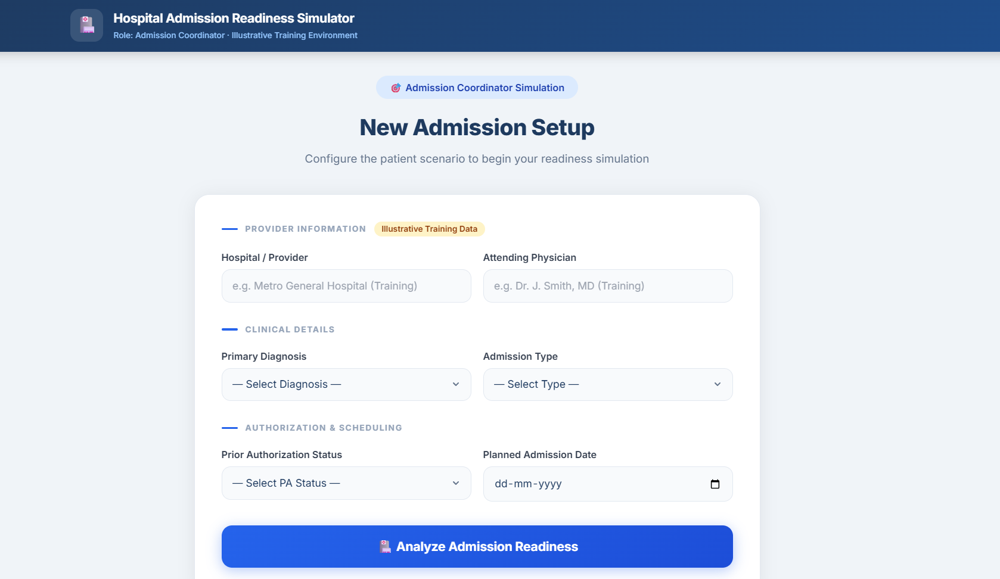
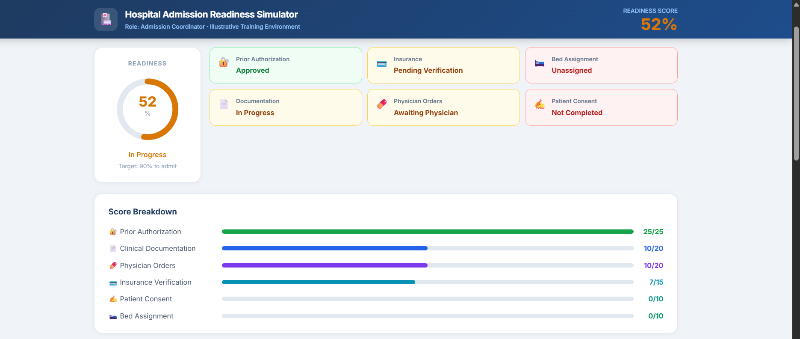
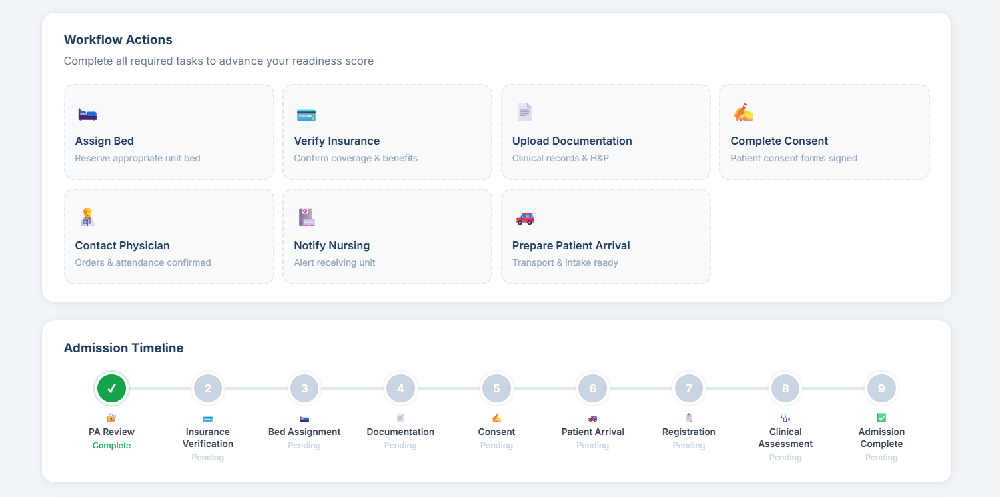
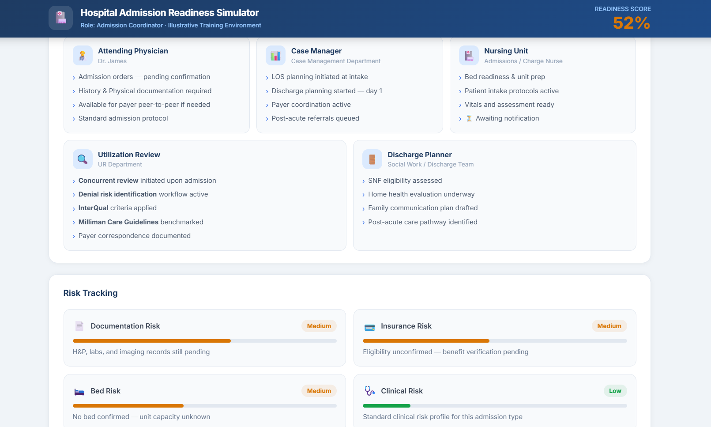

# Day 28 — Hospital Admission Readiness Simulator

**Challenge:** ABTalksOnAI 60-Day Claude Challenge
**Builder:** Lakshay Aggarwal · ABES Engineering College
**GitHub:** LakshayAggarwal12 · **LinkedIn:** lakshay-aggarwal-dev

---

## 🏥 What I Built

A **single-file HTML simulation app** that puts you in the role of a **Hospital Admission Coordinator**. You configure a real patient scenario (diagnosis, admission type, PA status), analyze readiness across 6 weighted components, work a branching PA workflow, and receive a final admit/block decision — all driven by pure vanilla JS state management with zero external dependencies beyond Tailwind CDN.

This is Day 3 of the Healthcare Simulation arc (Days 25–28), completing the series with the most operationally complex build yet.

---

## 🎯 Build Summary

| Attribute         | Detail                                                      |
|-------------------|-------------------------------------------------------------|
| File type         | Single-file HTML (vanilla JS + Tailwind CDN)                |
| Lines of code     | ~1,118                                                      |
| State model       | Centralized `S` object, `render()` fan-out pattern          |
| Score components  | 6 weighted (PA 25%, Docs 20%, Orders 20%, Ins 15%, Consent 10%, Bed 10%) |
| PA branches       | 3 (Approved / Pending / Denied w/ appeal pathway)           |
| Workflow actions  | 10 total (7 standard + 3 PA branch)                         |
| Timeline steps    | 9 milestones with live status tracking                      |
| Care coordination | 5 cards (Attending, Case Mgr, Nursing, UR, Discharge)       |
| Risk panels       | 4 (Docs, Insurance, Bed, Clinical — weighted for acuity)    |
| Design system     | Continues Days 25–27 navy/blue/white healthcare palette     |

---

## 📸 Screenshots








---

## 🧠 Prompts Used

### Prompt 1 — Architecture & State Design
```
Hospital Admission Readiness Simulator. Single-file HTML, Tailwind CDN, Vanilla JS.
Healthcare simulation design system (navy header, blue palette, white cards).
Task-first — no dashboard on load. User plays Hospital Admission Coordinator.
[Full spec followed...]
```
*Output: State object design, score weighting logic, PA branch model*

### Prompt 2 — PA Denied Appeal Sequencing
```
The denied PA appeal pathway should enforce step ordering:
1. Review Denial Reason → 2. Contact Insurance → 3. Submit Appeal.
Steps 2 and 3 should be disabled until prerequisites are met.
Successful appeal converts PA score to 25 and sets paConverted=true.
```
*Output: `paReasonReviewed → paInsuranceContacted → paAppealSubmitted` gate logic*

### Prompt 3 — ICU + Denied PA Cap
```
Denied PA + ICU admission cannot reach 70% from admin tasks alone.
Apply a hard cap of 67% to total score when admissionType=ICU and PA remains denied.
```
*Output: Score cap in `calcScore()` with conditional guard*

### Prompt 4 — Regulatory Notices
```
Observation Status must always show the MOON notification (CMS 2-Midnight Rule).
Acute MI and CHF trigger an InterQual/Milliman medical necessity note.
Label all provider/payer names as illustrative training data.
```
*Output: Conditional banner renders, training data disclaimers throughout*

---

## 🏗️ Architecture

```
S (state object)
├── phase: 'setup' | 'analysis' | 'decision'
├── form: { provider, physician, diagnosis, admissionType, paStatus, admissionDate }
├── scores: { pa(25), docs(20), orders(20), insurance(15), consent(10), bed(10) }
├── actions: { bedAssigned, insuranceVerified, docsUploaded, consentComplete,
│             physicianContacted, nursingNotified, patientArrivalPrepped,
│             paFollowedUp, paDocsUploaded, paPhysicianContacted,         ← Pending branch
│             paReasonReviewed, paInsuranceContacted, paAppealSubmitted } ← Denied branch
├── paConverted: bool  (appeal success flips this true)
└── logs: [{ t, msg }]

render() → buildSetup() | buildAnalysis() | buildDecision()
doAction(key) → mutates S.scores + S.actions → render()
calcScore() → sum components; apply ICU+Denied cap if needed
```

### Score Initialization (lands 30–60%)

| PA Status | Initial Score | Components |
|-----------|--------------|------------|
| Approved  | ~52%         | PA=25, Docs=10, Orders=10, Ins=7 |
| Pending   | ~35%         | PA=8, Docs=10, Orders=10, Ins=7  |
| Denied    | ~30%         | PA=3, Docs=10, Orders=10, Ins=7  |

### Maximum Achievable Scores

| Scenario                 | Max Score | Notes                           |
|--------------------------|----------|---------------------------------|
| PA Approved + all tasks  | 100%     | Full admit                      |
| PA Pending + all tasks   | ~91%     | Above threshold with follow-up  |
| PA Denied + appeal       | 100%     | After successful appeal         |
| PA Denied, no appeal     | ~75%     | Blocked from admit              |
| **ICU + Denied, no appeal** | **≤67%** | **Hard cap — cannot reach 70%** |

---

## 📋 Regulatory & Clinical Logic

### CMS 2-Midnight Rule / MOON
- Triggers when `admissionType === 'Observation'`
- Banner shown in setup preview AND always in analysis phase
- Text: CMS 2-Midnight Rule, cost-sharing differences, SNF eligibility, MOON 36-hour requirement

### InterQual / Milliman (Acute MI, CHF)
- Triggers for high-acuity diagnoses in analysis phase
- UR card explicitly names: concurrent review, denial risk identification, InterQual, Milliman

### PA Branch Logic
```
Approved → no additional PA actions required
Pending  → Follow Up | Upload Docs | Contact Physician  (all independent)
Denied   → Review Reason → Contact Insurance → Submit Appeal (sequential gates)
           Successful appeal: paConverted = true, scores.pa = 25
```

### Governance Snapshot (≥75%)
Renders automatically when score crosses 75%:
- PA turnaround: 3–5 days (industry estimate)
- Inpatient denial rate: 8–10% (CMS)
- PA rework cost: $11/transaction (CAQH)

---

## 🔑 Key Learnings

1. **Branching simulation state needs a single truth object.** Separating PA-branch actions from workflow actions in `S.actions` kept score logic clean and prevented cross-contamination between branches.

2. **Idempotent action dispatch prevents double-scoring.** Early return `if (S.actions[key]) return` means buttons can be re-clicked safely without corrupting score state — critical for re-render patterns.

3. **Hard score caps are cleaner than penalty math.** Implementing the ICU+Denied constraint as `Math.min(total, 67)` in `calcScore()` was simpler and more predictable than negative score penalties spread across actions.

4. **Inline event handlers (`onclick=`) are essential for innerHTML re-render patterns.** `addEventListener` bindings are lost on re-render; `onclick=` attributes on globally-scoped functions survive each `innerHTML` replacement cleanly.

5. **Tailwind CDN JIT limitation reinforced.** All dynamic colors, widths (progress bars, risk bars), and conditional backgrounds use inline `style=` attributes — not dynamic Tailwind class strings. No hidden rendering bugs.

6. **Sequential prerequisite gates in UX.** The appeal pathway (`Review → Contact → Submit`) uses disabled states + contextual hint text to teach correct clinical workflow without being punitive — the right balance for a training simulator.

7. **Regulatory language must be exact, not paraphrased.** MOON notification copy, CMS 2-Midnight Rule, and InterQual/Milliman references use precise industry terminology because the app's training value depends on accuracy.

---

## 📊 Stats

| Metric                  | Value       |
|-------------------------|-------------|
| Build time              | ~3.5 hours  |
| File size               | ~90KB       |
| Lines of code           | 1,118       |
| JS functions            | 38          |
| Simulation phases       | 3           |
| Unique action types     | 10          |
| Conditional UI branches | 12+         |
| Regulatory notices      | 3 (MOON, InterQual, ICU cap) |


---

`#60DayChallenge #ABTalksOnAI #ClaudeAI #Anthropic #HealthcareIT #HospitalOperations #PriorAuthorization #HealthcareSimulation #UtilizationReview #VanillaJS #BuildInPublic #MedicalBilling #RevenueCycleManagement #CMS #HealthcareCompliance`