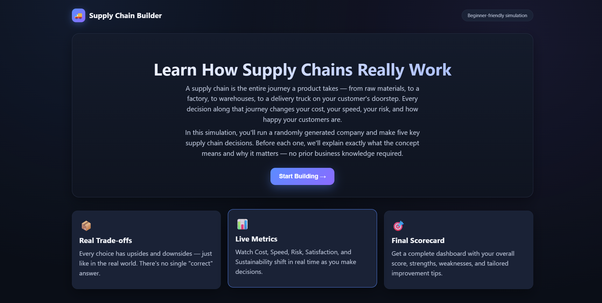
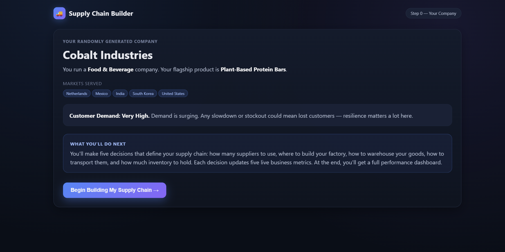
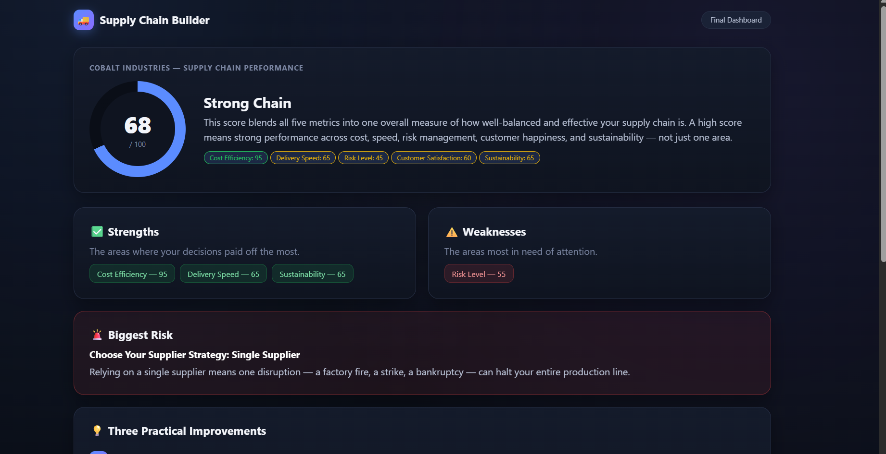

# Day 30 — Supply Chain Builder Simulator

**Challenge:** ABTalksOnAI · 60-Day Claude Challenge
**Builder:** Lakshay Aggarwal · [@lakshay-aggarwal-dev](https://linkedin.com/in/lakshay-aggarwal-dev)
**GitHub:** [LakshayAggarwal12](https://github.com/LakshayAggarwal12)

> **Context note:** Day 30 marks the halfway point of the 60-Day Challenge. After two days building healthcare literacy tools (Day 26 Kanban simulator, Day 27 story simulator), this build shifts domains — from healthcare operations to business/supply chain education — while keeping the same core philosophy: teach a complex real-world system through guided, beginner-first interaction rather than a wall of text.

---

## What I Built

A single-file, React-powered educational simulator called **Supply Chain Builder** that walks a complete beginner through the fundamentals of supply chain management. The user runs a randomly generated company and makes five sequential, consequential decisions — choosing suppliers, factory location, warehouse strategy, transportation method, and inventory strategy — while five live business metrics react in real time.

**Core idea:** every decision in a supply chain is a trade-off, not a "correct answer." The app never tells the user what to pick — it explains the concept, shows the trade-off in plain English *after* they choose, and lets the consequences show up visually in animated metric bars.

**Flow:**
1. 🏠 **Welcome Screen** — plain-language intro to what a supply chain even is
2. 🏢 **Random Company Generation** — industry, flagship product, countries served, demand level
3. 🧩 **Five Guided Decisions** — suppliers → factory → warehouse → transport → inventory
4. 📊 **Live Metrics Sidebar** — Cost Efficiency, Delivery Speed, Risk Level, Customer Satisfaction, Sustainability, updating with smooth animated transitions after every click
5. 🏁 **Final Dashboard** — Overall Score (0–100) on a conic-gradient ring, Strengths, Weaknesses, Biggest Risk, and three tailored improvement suggestions generated from the user's actual choices
6. 🔄 **Replay** — generates a brand-new random company and resets all state

---

## Screenshots

### Welcome Screen
Dark enterprise-dashboard theme, gradient hero text, three feature cards explaining what the user is about to experience.



---

### Decision Step — Factory Location
Concept box explains *why* factory location matters before any choice is made. Three selectable option cards (Domestic / Nearshore / Offshore) with a trade-off box that appears only after selection. Live metrics sidebar updates immediately.



---

### Final Dashboard
Conic-gradient score ring, color-coded strength/weakness tags, a highlighted "Biggest Risk" card, and three numbered, decision-specific improvement suggestions.



---

## Prompt Used

```
You are an expert frontend developer, UX designer, game designer, and supply chain consultant.
Build a complete single-file HTML app named 'Supply Chain Builder'.
Design it so a complete beginner can understand supply chains. Before every decision, explain
what the concept means, why it matters, and how it affects a business.

Requirements:
- Output ONLY one HTML file.
- React via CDN + Babel JSX.
- Plain HTML, CSS, and JavaScript only.
- No Tailwind, npm, backend, APIs, images, or external assets.
- Runs offline by opening the HTML file.
- No placeholders or incomplete features.

Flow:
1. Welcome screen introducing supply chains in simple language.
2. Generate a random company (industry, products, countries served, demand level).
3. Guide the player through building their supply chain by choosing:
   - Number of suppliers (single or multiple)
   - Factory location
   - Warehouse strategy
   - Transportation method (road, rail, sea, air)
   - Inventory strategy (low, balanced, high)
4. After every choice, explain the trade-offs in plain English.
5. Display live business metrics that update after each decision:
   - Cost
   - Delivery Speed
   - Risk
   - Customer Satisfaction
   - Sustainability
6. At the end, generate a dashboard with an Overall Supply Chain Score (0-100), strengths,
   weaknesses, biggest risk, and three practical improvements.

Design:
- Premium enterprise dashboard.
- Dark theme.
- Responsive.
- Smooth transitions.
- Rounded cards.
- Hover effects.
- Animated progress bars.
- Replay button.

Randomize company details each playthrough. Organize the app into reusable React components
using useState. Ensure every button works.
```

---

## Architecture

```
supply_chain_builder.html  (single file, React + Babel via CDN)
│
├── <style>              CSS variables for dark theme, conic-gradient score ring,
│                         animated progress bars, hover/transition rules
├── React + ReactDOM CDN  No build step, no bundler
├── Babel Standalone CDN  In-browser JSX transpilation
│
└── <script type="text/babel">
    ├── DATA
    │   ├── INDUSTRIES[]      8 industries × 4 products each
    │   ├── COUNTRIES[]       16-country pool
    │   ├── DEMAND_LEVELS[]   Low / Medium / High / Very High, each with a plain-English note
    │   └── PREFIXES/SUFFIXES company name generator word banks
    │
    ├── generateCompany()     Random industry, product, 3–5 countries, demand level, name
    │
    ├── STEPS[]               5 decision objects, each with:
    │   ├── concept            beginner explanation shown BEFORE choosing
    │   └── options[]          2–4 choices, each with:
    │       ├── explain         trade-off text shown AFTER choosing
    │       ├── riskNote        used later for "Biggest Risk" on the dashboard
    │       └── deltas{}        effect on all 5 metrics
    │
    ├── computeMetrics()      Reduces all chosen deltas onto a BASE_METRICS object, clamped 0–100
    ├── overallScore()        Averages "goodness" across all 5 metrics (Risk is inverted)
    ├── biggestRisk()         Finds the single choice with the largest risk-increasing delta
    ├── getImprovements()     Rule-based: checks weak metrics + specific past choices,
    │                         falls back to 5 generic tips if fewer than 3 triggers fire
    │
    ├── Components (all function components, all useState-driven)
    │   ├── <Welcome/>         Hero + 3 feature cards
    │   ├── <CompanyIntro/>    Shows the randomly generated company before Step 1
    │   ├── <Sidebar/>         Sticky live metrics + company info, re-renders on every decision
    │   ├── <StepDecision/>    Concept box → option cards → trade-off box → back/continue
    │   ├── <Dashboard/>       Score ring, strengths/weaknesses, risk card, improvements, summary table
    │   └── <App/>             Top-level state machine: welcome → intro → building → dashboard
    │
    └── ReactDOM.createRoot().render(<App/>)
```

---

## Key Architecture Flow

```
App state: screen ("welcome" | "intro" | "building" | "dashboard")
           company    → generated once per playthrough via generateCompany()
           decisions  → { suppliers, factory, warehouse, transport, inventory }
           stepIndex  → which of the 5 STEPS is active

handleSelect(stepId, optionId)
    └── setDecisions(prev => ({ ...prev, [stepId]: optionId }))
            └── metrics = useMemo(() => computeMetrics(decisions), [decisions])
                    └── re-renders <Sidebar/> bars with new widths + colors (CSS transition)

handleContinue()
    ├── stepIndex < 4   → setStepIndex(i => i + 1)
    └── stepIndex === 4 → setScreen("dashboard")
            └── <Dashboard/> computes score, strengths, weaknesses, risk, and
                improvements ONCE from final `decisions` + `metrics`

handleReplay()
    └── setCompany(generateCompany())
        setDecisions({})
        setStepIndex(0)
        setScreen("welcome")
```

---

## Key Technical Learnings

1. **Trade-offs need to be revealed *after* the choice, not before.** Showing the downside text only once an option card is clicked keeps the user making an honest first decision instead of reverse-engineering the "best" answer from the explanation text.

2. **Inverted metrics need their own "goodness" function.** Risk is the only metric where *lower* is better. Centralizing that in a single `goodness()` helper (instead of special-casing Risk everywhere) kept the scoring, coloring, and strength/weakness logic consistent across the whole dashboard.

3. **`useMemo` on derived metrics avoids recomputation drift.** Metrics are never stored directly in state — they're always recalculated from `decisions` via `computeMetrics()`. This guarantees the sidebar, the dashboard, and the improvement engine can never disagree with each other.

4. **CSS custom properties make the score ring trivial.** `conic-gradient(var(--accent) calc(var(--p) * 1%), var(--bg-0) 0)` driven by a `--p` inline style variable means the ring animates on score change with zero extra JS — just a CSS transition on `background`.

5. **Rule-based "improvement" generation beats static text.** Each improvement check inspects both a weak metric *and* the specific decision that likely caused it (e.g., single supplier + high risk → suggest a second supplier). A generic-tip fallback array guarantees exactly 3 results even if fewer than 3 rules fire, so the dashboard never looks empty.

6. **Decision deltas double as risk attribution.** Reusing each option's `riskLevel` delta to find the "Biggest Risk" on the final dashboard avoided building a second, separate risk-scoring system — the same data structure powers both the live sidebar and the end-game narrative.

7. **Sticky sidebar + responsive grid collapses cleanly.** `grid-template-columns: 1fr 320px` with a single media query at 880px turns the two-column "decision + live metrics" layout into a clean single-column stack on mobile, with no separate mobile component needed.

8. **No placeholders, no TODOs — every option must have real deltas and real explanation text.** With 5 steps × 2–4 options each, that's 16 fully-written trade-off explanations and risk notes, all hand-tuned so the final score actually reflects coherent business trade-offs rather than arbitrary numbers.

---

## Stats

| Metric | Value |
|--------|-------|
| External dependencies | React CDN, ReactDOM CDN, Babel Standalone CDN |
| Decision steps | 5 |
| Total options across all steps | 16 |
| Live metrics tracked | 5 (Cost, Speed, Risk, Satisfaction, Sustainability) |
| Industries in random pool | 8 |
| Countries in random pool | 16 |
| Demand levels | 4 |
| Improvement-suggestion rules | 7 conditional + 5 generic fallback |
| Screens (state machine) | 4 (welcome, intro, building, dashboard) |

---

## Educational Content Per Step

| Step | Key Concept Taught |
|------|--------------------|
| Company Intro | What a supply chain is end-to-end; how demand level shapes strategy priorities |
| Suppliers | Single vs. multiple sourcing; bulk-discount cost savings vs. single-point-of-failure risk |
| Factory Location | Domestic vs. nearshore vs. offshore; labor cost vs. shipping time vs. geopolitical exposure |
| Warehouse Strategy | Centralized vs. regional vs. just-in-time; storage cost vs. delivery speed vs. buffer risk |
| Transportation | Road vs. rail vs. sea vs. air; cost, speed, and sustainability trade-offs across modes |
| Inventory Strategy | Lean vs. balanced vs. high safety stock; cash-flow efficiency vs. stockout protection |
| Final Dashboard | How individual trade-offs compound into an overall score, and how to read strengths vs. risk |

---

## Relationship to Earlier Builds

| Day | Build | Domain | Interaction Model |
|-----|-------|--------|--------------------|
| Day 26 | PA Workflow Simulator | Healthcare ops | Drag-and-drop Kanban, gamified |
| Day 27 | PA Story Simulator | Healthcare literacy | Linear narrative, character dialogue |
| Day 30 | Supply Chain Builder | Business / logistics | Sequential decisions, live metric simulation |

Across all three builds, the underlying pattern holds: explain the concept in plain language *before* the user acts, reveal the real-world consequence *after* they act, and surface the cumulative effect visually rather than as a wall of text. Day 30 applies that same literacy-first design system to a completely different domain, proving the pattern generalizes beyond healthcare.

---

## Hashtags

`#ABTalksOnAI` `#60DayChallenge` `#Day30` `#BuildInPublic` `#SupplyChain` `#BusinessEducation` `#EdTech` `#ReactJS` `#JavaScript` `#FrontendDevelopment` `#AILearning` `#IndianDeveloper` `#StudentDeveloper` `#HalfwayThere`