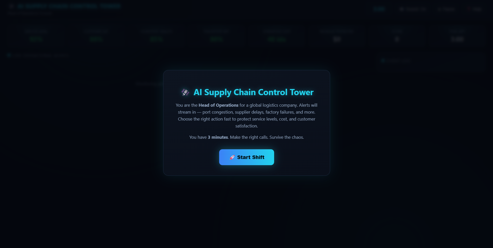
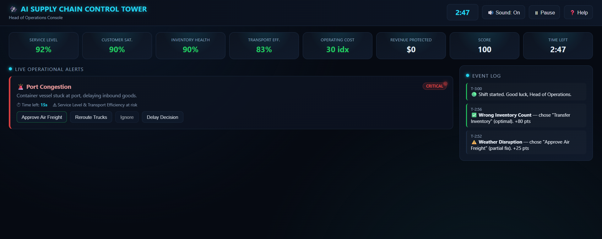

# Day 31 — AI Supply Chain Control Tower 🛰️

**#ABTalksOnAI #60DayClaudeChallenge**

---

## 1. Overview

Today's build simulates the experience of being **Head of Operations** at a global logistics company. It's a fast-paced, single-file browser game where operational alerts stream in continuously — port congestion, supplier delays, truck breakdowns, factory failures, demand spikes, and more — and the player has to triage and resolve them before time runs out, all while a live KPI dashboard reacts to every decision in real time.

The goal was to combine three things I've been trying to get better at across this challenge: **game-loop logic in vanilla JS**, **dashboard-style UI design**, and **decision-consequence modeling** (immediate effects vs. delayed downstream effects) — all inside a single, dependency-free HTML file that works completely offline.

**Live demo:** `supply_chain_control_tower.html` (double-click to open, no server needed)

---

## 2. What Was Built

### Core gameplay loop
- Player takes on the role of Head of Operations for a 3-minute shift.
- Alerts spawn continuously from a pool of **10 operational disruption types**.
- Each alert carries a **priority level** (critical / medium / low), a **countdown timer**, a **description**, and a **business impact statement**.
- Player picks one of **4 response actions** per alert: e.g. *Expedite Shipment, Use Backup Supplier, Reroute Trucks, Increase Production, Transfer Inventory, Approve Air Freight, Ignore, Delay Decision* (the exact 4 shown vary by alert type, matched to what's operationally realistic for that disruption).
- Every action maps to an **effect object** that shifts one or more KPIs — some actions are clearly optimal, others are partial fixes, and some (Ignore, Delay) are actively harmful.
- **Delayed consequences**: choosing "Delay Decision" doesn't dodge the problem — it applies a small immediate penalty *and* schedules a larger secondary penalty ~5 seconds later via an independent `setTimeout`, simulating how postponed operational decisions compound.
- **Unresolved alerts auto-expire** if their countdown hits zero, applying an automatic penalty equivalent to ignoring the issue — this stops players from simply doing nothing.

### Live KPI Dashboard
Eight KPIs update in real time after every decision:

| KPI | Behavior |
|---|---|
| Service Level (%) | Rises with fast/correct fixes, drops with delays/ignores |
| Customer Satisfaction (%) | Sensitive to shipment and delivery-related decisions |
| Inventory Health (%) | Driven by stock, supplier, and production decisions |
| Transportation Efficiency (%) | Driven by routing/logistics decisions |
| Operating Cost (index, lower = better) | Rises when expensive shortcuts (e.g. air freight) are overused |
| Revenue Protected ($) | Accumulates from decisions that safeguard revenue-at-risk alerts (demand spikes, damaged shipments) |
| Score | Overall decision-quality metric, drives the end-game grade |
| Time Left | Countdown clock for the 3-minute shift |

KPI cards are color-coded (green/orange/red) based on live thresholds, and briefly pulse-glow whenever they update, so the player gets instant visual feedback without needing to re-read numbers.

### Difficulty scaling
- Alert spawn frequency increases in three phases across the 3-minute shift (slow start → moderate → chaotic).
- The maximum number of simultaneous active alerts also increases over time (3 → 5 → 7), forcing genuine triage decisions under pressure rather than one-at-a-time resolution.

### End-of-shift summary
When the timer hits zero:
- Final **Score** and a letter **Performance Grade** (A+, A, B, C, D) computed from a blend of score and average KPI health.
- Full breakdown of all 8 final KPI values.
- **Total alerts resolved**, **correct decisions**, and **wrong decisions**.
- A short narrative operational summary that changes based on grade (e.g. "Exceptional operations leadership" vs. "Operations were overwhelmed").
- **Play Again** button that resets state and restarts the shift.

### Extra features
- Sound toggle (visual-only per spec — no audio required)
- Pause / Resume, which freezes the timer, spawn engine, and alert countdowns
- Help / Instructions modal
- Fully responsive layout — KPI grid reflows from 8 → 4 → 2 columns on smaller screens

---

## 3. Verbatim Prompt Used

> Act as an expert Product Designer, Operations Consultant, UX Designer, and Frontend Developer. Build a complete interactive web application called **AI Supply Chain Control Tower** — the entire project contained inside ONE self-contained HTML file using HTML, CSS, and vanilla JavaScript only. No React, Vue, Angular, Tailwind, Bootstrap, external libraries, APIs, or backend services — everything must work offline after opening the file.
>
> **Theme:** Premium dark Operations Control Center inspired by modern logistics dashboards — dark background, blue/cyan highlights, red warning alerts, green success indicators, orange medium-priority alerts, animated glowing cards, modern dashboard layout, professional typography, smooth transitions.
>
> **Gameplay:** The player becomes Head of Operations. A stream of operational alerts appears; the player decides which issue to solve first; every decision changes business KPIs; the goal is to maximize operational performance before time runs out.
>
> **KPIs (live, top of screen):** Service Level %, Customer Satisfaction, Inventory Health, Transportation Efficiency, Operating Cost, Revenue Protected, Score, Remaining Time.
>
> **Alert types:** Port Congestion, Supplier Delay, Truck Breakdown, Warehouse Running Out of Stock, Customs Inspection, Demand Spike, Factory Machine Failure, Weather Disruption, Wrong Inventory Count, Damaged Shipment — each with title, short description, priority, time remaining, and business impact.
>
> **Player actions:** Expedite Shipment, Use Backup Supplier, Reroute Trucks, Increase Production, Transfer Inventory, Approve Air Freight, Ignore, Delay Decision — each with different consequences; wrong decisions reduce KPIs, increase cost, lower satisfaction; some decisions have delayed consequences after several seconds.
>
> **Difficulty:** Game lasts 3 minutes; alerts increase in frequency and multiple alerts stay active simultaneously as time progresses.
>
> **Visuals:** Animated KPI cards, live scrolling event log, countdown timer, priority color coding, pulse animation for critical alerts, hover effects, professional dashboard layout.
>
> **End of game:** Final Score, Performance Grade (A+ to D), final KPI values, total alerts resolved, correct/wrong decisions, a short operational summary, and a Play Again button.
>
> **Extras:** Sound toggle (visual only), Pause button, Help/Instructions modal, responsive layout for desktop and mobile. Clean, well-commented, modular code — return only the complete HTML document.

---

## 4. Architecture

### High-level flow

```
┌─────────────────┐     spawn loop      ┌──────────────────┐
│  ALERT_TYPES[]   │ ──────────────────▶ │  activeAlerts[]   │
│  (10 templates)  │   (accelerating)    │  (live queue)      │
└─────────────────┘                     └─────────┬─────────┘
                                                    │ player clicks action
                                                    ▼
                                          ┌──────────────────┐
                                          │  applyEffect()    │
                                          │  updates state.kpis│
                                          └─────────┬─────────┘
                                                    │
                              ┌─────────────────────┼─────────────────────┐
                              ▼                     ▼                     ▼
                     renderKPIs()          renderAlerts()          logEvent()
                     (KPI bar UI)        (alert feed UI)         (event log UI)
```

### Module responsibilities

| Layer | Responsibility |
|---|---|
| **State object (`state`)** | Single source of truth — KPIs, timers, active alerts, resolved/correct/wrong counters, pause/running flags |
| **`ALERT_TYPES` config** | Static data — 10 alert templates, each pre-defining its 4 actions and their effect objects (including which action is "best" and which has a delayed effect) |
| **Alert engine (`spawnAlert`, `scheduleSpawning`)** | Selects a random alert type + priority, computes a priority-based countdown, and recursively schedules the next spawn with a decreasing delay as the shift progresses |
| **Decision engine (`resolveAlert`, `applyEffect`)** | Looks up the chosen action's effect object, clamps and applies KPI deltas, schedules delayed effects via `setTimeout` when present |
| **Game loop (`startGameLoop`)** | One `setInterval` tick per second — decrements the shift clock and every active alert's countdown, auto-expires alerts at zero, triggers `endGame()` at time-zero |
| **Render layer (`renderKPIs`, `renderAlerts`, `logEvent`)** | Pure re-render functions driven entirely off `state` — no hidden UI state, every render is a fresh reflection of the data |
| **End-game scoring (`endGame`)** | Computes average KPI health, blends it with score to assign a letter grade, and renders the summary modal |

### Design decisions worth noting
- **Effect objects, not hardcoded if/else branches** — every action's consequence is a plain `{kpiKey: delta}` object, so `applyEffect()` is one generic function that works for all 40 action variants (10 alert types × 4 actions) instead of 40 bespoke handlers.
- **Delayed effects are declarative** — an action just carries an optional `delayed: {...}` object; the resolve function handles scheduling generically rather than special-casing "Delay Decision" as a unique code path.
- **Priority determines urgency, not just color** — critical alerts get an 18-second timer, medium 25s, low 32s, so the color coding is backed by actual gameplay pressure, not just cosmetic labeling.

---

## 5. Key Learnings

1. **Delayed consequences need their own timer, decoupled from the main game tick.** Using an independent `setTimeout` per "Delay Decision" choice kept the delayed-penalty logic separate from the second-by-second game loop, avoiding race conditions where a delayed penalty could fire after the game had already ended.
2. **Escalating spawn rate should be a recursive `setTimeout`, not a fixed `setInterval`.** Recalculating the next spawn delay *inside* the loop — based on elapsed time — made it trivial to ramp difficulty across three phases smoothly, versus fighting with a single fixed interval.
3. **Auto-expiring alerts must share the same penalty path as manual "Ignore" decisions.** Routing both through the same `applyEffect()` call kept KPI math consistent and prevented duplicated, drift-prone logic between "player ignored it" and "player never got to it."
4. **Inverted-metric KPIs need their own color-coding branch.** Operating Cost is "lower is better," unlike every other percentage KPI — the render function needed a conditional branch rather than one universal green/orange/red threshold rule, otherwise Operating Cost looked backwards on the dashboard.
5. **Effect objects as data (not code) dramatically reduce branching complexity.** Modeling all 40 action outcomes as data objects consumed by one generic `applyEffect()` function kept the codebase small and made balancing (tweaking KPI deltas for game feel) a matter of editing numbers, not logic.
6. **Pulse animations tied to specific KPI keys, not global re-renders**, gave much clearer visual feedback — passing a `pulseKey` into `renderKPIs()` so only the just-changed card glows, rather than the whole dashboard flashing on every tick.

---

## 6. Screenshots

 
— Landing/briefing screen: mission framing, role context ("You are the Head of Operations"), shift length, and the "Start Shift" CTA over a dimmed, pre-loaded dashboard backdrop.
 
— Live gameplay mid-shift: full 8-KPI bar (Service Level 92%, CSAT 90%, Inventory 90%, Transport 83%, Cost 30 idx, Revenue $0, Score 100, Time 2:47), an active **critical** Port Congestion alert with its 15s countdown and 4 action buttons, and the scrolling event log showing prior resolved decisions with point deltas.

---


## 8. Tech Stack & Stats

| Metric | Value |
|---|---|
| File type | Single-file HTML (HTML + CSS + vanilla JS) |
| External dependencies | None — fully offline-capable |
| Alert types | 10 |
| Actions per alert | 4 (40 total effect combinations) |
| KPIs tracked live | 8 |
| Session length | 3 minutes, 3-phase escalating difficulty |
| Max simultaneous alerts | 3 → 5 → 7 (scales with elapsed time) |
| Performance grades | A+, A, B, C, D |
| Extra features | Pause/Resume, Sound toggle, Help modal, responsive layout |

---

## 9. What's Next

- Considering a "difficulty select" screen (Analyst / Manager / Director) that changes spawn rate and countdown windows.
- Possible session-only high-score display, consistent with keeping everything dependency-free (no localStorage per artifact constraints).
- Could extend the effect-object pattern to model **cascading alerts** — e.g. an ignored Supplier Delay spawning a follow-up Warehouse Stockout alert a few seconds later.

---

#ABTalksOnAI #60DayClaudeChallenge #SupplyChain #OperationsManagement #BuildInPublic #AI #WebDev #JavaScript #GameDev #Dashboard