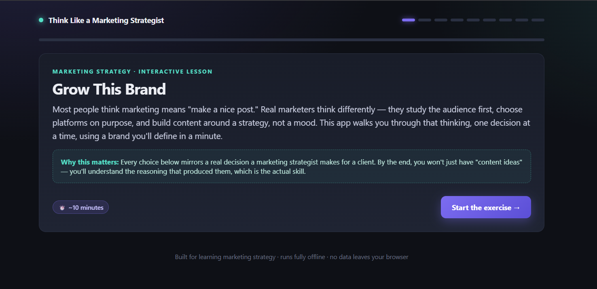
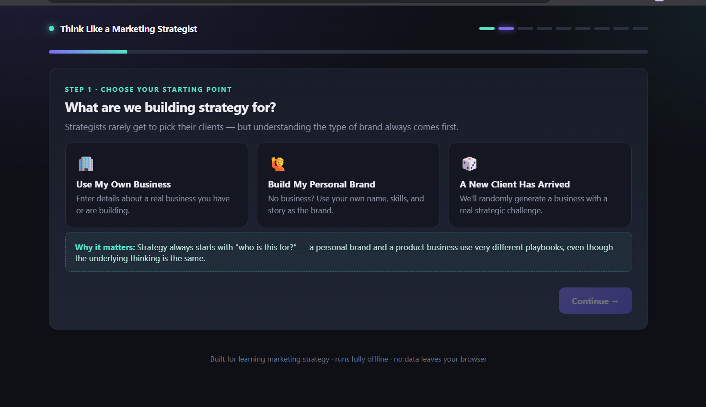
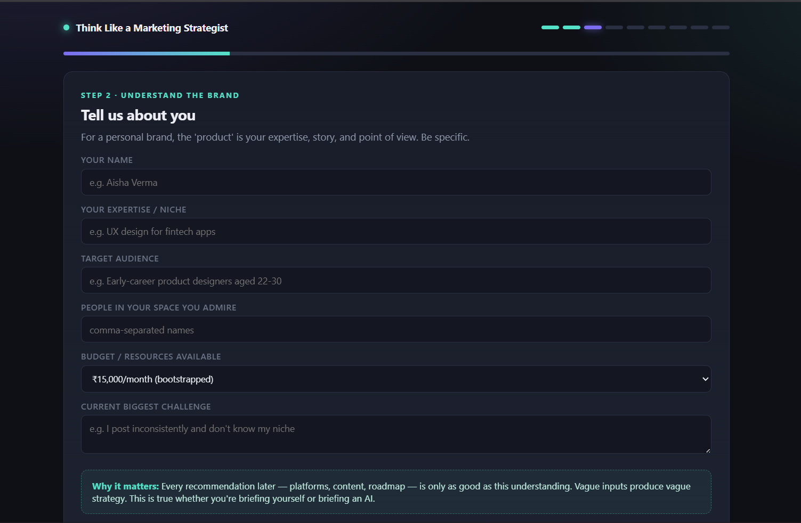
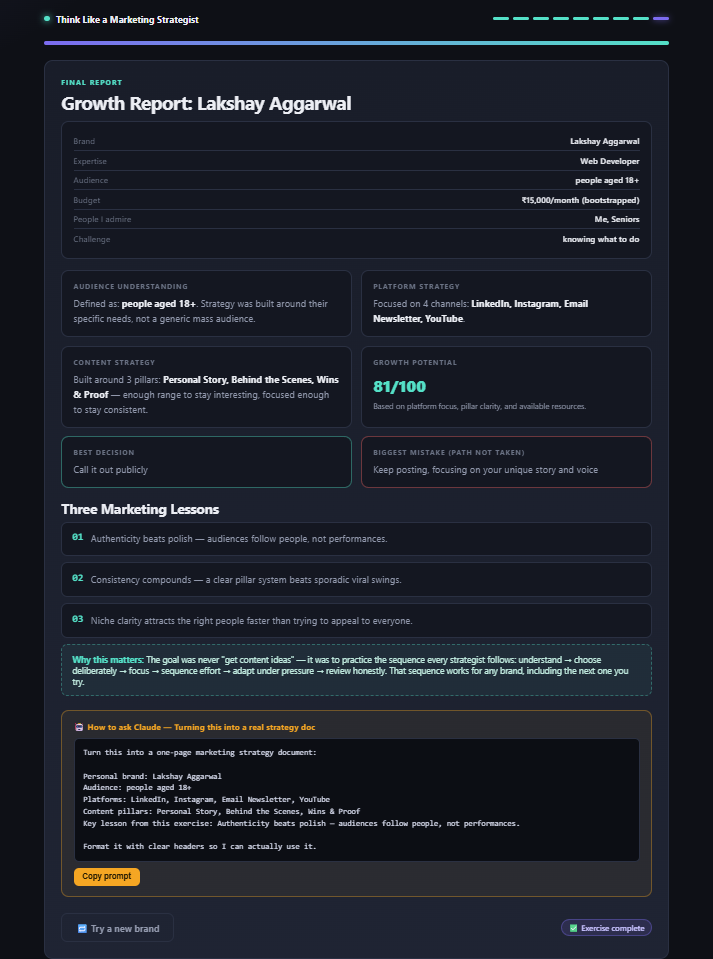

# Day 32 — Think Like a Marketing Strategist: Grow This Brand

**#60DaysOfClaude | ABTalksOnAI Challenge**

## What I Built

An interactive, single-file HTML/React app that teaches marketing **strategy**, not marketing **content generation**. Most AI marketing tools spit out captions and hashtags. This one forces the user through the actual decision sequence a strategist follows — understand the audience, choose platforms on purpose, commit to three content pillars, sequence a 30-day roadmap, and react to an unpredictable real-world event — with a "Why does this matter?" explanation after every choice.

Three entry paths:
- 🏢 **Use My Own Business** — real business, entered via a brief form
- 🙋 **Build My Personal Brand** — for people with no business yet; your name, expertise, and story become the "product" (pillars, platform weighting, and roadmap all shift accordingly)
- 🎲 **A New Client Has Arrived** — randomly generates a business with industry, audience, budget, competitors, and a specific marketing challenge

Every major step (brand definition, audience, platforms, pillars, roadmap, curveball event) ends with a **"How to ask Claude"** card — a copy-pasteable, reusable prompt template pre-filled with the user's own inputs, so the app teaches prompt engineering alongside marketing thinking.

It closes with a **Growth Report**: audience understanding, platform strategy, content strategy, a growth-potential score, best decision, biggest mistake (the path not taken from the curveball event), and three marketing lessons — tuned to reference personal-branding principles (authenticity, consistency, niche clarity) when in personal-brand mode.

## The Verbatim Prompt Used

```
Think Like a Marketing Strategist: Grow This Brand:
You are an expert frontend developer, UX designer, marketing strategist, and instructional designer.
Build a complete single-file HTML app called: "Think Like a Marketing Strategist: Grow This Brand"
The goal is to teach beginners how marketers think, not just generate marketing content. Every section
should explain "What is this?" and "Why does it matter?" in simple language.

Requirements: Output ONLY one HTML file. React via CDN + Babel JSX. HTML, CSS and JavaScript only.
No Tailwind, npm, backend or APIs. Runs offline. Responsive. Dark modern UI. Replayable with
randomized businesses.

Flow: Welcome screen → choose Use My Own Business / Build My Personal Brand / A New Client Has
Arrived (randomly generated) → understand the business/brand and audience → choose social platforms
with reasoning → generate content pillars, choose only three → build a 30-day roadmap (weekly goals,
not individual posts) → one unexpected marketing event with user response and consequences → end
with a Growth Report (Audience Understanding, Platform Strategy, Content Strategy, Growth Potential,
Best Decision, Biggest Mistake, Three Marketing Lessons).

After every major section, include a "How to ask Claude" card with a reusable prompt. Use reusable
React components with useState. Add smooth transitions, cards, progress indicators, ensure every
button works.
```

## Architecture

```
┌─────────────────────────────────────────────────────────────┐
│                          <App/>                              │
│              (single source of truth: useState)              │
└───────────────┬─────────────────────────────────────────────┘
                 │ step (0-8) drives conditional rendering
                 ▼
  0 Welcome ──▶ 1 ModeSelect ──▶ 2 BusinessForm / RandomReveal
                                        │
                                        ▼
                            3 AudienceUnderstanding
                                        │
                                        ▼
                              4 PlatformPicker
                          (8 platforms, good/bad copy)
                                        │
                                        ▼
                          5 PillarPicker (choose 3 of 6)
                          business pillars ≠ personal pillars
                                        │
                                        ▼
                          6 Roadmap (4 weekly goal blocks,
                          personal Week 1 = POV + bio)
                                        │
                                        ▼
                          7 CurveballEvent (random event,
                          3 response options → consequence)
                                        │
                                        ▼
                          8 GrowthReport (computed score +
                          best/worst decision + 3 lessons)

Shared components: <TopBar/> <ClaudeCard/> <Dossier/>
State branches on business.kind: "own" | "personal" | "random"
```

## Key Learnings

1. **Mode-branching content, not just mode-branching UI.** The real teaching value was in swapping the *substance* per mode — pillar sets, platform weighting, event pools, and lesson copy are entirely separate arrays for personal vs. business, not just relabeled. A single generic pillar list reused across modes would've made "Build My Personal Brand" feel like an afterthought.

2. **"Why it matters" boxes need to earn their place, not decorate.** Following the established build-in-stages principle, I wrote the mechanic (choose 3 pillars, pick platforms) first, then went back and wrote the reasoning box for each — writing them together produced generic filler ("this is important for growth!") instead of specific trade-off logic.

3. **Consequence text should be asymmetric, not just "good/bad."** Early draft had one clearly-best and one clearly-worst option per curveball event, which made the choice trivial. Reworked each event so every option has a real trade-off (e.g., "ride the viral wave" isn't wrong, it's just lower-quality growth than "redirect to your core offer") — this is closer to how real marketing decisions actually feel.

4. **Reused the `useMemo` pattern for the growth score** so it recalculates from actual user choices (platform count, pillar count, budget tier) instead of being a static number — small thing, but it makes the "randomized/replayable" requirement feel earned rather than cosmetic.

5. **Copy-to-clipboard prompt cards interpolate live state.** Every `ClaudeCard` prompt string pulls from the actual `business`, `platforms`, and `pillars` state rather than static placeholder text — so the "reusable prompt" a user copies is already personalized to their session, reinforcing the prompt-engineering lesson with a real example instead of a template.

## Screenshots






## Stats

| Metric | Value |
|---|---|
| File count | 1 HTML file (no build step) |
| Lines of code | ~1,010 |
| React components | 11 reusable components |
| Flow steps | 9 (welcome → growth report) |
| Content pillar sets | 2 (business, personal) — 6 pillars each |
| Platforms covered | 8, each with good/bad reasoning |
| Randomized curveball events | 7 total (3 business, 4 personal) |
| "How to ask Claude" prompt cards | 7 |
| External dependencies | React 18, ReactDOM 18, Babel standalone (CDN only) |

## Next Actions

- Add a persistent "strategy notebook" export (download the Growth Report as a shareable text/markdown summary)
- Expand curveball event pool so repeat plays feel less repetitive
- Consider a lightweight scoring rubric shown *before* the reveal, so users predict their own growth score first

#60DaysOfClaude #ABTalksOnAI #MarketingStrategy #BuildInPublic #ClaudeAI #PersonalBranding #ReactJS #LearningInPublic